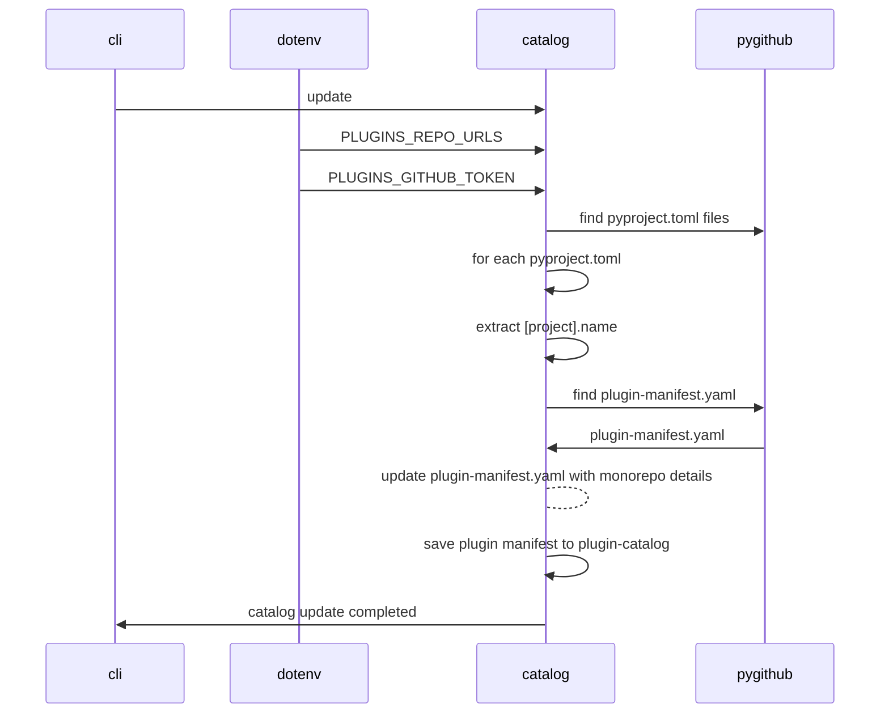
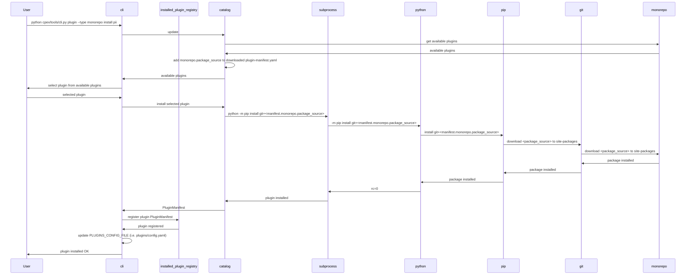
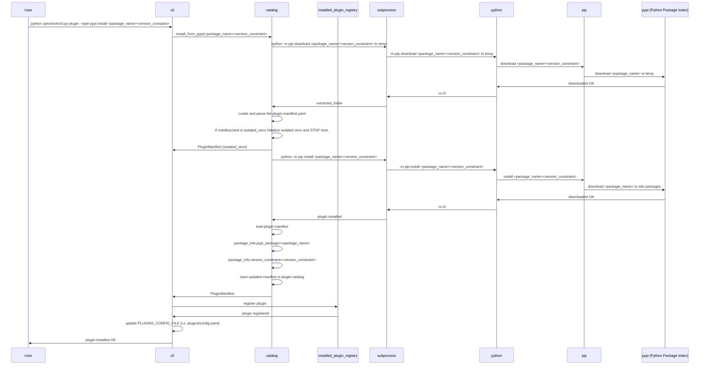
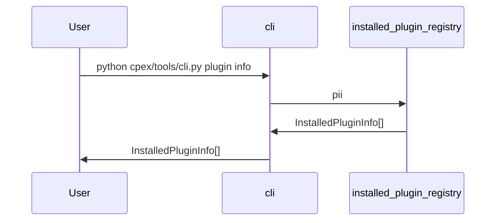

## Before you begin

Update the environment variables in .env

All values except PLUGINS_GITHUB_TOKEN have defaults.

```dotenv
### Plugin installation
# Comma Separated Values used by install with --type monorepo
# The default value is https://github.com/ibm/cpex-plugins
# PLUGINS_REPO_URLS="https://github.com/ibm/cpex-plugins"

# registry path (default shown below)
# PLUGIN_REGISTRY_FOLDER=data

# Github API (default shown below)
# PLUGINS_GITHUB_API=api.github.com

# PLUGINS_GITHUB_TOKEN=<github token>
### end Plugin installation
```

## Plugin installation using the cli

```bash
  python cpex/tools/cli.py plugin --help                              
                                                                                                                                                                                                                                                                                                      
 Usage: cli.py plugin [OPTIONS] [CMD_ACTION] [SOURCE]                                                                                                                                                                                                                                                 
                                                                                                                                                                                                                                                                                                      
 List, search, install or uninstall plugins.                                                                                                                                                                                                                                                          
                                                                                                                                                                                                                                                                                                      
default install type is monorepo                                                                                                                                
 Examples:                                                                                                                                                       
 python cpex/tools/cli.py plugin info pii                                                                                                                        
 python cpex/tools/cli.py plugin search pii                                                                                                                      
 python cpex/tools/cli.py plugin --type monorepo search pii                                                                                                      
 python cpex/tools/cli.py plugin --type monorepo install cpex-pii-filter                                                                                         
 python cpex/tools/cli.py plugin --type pypi install "ExamplePlugin@>=0.1.0"                                                                                     
 python cpex/tools/cli.py plugin --type test-pypi install "cpex-test-plugin@>=0.1.1"                                                                             
 python cpex/tools/cli.py plugin --type git install "cpex-test-plugin @ git+https://github.com/tedhabeck/cpex-test-plugin@main"                                  
 python cpex/tools/cli.py plugin versions cpex-test-plugin                                                                                                       
 python cpex/tools/cli.py plugin uninstall cpex-pii-filter.                                                                                                      

╭─ Arguments ────────────────────────────────────────────────────────────────────────────────────────────────────────────────────────────────────────────────────────────────────────────────────────────────────────────────────────────────────────────────────────────────────────────────────────╮
│   cmd_action      [CMD_ACTION]  One of: list|info|install|search|uninstall                                                                                                                                                                                                                         │
│   source          [SOURCE]      The pypi, git, or local folder where the plugin resides                                                                                                                                                                                                            │
╰────────────────────────────────────────────────────────────────────────────────────────────────────────────────────────────────────────────────────────────────────────────────────────────────────────────────────────────────────────────────────────────────────────────────────────────────────╯
╭─ Options ──────────────────────────────────────────────────────────────────────────────────────────────────────────────────────────────────────────────────────────────────────────────────────────────────────────────────────────────────────────────────────────────────────────────────────────╮
│ --type  -t      TEXT  The types of plugins to list.  One of: monorepo|pypi|test-pypi|git|local  Defaults to monorepo if unspecified.                                                                                                                                                               │
│ --help                Show this message and exit.                                                                                                                                                                                                                                                  │
╰────────────────────────────────────────────────────────────────────────────────────────────────────────────────────────────────────────────────────────────────────────────────────────────────────────────────────────────────────────────────────────────────────────────────────────────────────╯

```


## Installation catalog and plugin registry

### Catalog update sequence diagram

Catalog update from monorepo IBM/cpex-plugins:



### Plugin installation sequence diagrams
Installation from git monorepo:

`python cpex/tools/cli.py plugin --type monorepo install pii`



 Installation from pypi:

`python cpex/tools/cli.py --type pypi install <package_name>>=<package_Version>`


Note: installation from test.pypi.org is also supported using --type test-pypi. e.g:

`python cpex/tools/cli.py plugin --type test-pypi install "cpex-plugin-test@>=0.1.1" `

### Uninstall

Example uninstall of plugin:
`python cpex/tools/cli.py plugin uninstall cpex-pii-filter`


### Pligin information query sequence diagram

Query information for installed plugins:

`python cpex/tools/cli.py plugin info`



Example output:
```zsh
   python cpex/tools/cli.py plugin info
{
  "name": "cpex-test-plugin",
  "kind": "isolated_venv",
  "version": "0.2.0",
  "installation_type": "monorepo",
  "installation_path": "/Users/habeck/tedhabeck/contextforge-plugins-framework/plugins/cpex_test_plugin/.venv/lib/python3.13/site-packages/cpex_test_plugin",
  "installed_at": "2026-05-01T00:14:26.123924+00:00Z",
  "installed_by": "habeck",
  "package_source": "https://github.com/tedhabeck/cpex-test-plugin",
  "editable": false
}
```