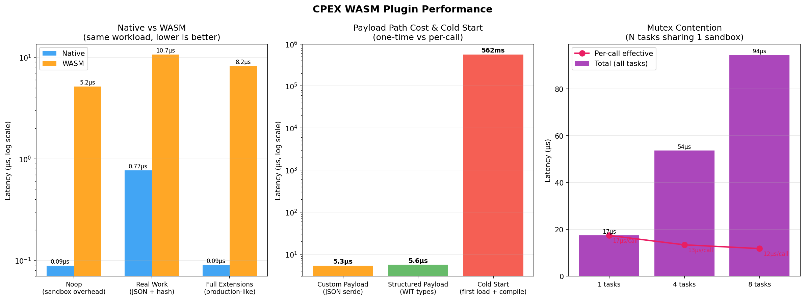

# cpex-wasm-host

Run plugins in sandboxed WebAssembly instead of trusting them with full process access. This crate loads `.wasm` plugin binaries, enforces resource limits and capabilities, and plugs into the same `PluginManager` pipeline as native plugins — no changes to your invocation code.

---

## Table of Contents

1. [What Is This?](#what-is-this)
2. [Prerequisites](#prerequisites)
3. [Quick Start (See It Work in 2 Minutes)](#quick-start-see-it-work-in-2-minutes)
4. [How It Works](#how-it-works)
5. [Using WASM Plugins in Your Code](#using-wasm-plugins-in-your-code)
6. [Using Custom Payload Types](#using-custom-payload-types)
7. [Configuring Plugins (YAML)](#configuring-plugins-yaml)
8. [Running the Demos](#running-the-demos)
9. [Running Tests](#running-tests)
10. [Performance](#performance)
11. [Security Model](#security-model)
12. [Error Handling](#error-handling)
13. [API Reference](#api-reference)
14. [Project Structure](#project-structure)
15. [Troubleshooting](#troubleshooting)
16. [Known Limitations & Future Work](#known-limitations--future-work)

---

## What Is This?

CPEX plugins inspect and modify requests flowing through your system (tool calls, LLM messages, identity checks). Normally these plugins run as native Rust code in the same process — fast but fully trusted.

**cpex-wasm-host** lets you run plugins in a **WebAssembly sandbox** instead. Each plugin:
- Runs in isolated memory (can't read your process's data)
- Has no filesystem access unless you explicitly grant it
- Has no network access unless you explicitly allow specific hosts
- Can't exceed a CPU budget (fuel limit) or wall-clock timeout
- Can only see the extension data you declare in its capabilities

The plugin author writes the same Rust code (same `HookHandler` trait, same `PluginResult`). The only difference is it compiles to `.wasm` instead of linking into your binary.

---

## Prerequisites

You need one extra Rust target installed:

```bash
rustup target add wasm32-wasip2
```

That's it. Everything else (wasmtime, WIT bindings) is handled by Cargo dependencies.

---

## Quick Start (See It Work in 2 Minutes)

```bash
# From the repository root:
cd crates/cpex-wasm-host

# This builds all WASM plugins and runs both demos end-to-end:
make run-demos
```

You'll see output showing 4 plugins processing requests in a pipeline — identity checks, PII access control, remote authorization, and audit logging — all running inside WASM sandboxes.

If you want to reset everything and start fresh:

```bash
make clean-all && make run-demos
```

---

## How It Works

```
Your Code
    │
    ▼
PluginManager::invoke::<HookType>(payload, extensions, context)
    │
    ▼  (same API whether plugin is native or WASM)
┌─────────────────────────────────────────────────────┐
│  WasmBridgeHandler                                  │
│                                                     │
│  1. Convert payload + extensions → WIT types        │
│  2. Reset fuel + timeout for this call              │
│  3. Call into the WASM sandbox                      │
│  4. Convert result back to native types             │
│  5. Validate: did the plugin modify things it's     │
│     not allowed to? If so, reject the changes.      │
└─────────────────────────────────────────────────────┘
    │
    ▼
┌─────────────────────────────────────────────────────┐
│  Wasmtime Sandbox (per plugin)                      │
│                                                     │
│  - Isolated linear memory (can't see host memory)   │
│  - Fuel budget (instruction limit per call)         │
│  - Epoch timeout (wall-clock limit per call)        │
│  - Capability-filtered extensions (only sees what   │
│    it declared)                                     │
│  - Network/filesystem/env access only if allowed    │
└─────────────────────────────────────────────────────┘
```

From the caller's perspective, WASM and native plugins are identical. You use the same `PluginManager`, same `invoke()` call, same result handling. The sandbox is invisible to the calling code.

---

## Using WASM Plugins in Your Code

### Step 1: Add the dependency

```toml
[dependencies]
cpex-wasm-host = { path = "../cpex-wasm-host" }
cpex-core = { path = "../cpex-core" }
```

### Step 2: Register a WASM factory with the PluginManager

```rust
use std::path::PathBuf;
use cpex_core::manager::PluginManager;
use cpex_wasm_host::factory::WasmPluginFactory;

let mgr = PluginManager::default();

// Point at the directory containing your .wasm files
let wasm_dir = PathBuf::from("wasm");

// Register a factory for each plugin kind in your YAML config.
// "wasm://my-plugin.wasm" matches the `kind:` field in config.
mgr.register_factory(
    "wasm://my-plugin.wasm",
    Box::new(WasmPluginFactory::with_builtin_payloads(wasm_dir)),
);
```

### Step 3: Load config and invoke (same as native)

```rust
use cpex_core::cmf::CmfHook;
use cpex_core::config::parse_config;

// Load YAML config (declares which plugins, hooks, capabilities)
let config = parse_config(&yaml_string)?;
mgr.load_config(config)?;
mgr.initialize().await?;

// Invoke a hook — WASM plugins participate transparently
let (result, bg) = mgr
    .invoke_named::<CmfHook>("cmf.tool_pre_invoke", payload, extensions, None)
    .await;

// Check the result
if !result.continue_processing {
    println!("Denied: {}", result.violation.unwrap().reason);
}

// Wait for fire-and-forget plugins to finish
bg.wait_for_background_tasks().await;
```

That's it. The plugin runs in a sandbox, but your invocation code is identical to native.

---

## Using Custom Payload Types

The built-in payloads (CMF `MessagePayload`, `IdentityPayload`, `DelegationPayload`) work out of the box with `WasmPluginFactory::with_builtin_payloads()`.

If you want to define **your own** payload type (like `ToolInvokePayload` in the demo), you need two extra steps:

### Host side (your binary):

```rust
use serde::{Deserialize, Serialize};
use cpex_wasm_host::factory::WasmPluginFactory;
use cpex_wasm_host::payload_registry::PayloadSerializerRegistry;

// 1. Define your payload struct
#[derive(Debug, Clone, Serialize, Deserialize)]
struct ToolInvokePayload {
    tool_name: String,
    user: String,
    arguments: String,
}

// 2. Implement the required traits (these macros do it for you)
cpex_core::impl_plugin_payload!(ToolInvokePayload);
cpex_core::impl_wasm_payload!(ToolInvokePayload, "cpex.tool_invoke");
//                                                 ^^^^^^^^^^^^^^^^
//                    This string must match exactly on host and guest side

// 3. Define a hook type that uses your payload
struct ToolPreInvoke;
impl HookTypeDef for ToolPreInvoke {
    type Payload = ToolInvokePayload;
    type Result = PluginResult<ToolInvokePayload>;
    const NAME: &'static str = "tool_pre_invoke";
}

// 4. Register your payload with the factory
let mut registry = PayloadSerializerRegistry::new();
registry.register::<ToolInvokePayload>();
let factory = WasmPluginFactory::new(wasm_dir, Arc::new(registry));
```

### Guest side (your plugin — see cpex-wasm-plugin README for full tutorial):

Define the **exact same struct** with the same field names and types, the same `impl_wasm_payload!` discriminator string, and implement `HookHandler<YourHook>`. The payload crosses the boundary automatically as JSON bytes.

**Working examples:** See `examples/wasm_plugin_demo.rs` (host) and `cpex-wasm-plugin/src/plugins/tool_invoke_checker.rs` (guest).

---

## Configuring Plugins (YAML)

Each WASM plugin is declared in YAML with its hooks, mode, priority, capabilities, and sandbox policy:

```yaml
plugins:
  - name: my-plugin
    kind: wasm://my-plugin.wasm          # "wasm://" prefix tells the manager to use WasmPluginFactory
    hooks: [cmf.tool_pre_invoke]         # which hooks this plugin runs on
    mode: sequential                      # sequential | transform | audit | concurrent | fire_and_forget
    priority: 50                          # lower number = runs earlier within same mode
    on_error: fail                        # fail | ignore | disable (circuit breaker)
    capabilities:                         # what extension data the plugin can see/modify
      - read_labels
      - read_subject
      - read_roles
    config:
      sandbox_policy:
        allowed_filesystem: []            # empty = no filesystem access
        allowed_network: []               # empty = no network access
        allowed_env: []                   # empty = no environment variables visible
        resources:
          max_memory_bytes: 10485760      # 10 MB linear memory cap
          max_fuel: 1000000000            # ~1 billion instructions per call
          max_execution_time_ms: 5000     # 5 second wall-clock timeout per call
          max_instances: 10
          max_tables: 10
```

**Defaults** (if you omit `sandbox_policy` entirely): deny-all filesystem, deny-all network, deny-all env vars, 5-second timeout, unlimited fuel/memory.

### Routing plugins to specific tools

```yaml
global:
  policies:
    all:                    # these plugins fire on EVERY invocation
      plugins: [identity-checker]
    pii:                    # these fire only when a route has the "pii" tag
      plugins: [pii-guard]

routes:
  - tool: get_compensation  # specific tool
    meta:
      tags: [pii, hr]       # activates the "pii" policy group
    plugins:
      - audit-logger        # plus any route-specific plugins

  - tool: "*"               # wildcard catch-all
    plugins:
      - audit-logger
```

---

## Running the Demos

| Demo | What it shows | Command |
|------|---------------|---------|
| **Plugin Demo** | 4 WASM plugins, custom payload, 7 scenarios, policy routing | `make run-plugin-demo` |
| **Capabilities Demo** | 3 WASM plugins, capability-gated extension visibility | `make run-capabilities-demo` |
| **Both** | Everything above | `make run-demos` |

All commands should be run from `crates/cpex-wasm-host`.

The Plugin Demo mirrors the native `cpex-core/examples/plugin_demo.rs` exactly — same plugins, same scenarios, same results — but all running in WASM sandboxes. See the [detailed Plugin Demo section](#plugin-demo-details) at the end for expected output.

---

## Running Tests

```bash
# From the repository root:
cargo test -p cpex-wasm-host
```

This runs all tests that have their `.wasm` binaries pre-built. For the full suite including sandbox isolation tests:

```bash
# One command that cleans, rebuilds everything, and runs all tests:
cd crates/cpex-wasm-host
make test
```

### What the tests cover

| Category | Count | What it proves |
|----------|:-----:|----------------|
| Security enforcement | 15 | Capability filtering, immutable tier, monotonic labels, write authorization, slot preservation |
| Custom payload pipeline | 8 | 4 WASM plugins with user-defined payload through the full PluginManager pipeline (E2E) |
| Sandbox isolation | 6 | Real plugins attempt filesystem/network/env access — sandbox blocks them |
| Policy loader | 8 | YAML config parsing, context building, deny-all defaults |
| Config integration | 8 | Config structure, resource limits validation |
| Error classification | 6 | Timeout, fuel, memory, trap, network errors classified correctly |
| Conversions | 3 | Payload round-trips, extension immutability |

---

## Performance

**Benchmark environment:** Apple M4 Max, 64 GB RAM, macOS 15.5, Rust 1.96.0, wasmtime 45.0, release profile.



| Scenario | Latency | vs Native |
|----------|:-------:|:---------:|
| Native handler (noop) | 87 ns | 1x |
| Native compute (real work) | 874 ns | 10x |
| WASM noop (sandbox overhead only) | 5.1 µs | 58x |
| WASM compute (same real work) | 10.5 µs | 120x |
| Custom payload (JSON serde path) | 5.3 µs | 61x |
| Structured payload (WIT types) | 5.6 µs | 64x |
| Cold start (first load + compile) | 547 ms | one-time |

### The bottom line

| | Native | WASM |
|---|---|---|
| **Per-call latency** | 87ns - 874ns | 5-10µs (12-120x slower) |
| **Cold start** | Zero (compiled in) | ~550ms (one-time WASM compilation) |
| **Concurrency** | Lock-free | Mutex-serialized per plugin |
| **Isolation** | None (same process, trusted) | Full sandbox (fuel, memory, timeout, network, filesystem) |

**For typical CPEX usage** (2-4 plugin calls per LLM request at 200ms+), the WASM overhead is 20-40µs total — **0.01-0.02% of request latency**. Effectively invisible.

**When to use WASM:** untrusted/third-party plugins, multi-tenant environments, or anywhere you need the guarantee that a plugin can't read files, exfiltrate data, or crash the host.

**When to use native:** your own code, performance-critical hot paths, or plugins that need async I/O or cross-invocation mutable state beyond what `OnceLock` provides.

### Running benchmarks yourself

```bash
cd crates/cpex-wasm-host
make bench-all
```

This builds all required plugins, runs both benchmark suites (Criterion), and generates the performance comparison chart. See `benchmarking/README.md` for a detailed step-by-step guide.

---

## Security Model

Five layers of defense-in-depth at the WASM trust boundary:

| Layer | What It Does | On Violation |
|-------|-------------|--------------|
| **Capability filtering** | Strips extension slots the plugin isn't authorized to read | Plugin never receives unauthorized data |
| **Immutable tier** | Verifies Arc pointer identity on immutable slots after return | Rejects all extension modifications |
| **Monotonic labels** | Verifies security labels can only be added, never removed | Rejects extension modifications |
| **Write authorization** | Verifies mutations only on slots with write capability | Rejects extension modifications |
| **Slot preservation** | Hidden slots preserved unchanged during writeback | Pipeline data integrity maintained |

Additionally, the sandbox enforces:
- **Fuel limits** — per-invocation instruction budget (prevents infinite loops)
- **Execution timeout** — epoch-based wall-clock limit (prevents hanging)
- **Memory caps** — linear memory growth limited (prevents OOM)
- **Network allowlist** — outbound HTTP only to declared hosts
- **Filesystem preopens** — only declared paths accessible

---

## Error Handling

WASM runtime errors are classified into proper `PluginError` variants so the executor can apply the correct `on_error` policy:

| Error | Variant | What happened |
|-------|---------|---------------|
| Epoch deadline exceeded | `Timeout` | Plugin took too long (wall-clock) |
| Fuel exhausted | `Execution { code: "fuel_exhausted" }` | Plugin used too many instructions |
| Memory limit | `Execution { code: "memory_limit" }` | Plugin tried to allocate too much memory |
| Plugin trap/panic | `Execution { code: "wasm_trap" }` | Plugin crashed (unreachable, divide by zero, etc.) |
| Network denied | `Execution { code: "network_denied" }` | Plugin tried to access a non-allowed host |

With `on_error: disable`, the executor permanently disables a failing plugin (circuit breaker pattern).

---

## API Reference

### `WasmPluginFactory`

The main entry point. Implements `cpex_core::factory::PluginFactory` so WASM plugins register with `PluginManager` the same way native plugins do.

```rust
use cpex_wasm_host::factory::WasmPluginFactory;

// For built-in payloads (CMF, Identity, Delegation):
let factory = WasmPluginFactory::with_builtin_payloads(PathBuf::from("wasm"));

// For custom payloads (you must register your types):
let factory = WasmPluginFactory::new(wasm_dir, Arc::new(registry));
```

### `PayloadSerializerRegistry`

Tells the host how to serialize/deserialize your custom payload types for the WASM boundary.

```rust
use cpex_wasm_host::payload_registry::PayloadSerializerRegistry;

let mut registry = PayloadSerializerRegistry::new();
registry.register::<MyPayload>();  // MyPayload must impl WasmSerializablePayload
```

### `SharedEngine`

One wasmtime engine + one epoch ticker thread, shared across all plugins from the same factory. You don't create this directly — `WasmPluginFactory` manages it internally.

### `SandboxManager`

Per-plugin isolated Store. Also managed internally by the factory. If you need direct access (e.g., for benchmarks), see `benchmarking/invocation.rs` for usage patterns.

---

## Project Structure

```
cpex-wasm-host/
├── Cargo.toml
├── README.md
├── Makefile                               # Build, test, run, bench targets
├── config/
│   ├── config.yaml                        # Test fixture (policy loader tests)
│   ├── config_plugin_demo.yaml            # 4-plugin custom payload demo
│   └── config_capabilities.yaml           # 3-plugin capabilities demo
├── examples/
│   ├── wasm_plugin_demo.rs                # 4 plugins, custom payload, 7 scenarios
│   └── wasm_capabilities_demo.rs          # 3 plugins, capability isolation
├── benchmarking/
│   ├── README.md                          # Step-by-step benchmarking guide
│   ├── invocation.rs                      # Benchmark: sandbox overhead
│   ├── comprehensive.rs                   # Benchmark: real work, cold start, contention
│   ├── plot_results.py                    # Generates performance_comparison.png
│   └── performance_comparison.png         # Chart (committed for README display)
├── tests/
│   ├── test_security_enforcement.rs       # 15 tests: 5-layer security validation
│   ├── test_custom_payload_pipeline.rs    # 8 tests: E2E custom payload pipeline
│   ├── test_sandbox_isolation.rs          # 2 tests: filesystem denied
│   ├── test_sandbox_network.rs            # 2 tests: network denied
│   ├── test_sandbox_env.rs               # 2 tests: env vars hidden
│   └── test_policy_loader.rs             # 8 tests: config parsing
├── src/
│   ├── lib.rs                             # Crate docs + module re-exports
│   ├── factory.rs                         # WasmPluginFactory, WasmBridgeHandler
│   ├── sandbox_manager.rs                 # SharedEngine, SandboxManager, host-logging
│   ├── conversions.rs                     # Native ↔ WIT type conversions
│   ├── policy_loader.rs                   # SandboxPolicy parsing, WASI context
│   └── payload_registry.rs               # Custom payload serialization
├── wasm/                                  # Compiled .wasm binaries (gitignored)
└── wit/
    ├── world.wit                          # WIT interface definition
    └── deps/                              # WASI P2 interface dependencies
```

---

## Troubleshooting

| Symptom | Cause | Fix |
|---------|-------|-----|
| `target 'wasm32-wasip2' not found` | WASM target not installed | `rustup target add wasm32-wasip2` |
| `failed to load wasm from .../plugin.wasm` | Binary not built | `cd crates/cpex-wasm-host && make build-all-plugins` |
| `failed to instantiate plugin` | Stale `.wasm` (WIT mismatch after code changes) | Rebuild: `make clean-all && make build-all-plugins` |
| `WASM invocation failed: epoch deadline` | Plugin took too long | Increase `max_execution_time_ms` in YAML config |
| `WASM invocation failed: all fuel consumed` | Plugin too compute-heavy | Increase `max_fuel` in YAML config |
| `block_in_place` panic | Single-threaded tokio runtime | Use `tokio::runtime::Builder::new_multi_thread()` or `#[tokio::main]` (multi-thread is default) |
| Benchmark says "SKIP: noop.wasm not found" | Benchmark plugins not built | `make build-bench-plugins` |
| Sandbox tests fail with "not found" | Test plugins not built | `make build-test-plugins` |

---

## Known Limitations & Future Work

### Current Limitations

| Limitation | Impact | Workaround |
|-----------|--------|------------|
| **Single-threaded per plugin** | Mutex serializes all calls to one plugin — no parallel invocations | Acceptable at ~126K calls/sec/core; bottleneck only under extreme concurrency |
| **One plugin per `.wasm` binary** | WIT single-export constraint | Use feature flags; minor build-time cost |
| **Cold start ~550ms** | First load compiles WASM to native code | Load all plugins at startup, not per-request |
| **No raw credential access** | Bearer tokens never cross the boundary | By design — plugins needing credentials should run natively |
| **No streaming** | Full payload buffering, no per-token hooks | Use native plugins for streaming paths |
| **No WIT schema versioning** | WIT changes are breaking — all plugins must be recompiled | Pin WIT version across releases |
| **Rust-only guest SDK** | No Go/TypeScript/Python convenience wrappers | Any `wasm32-wasip2` language works; Rust SDK is just the ergonomic layer |

### Future Work

| Priority | Feature | Benefit |
|:--------:|---------|---------|
| High | **Instance pooling** | N pre-warmed Stores per plugin, round-robin dispatch. Eliminates mutex contention. |
| High | **Pre-compilation cache** | Serialize compiled modules to disk. Reduces cold start from ~550ms to <5ms. |
| Medium | **Per-token streaming hooks** | `HookPayload::Stream` variant for LLM token-level processing. |
| Medium | **Hot reload** | Replace `.wasm` binary without restarting the host process. |
| Medium | **Multi-language guest SDKs** | TypeScript/Go/Python wrappers for the guest-side plugin API. |
| Low | **WIT version negotiation** | Host and guest report versions at load time. Enables rolling upgrades. |
| Low | **Resource usage metrics** | Expose fuel consumed, memory high-water mark per plugin. |
| Low | **Plugin-to-plugin communication** | Shared memory or message-passing between plugins in the same pipeline. |

---

## Appendix: Plugin Demo Details

<a id="plugin-demo-details"></a>

The `wasm_plugin_demo` example runs 4 WASM plugins through 7 scenarios, demonstrating the full feature set:

| Plugin | Binary | Priority | Mode | Role |
|--------|--------|:--------:|------|------|
| identity-resolver | `tool-invoke-checker.wasm` | 10 | sequential | Checks user identity is present |
| pii-guard | `pii-guard.wasm` | 20 | sequential | Blocks PII tools without clearance |
| remote-authz | `remote-authz.wasm` | 30 | sequential | ACL-based authorization (state persists across calls) |
| audit-logger | `audit-logger-custom.wasm` | 100 | fire_and_forget | Logs all tool invocations |

**Expected output:**

```
Scenario 1: get_compensation (no clearance)     → DENIED by pii-guard
Scenario 2: get_compensation (with clearance)   → ALLOWED (+ post-invoke)
Scenario 3: list_departments (non-PII)          → ALLOWED
Scenario 4: some_other_tool (wildcard)          → ALLOWED
Scenario 5: query_external_data (alice in ACL)  → ALLOWED
Scenario 6: query_external_data (charlie)       → DENIED by remote-authz
Scenario 7: list_departments (no user)          → DENIED by identity-resolver
```

Run with: `cd crates/cpex-wasm-host && make run-plugin-demo`
