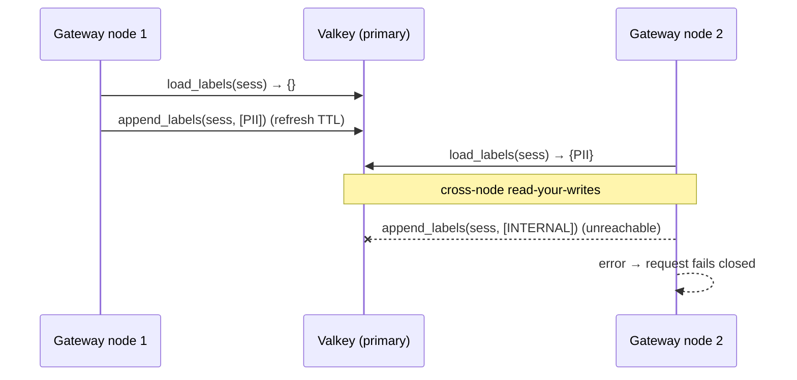

# Valkey-backed Session Store

## Summary

Add a config-selectable, Valkey-backed `SessionStore` alongside the in-process `MemorySessionStore`, so session security labels persist across application restarts and are shared across gateway nodes. It is **fail-closed**, serves **primary-only reads**, and supports an optional **sliding TTL** that is sound only when set ≥ the gateway's session-identity lifetime. To make fail-closed possible, the `SessionStore` trait gains an error channel.

---

## Problem Frame

CPEX embeds in an AI gateway that mediates A2A / MCP interactions. The only session-scoped state today is `extensions.security.labels` — a monotonic accumulation of taint/security labels per `session_id` that feed information-flow authorization decisions. The single built-in backend, `MemorySessionStore` (`crates/apl-cpex/src/session_store.rs`), holds this in a process-local `HashMap`.

Two deployment realities break that model. When a gateway process restarts, every session's accumulated taint is lost — a session that was exposed to PII before the restart looks clean afterward. And in a multi-node deployment, a session pinned to node A carries no taint when its next request lands on node B, because the nodes share no state. In both cases the failure is silent and security-relevant: labels that should constrain a downstream operation simply aren't there. The store's own design comments already anticipate a distributed backend ("Redis or DynamoDB for distributed ones"), but none exists, and the FFI host currently hardcodes the memory store with no way to swap it. That comment predates this work; the design here is Valkey-specific (the config `kind:` is `valkey`), and broader Redis-compatibility or multi-store support is not a goal.

---

## Actors

- A1. Gateway node (CPEX-embedded): hydrates session labels at request start and appends newly-accumulated labels at request end. Multiple nodes share one store.
- A2. Operator: provisions and manages Valkey, supplies the YAML config (endpoint, TLS, auth, TTL, key prefix), and owns capacity planning and the eviction policy.
- A3. Valkey instance/endpoint: the shared, persistent KV backing the session labels.

---

## Key Flows

- F1. Cross-node / cross-restart label propagation
  - **Trigger:** A session request arrives at any gateway node.
  - **Actors:** A1, A3
  - **Steps:** Node loads the session's labels from the Valkey primary → evaluates policy → appends any newly-accumulated labels back (union), refreshing TTL if configured. A later request for the same session on a different node (or after a restart) loads the same unioned labels.
  - **Outcome:** Accumulated taint is consistent across nodes and survives restarts.
  - **Covered by:** R1, R6, R7, R15

- F2. Valkey store error (fail-closed)
  - **Trigger:** A load or append errors (unreachable, timeout, or a reachable-but-invalid response).
  - **Actors:** A1, A3
  - **Steps:** The store returns an error rather than empty labels or a dropped append. A load error fails the request closed before any decision is made. An append error also fails the request closed: `continue_processing` is computed after `persist_session` in `route_handler.rs`, so the error flips the outcome to Deny — in the Pre phase this blocks the mediated action before it is externalized (write-ahead); in the Post phase it blocks the tainted response from returning.
  - **Outcome:** No silent taint loss; a store error degrades to denial, never to under-labeling. During a full outage this is self-covering — the next request's load also fails closed, so a lost append cannot cause downstream under-labeling. The residual case (append fails while reads still succeed) is alarmed.
  - **Covered by:** R4, R5, R18

---

## Requirements

**Backend and selection**
- R1. Provide a Valkey-backed `SessionStore` implementing the existing trait surface (`load_labels` / `append_labels`), usable alongside `MemorySessionStore`.
- R2. The backend is selectable through the unified YAML config via a `SessionStore` factory/registry that mirrors the existing `PdpFactory` pattern (a `kind:`-tagged block under `global.apl`). The FFI/gateway host registers the factory so Valkey can be enabled without recompiling.
- R3. When no session-store config block is present, the default remains `MemorySessionStore` — existing deployments are unaffected.

**Trait change and compatibility**
- R4. The `SessionStore` trait methods return a `Result` so failures propagate to callers. `MemorySessionStore` adapts (it is infallible, returning `Ok`). All call sites are updated to propagate: in the CMF (CmfPluginInvoker) invoker, `persist_session` (which calls `append_labels`) and `for_request` (which calls `load_labels` and currently returns `Self`, not `Result`) must both become fallible, and `route_handler.rs` must act on the propagated error. The trait's error type is a crate-local enum (e.g., via `thiserror`, already a workspace dependency) — not `anyhow` — so `apl-cpex` gains no new dependency. Note: this makes error-propagation part of the shared `SessionStore` contract that future bridges (apl-mcp, apl-langgraph) inherit, not a Valkey-only detail; that is intended.
- R15. Preserve monotonic union semantics across both backends: `append_labels` unions labels into the session's set, `load_labels` returns the union, and an unknown session returns empty (not an error). "Unknown session" means a positively-confirmed key-miss (the session id has no stored labels — never seen or already expired), which is distinct from a store error (R5). Within a configured TTL window, accumulation is monotonic; TTL expiry (R7) is the only sanctioned time-based removal, and explicit declassification remains out of scope.
- R16. `append_labels` MUST be implemented as a single atomic server-side set-union operation (so concurrent appends from different nodes for the same session are race-free and monotonic). Client-side read-modify-write of the label set is forbidden — it loses labels under concurrent cross-node appends.
- R18. An `append_labels` error fails the request closed, uniformly with a load error. Because `continue_processing` is computed after `persist_session` (`route_handler.rs`), the handler flips the outcome to Deny on append error: in the Pre phase this prevents the mediated action (write-ahead — taint is durably committed before the side effect is externalized); in the Post phase it blocks the tainted response. The backend MUST emit a distinguished alarm/metric on append failure, since the dangerous residual is a *selective* failure (append rejected while reads still succeed), where a subsequent load would otherwise return a stale, smaller label set. A full outage is self-covering (the next load also fails closed).

**Failure and consistency semantics**
- R5. When Valkey is unreachable, times out, or returns an error on load or append, the store returns an error (fail-closed). It must not return empty labels or silently drop an append. A reachable-but-invalid response — a value that cannot be decoded into the expected label representation, or a partial/truncated result — is also treated as a store error (fail-closed), never as an empty or partial label set. This is distinct from the positively-confirmed key-miss of R15, which returns empty.
- R6. Reads are served from the primary only (read-your-writes consistency). No replica read-splitting.

**Expiry and lifecycle**
- R7. Support a configurable sliding TTL on session keys, refreshed on every load and append. Default is no expiry (TTL off). Note that refresh-on-load makes a read also issue a write (e.g., `EXPIRE`) to the primary; the design must define what happens when that refresh write fails on an otherwise-successful load (in particular under `noeviction` at capacity, see R9): a failed TTL refresh must not corrupt the load result, and the load/refresh failure semantics must be stated rather than left implicit.
- R8. Document the soundness rule: a TTL may be enabled only when set ≥ the maximum session-identity lifetime; a shorter TTL silently expires taint (downgrade-by-waiting) and is unsound.
- R17. When a TTL is configured, emit a startup WARNING (or structured audit event) if it is shorter than the configured/declared maximum session-identity lifetime. The soundness rule (R8) is otherwise enforced by nothing; a best-effort comparison catches the most common misconfiguration before it silently downgrades taint.
- R9. Provide a configurable key prefix/namespace (software requirement). Separately, document as an operator runbook note that the label keyspace must run under `maxmemory-policy noeviction`, so a full instance fails-closed on write rather than silently evicting taint — the client cannot enforce this server setting. Optionally, the backend issues a `CONFIG GET maxmemory-policy` check at startup and warns if it is not `noeviction`, making the durability property self-auditing.

**Connection and deployment**
- R10. Connect to a single Valkey endpoint (URL or host:port) with optional password/ACL auth. TLS is **required** for any non-localhost endpoint: security labels reveal session sensitivity and must not transit a network segment in plaintext, where passive interception discloses taint state and active MITM can inject or suppress labels. The minimum auth posture for production deployments is documented in operator guidance.
- R11. The connection config specifies a single endpoint, TLS settings, and auth. Keep it minimal; if Sentinel or Cluster support is added later, the config schema is versioned at that time. (Do not pre-add unused topology fields now — that is dead config surface with no current consumer; see Scope Boundaries.)
- R12. Provide a Valkey container / compose setup for local development and integration tests.

**Crate structure and reuse**
- R13. Ship the Valkey backend in its own crate and wire it into `cpex-ffi` as an **optional dependency behind a cargo feature** (e.g. `valkey = ["dep:apl-session-valkey"]`), mirroring `cedarling = ["dep:apl-cedarling"]`. `default-members` exclusion alone does not keep object code out of a `-p cpex-ffi` build — only feature-gating keeps the default FFI artifact (`libcpex_ffi.a`) size unaffected. Also exclude the crate from `default-members` so everyday `cargo build` stays lean.
- R14. Implement the connection/client logic (endpoint, TLS, auth, pooling, key prefix) inside the Valkey crate as an internal module. Extract a shared connection layer only when a second consumer (e.g. the OAuth token cache) is actually scheduled — at that point the interface is shaped by two real consumers (refactor-then-reuse) rather than speculatively designed for one.

---

## Acceptance Examples

- AE1. **Covers R4, R5.** Given Valkey is unreachable, when `load_labels` is called during hydration, the store returns an error and the request fails closed before any decision is made — it does not return an empty label set.
- AE6. **Covers R18.** Given a request that accumulated a new label and an `append_labels` that errors, when `persist_session` runs, the handler fails the request closed (Deny) and emits an append-failure alarm — it does not silently drop the append.
- AE2. **Covers R7.** Given a sliding TTL of 24h is configured, when a session is loaded or appended at the 23h mark, its key TTL is refreshed to 24h from that access.
- AE3. **Covers R3, R15.** Given no session-store config block, when APL is installed, `MemorySessionStore` is used and label load/append behavior is unchanged from today.
- AE4. **Covers R1, R6, R15.** Given an append on node A followed by a load on node B for the same `session_id`, node B observes the unioned labels via the shared primary.
- AE5. **Covers R2.** Given a `kind: valkey` config block, when APL is installed, the Valkey-backed store is selected as the active `SessionStore`.

---

## Success Criteria

- Session labels survive a gateway process restart and are visible across nodes sharing one Valkey endpoint.
- A Valkey outage produces explicit fail-closed errors at the call sites, never silent taint loss or under-labeling.
- Deployments that do not configure Valkey see no change to default build contents or FFI artifact size.
- `ce-plan` can implement the backend without inventing product behavior: the failure posture (fail-closed), TTL policy, and selection approach are decided here. The few genuinely technical or behavioral unknowns are enumerated explicitly under Outstanding Questions (the append-path fail-closed semantics being the one that must be resolved before planning).

---

## Scope Boundaries

- OAuth/exchanged token cache (the planned `TokenCacheControl`) — the most likely next consumer of the same Valkey connection, and the trigger for extracting a shared connection layer (R14). The token cache itself is not built here, and the connection layer is not pre-factored for it.
- Client-side Sentinel discovery and Valkey Cluster support — deferred; an infra-fronted single endpoint covers HA.
- Replica read-splitting — rejected; replication lag would silently downgrade taint.
- Local in-process fallback during outages — rejected in favor of fail-closed.
- Declassification / label removal — out of scope; the surface stays monotonic.
- Broader session KV surface (delegation hops, conversation history) beyond labels — deferred until those consumers exist.
- Sharing the CEL program cache, route/dispatch caches, or JWKS `KeyStore` through the KV store — these are per-node compute derived from config; a network store would be a pessimization, not a benefit.

---

## Key Decisions

- Config-driven selection via a `SessionStore` factory mirroring `PdpFactory`: the embedded FFI/gateway host cannot recompile to swap stores, and this reuses an established, understood pattern in the codebase.
- Fail-closed on store errors: labels drive information-flow authorization, so unavailability must degrade to denial, never to silent under-labeling.
- Append failure fails the request closed, uniformly with load failure (R18): `continue_processing` is computed after `persist_session`, so an append error flips the outcome to Deny — Pre-phase blocks the action (write-ahead), Post-phase blocks the tainted response. Chosen over best-effort+alarm because it is consistent with the never-silently-under-label thesis and the availability tradeoff already accepted; a full outage is self-covering (next load also fails closed), and the selective-failure residual is alarmed.
- `SessionStore` trait returns `Result`: the current `Vec<String>` / `()` signatures have no error channel, which fail-closed requires. The memory store adapts trivially.
- Sliding TTL, default off: time-based expiry is time-based declassification and is sound only when the window ≥ session-identity lifetime. Gateway sessions are bounded, so a sliding TTL is available and recommended for production, but off is the safe default.
- `noeviction` + primary-only reads: eviction under memory pressure and replica replication lag are each independent silent-downgrade vectors; both are closed off so fail-closed stays honest.
- Separate crate + feature-gated FFI wiring: keeps the lean default build and FFI artifact size unchanged. The connection layer is kept internal for now and extracted only when a second consumer materializes (R14).
- Availability tradeoff (accepted): fail-closed + single-endpoint + primary-only + no local fallback means a Valkey outage or failover converts directly into correlated, fleet-wide request denial on the auth hot path. This is the deliberate price of never silently under-labeling; operators own HA via a fronting endpoint, and a latency/timeout budget bounds the blast radius (deferred to planning).

---

## Dependencies / Assumptions

- The gateway issues bounded-lifetime `session_id`s (tied to auth/conversation lifetime). This is the precondition that makes a sliding TTL sound; if it ceases to hold, TTL must be disabled.
- The operator provisions and manages Valkey, including HA via a fronting endpoint (K8s Service / VIP / proxy) and the `noeviction` memory policy.
- A Rust Valkey/Redis async client and connection pool will be selected during planning.

---

## Outstanding Questions

### Deferred to Planning

- [Affects R2][Technical] **Config-selection seam.** "Mirror the `PdpFactory` pattern" is not a drop-in: PDPs are built *during* the config walk and threaded into handlers, but `session_store` is a single `Arc` captured into the visitor at construction (`register.rs`) before YAML parses, and the FFI `cpex_apl_install` hardcodes `in_process()` with no YAML. Planning must choose: defer store construction to the config walk, or parse the session-store block before `register_apl`. *(Raised by feasibility.)*
- [Affects R5, R6, R10][Technical] Connection/operation timeout, retry budget, and a stated latency/availability target (p99, thundering-herd control) for putting a synchronous primary round-trip on every request's critical path. *(Raised by product-lens, adversarial.)*
- [Affects R5, R16][Security] Label integrity against a compromised/writable Valkey — whether stored values need an HMAC/signature, or Valkey is accepted as a fully trusted component. Weigh the cost against the trust boundary. *(Raised by security.)*
- [Affects R1, R14][Technical] Rust client + pooling choice (e.g., `redis-rs` + `deadpool` vs `fred`), weighed against the workspace's lean-deps discipline.
- [Affects R1, R15, R16][Technical] Key/value representation and exact key schema (e.g., a Valkey SET per session keyed by prefix + `session_id`, with `SADD`/`SMEMBERS` giving the atomic union R16 requires).
- [Affects R10][Needs research] Whether the chosen client's TLS stack aligns with the workspace's existing `rustls` preference (as used by `reqwest` in `apl-identity-jwt` / `apl-delegator-oauth`).
