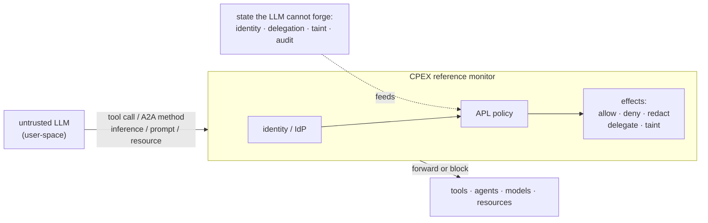

# CPEX

**A policy and authorization framework for agentic applications.**

CPEX is a deterministic reference monitor between an untrusted LLM and the capabilities it invokes. The LLM is user-space. CPEX mediates every operation it triggers (tool calls, A2A methods, inference calls, prompt and resource fetches) against state the model cannot see or forge: identity, delegation chains, taint labels, and an append-only audit log.

You write policy in **APL** (Authorization Policy Language): declarative, attribute-based rules with explicit effects. CPEX evaluates that policy at the boundary and enforces the result, allowing, denying, redacting, delegating, or tainting before the operation proceeds.

The plugin pipeline underneath (hooks, the plugin manager, execution modes) is the mechanism that runs policy effects. It is the supporting layer, not the headline. APL is how you express intent; the pipeline is how that intent executes.

---



### Get started

Stand up CPEX as an enforcement point and run your first policy.

[Quick Start &rarr;]()

<--->

### Write policy

Learn APL: predicates, effects, sequencing, PDPs, delegation, and tainting.

[APL &rarr;]()

<--->

### Why CPEX

The reference-monitor model and where CPEX sits in an agent stack.

[Vision &rarr;]()


