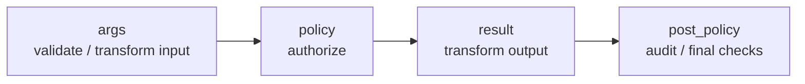

# APL: configuring enforcement pipelines

APL is the declarative configuration that defines a CPEX enforcement pipeline. Each capability an agent can invoke (a tool, resource, prompt, or A2A method) defines its own pipeline through a **route** that sequences the controls protecting it, evaluated at the boundary. You describe the conditions and the effects; you do not write enforcement logic in application code.


This page covers the configuration: routes, phases, predicates, rules, and field pipelines. The rest of this section goes deeper on each kind of policy:

- [Effects & Sequencing](): the effects a rule can run, halt-on-deny ordering, and composition.
- [PDP Integration](): hand a decision to Cedar, CEL, or an external engine.
- [Identity & IdP](): how callers are resolved into the attributes predicates read.
- [Delegation](): mint scoped downstream credentials via token exchange.
- [Session Tainting](): information-flow control across requests.

## Routes and phases

Policy is organized by **route**: an operation CPEX mediates, identified by the tool, A2A method, or other interface it governs. Each route runs through four phases, in order:



- **args**: validate and transform request inputs before the operation runs.
- **policy**: authorize the operation. Predicates, PDP calls, delegation, tainting.
- **result**: transform the response. Redaction and masking on the wire.
- **post_policy**: checks after the result is known. Audit, post-delegation verification.

The first `deny` in any phase halts that phase and every later phase. Nothing reaches the backend after a deny in `args` or `policy`.

```yaml
routes:
  - tool: get_employee
    args:
      employee_id: "str"
    policy:
      - "require(authenticated)"
      - "delegation.depth > 2: deny"
    result:
      ssn: "str | redact(!perm.view_ssn)"
      salary: "int | redact(!role.hr)"
      employee_id: "str | mask(4)"
```

## Predicates

A predicate reads attributes resolved from the caller's identity and request context (see [Identity]() for where attributes come from). The forms:

- **Truthiness**: a bare attribute is true when present and truthy. `authenticated`, `role.hr`, `perm.view_ssn`.
- **Comparison**: `delegation.depth > 2`, `client.trust_level == 'trusted'`. Operators: `==`, `!=`, `>`, `>=`, `<`, `<=`.
- **Set membership**: `subject.id in authorized_users`, `subject.id not in banned_list`.
- **Existence**: `exists(delegation.origin_subject_id)` is true when the attribute is present.
- **Containment**: `security.labels contains "secret"`.
- **Logical composition**: `&` (and), `|` (or), `!` (not). Precedence is `()` > `!` > `&` > `|`.

```yaml
- "(role.hr | role.security) & !delegated"
```

## Rules

A `policy:` (or `post_policy:`) entry is a rule. Two forms:

**`require(...)`** denies unless the predicate holds:

```yaml
- "require(authenticated)"
- "require(role.hr)"
- "require(!delegated)"
```

`require(a, b)` denies if either is false (an implicit and). `require(a | b)` denies only if both are false.

**`predicate: effect`** runs the effect when the predicate holds:

```yaml
- "delegation.depth > 2: deny"
- "security.labels contains \"secret\": deny('session touched secret data', 'session_tainted')"
```

`deny` takes an optional reason and code: `deny`, `deny('reason')`, or `deny('reason', 'code')`. The code is surfaced to the caller and the audit log.

For richer conditionals, use the `when` / `do` form, where `do` is a single effect or a list:

```yaml
- when: "role.hr & !perm.view_ssn"
  do:
    - "taint(restricted, session)"
    - "plugin(audit-log)"
```

## Field pipelines

`args:` and `result:` map a field to a pipeline of stages separated by `|`. Stages run left to right; a failed validator denies the phase.

```yaml
result:
  ssn: "str | redact(!perm.view_ssn)"
  email: "email"
  employee_id: "str | mask(4)"
```

The accepted stages:

| Category | Stages |
|----------|--------|
| Type validators | `str`, `int`, `bool`, `float`, `email`, `url`, `uuid` |
| Constraint validators | `enum(a, b, c)`, `regex("...")`, `len(1..100)`, range like `0..100` |
| Transforms | `mask(N)` (keep last N), `redact`, `redact(!predicate)` (redact unless), `omit`, `hash` |
| Scans | `pii.redact`, `pii.detect`, `injection.scan` |
| Dispatch | `plugin(name)` (alias `run(name)`), `taint(label[, scope])` |

Named-validator dispatch (`validate(name)`) is not implemented in the current build. Use `regex("...")` for pattern checks or `plugin(name)` to hand a field to a plugin.

## Effects beyond predicates

A `policy:` rule can also call a PDP, mint a delegated token, or invoke a plugin. Those effects and how they sequence are covered in [Effects]().

Every fragment on this page is drawn from the `apl-core` parser tests and the reference deployments, so the forms shown here parse as written.
