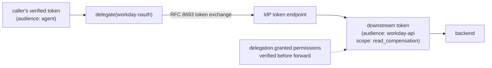

# Delegation and Token Exchange

When CPEX forwards an operation to a backend, the backend needs a credential. Forwarding the caller's inbound token is usually wrong: it is scoped for the agent, not the backend, and it carries more privilege than the operation needs. Delegation mints a fresh, narrowly scoped credential for the specific downstream call.

## The requirement

The scenario's `get_compensation` reads from a backend HR system that expects its own audience-scoped token with only the `read_compensation` scope. The caller never holds that token. CPEX must exchange the caller's verified identity for a downstream credential, scoped down to exactly what the operation needs, and only after authorization has passed.

## Delegation as an effect

`delegate` is an effect in the `authorization.pre_invocation` phase. It names a delegator plugin and the target it mints for:

```yaml
authorization:
  pre_invocation:
    - "require(role.hr)"
    - "delegate(workday-oauth, target: workday-api, audience: workday-api, permissions: [read_compensation])"
    - "delegation.granted.permissions contains 'read_compensation': allow"
```

The order matters. The `require` gate runs first, so a credential is only minted for a caller who passed authorization. After the exchange, a post-check verifies the credential actually carries the scope requested, and denies the operation if the IdP returned less.



## The delegator plugin

The bundled `delegator/oauth` plugin performs RFC 8693 token exchange against an IdP token endpoint:

```yaml
plugins:
  - name: workday-oauth
    kind: delegator/oauth
    hooks: [token.delegate]
    config:
      token_endpoint: "https://idp.example.com/realms/agents/protocol/openid-connect/token"
      client_id: "cpex-gateway"
      client_secret_source:
        kind: file
        path: /etc/cpex-secrets/client-secret
      default_outbound_header: "Authorization"
```

It exchanges the caller's inbound token for one scoped to `audience` with the requested `permissions`, and attaches it to the outbound request. The result populates delegation attributes that later rules read.

## Delegation attributes

After a `delegate` effect, policy can read the outcome and the delegation context:

| Attribute | Meaning |
|-----------|---------|
| `delegation.granted.permissions` | Scopes the IdP actually granted on the minted token. |
| `delegation.depth` | How many delegations deep this request is. |
| `delegated` | True when the request is acting under a delegated credential. |
| `delegation.origin_subject_id` | The original subject at the head of the chain. |
| `delegation.actor_subject_id` | The acting subject for this hop. |

These let policy reason about the chain itself, for example `require(delegation.depth <= 1)` to refuse deeply nested delegation, or the post-check above to enforce least privilege on what was actually granted.

## How it connects to the pipeline

`delegate` dispatches to a plugin implementing the `token.delegate` hook. The minted credential is recorded in the request's delegation context and the audit log. Because delegation is an explicit effect rather than a side effect of forwarding, it is sequenced like any other effect: gated behind authorization, followed by verification, and halted on error when configured with `on_error: deny`.
