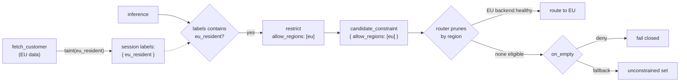

# Backend Restriction

Some controls are not about *whether* an operation runs, but *where* it runs. "EU customer data must be inferred on EU backends." "This tenant may only use the cheap model tier." The agent asks for a **class** of backend — "inference" — and policy shapes which concrete backends are eligible. That shaping is the `restrict` effect.

`restrict` declares a predicate over backend attributes, narrowing the set of backends the host's router may select from. It never picks a backend and never allows or denies the request — the router still chooses the best survivor by health and load. Like `taint`, it is an **accumulating** effect: every `restrict` that fires only ever *narrows* the set, and multiple restrictions compose by conjunction.

## What `restrict` is not

`restrict` is not an access-control verb. "May I use this *named* backend?" is a `require` / `deny`. `restrict` only shapes a set the router chooses from.

| Situation | Verb |
|-----------|------|
| The agent named a specific target ("model `gpt-4o`", "tool X at site A") | `require` / `deny` |
| The agent asked for a class ("inference"); policy shapes which backends are eligible | **`restrict`** |

## The requirement

A tenant is EU-resident: its data must stay in-region. When the agent runs inference on that tenant's data, only EU inference backends are eligible — and if none are reachable, the request must fail rather than silently spill to a US backend. The agent never named a backend; it asked for "inference." The control has to live in routing, not in the prompt.

## Declaring a restriction

The session is marked when EU-resident data is read (see [Session Tainting]()); a later inference route restricts routing to EU backends when that label is present. Whether the caller's tenant is EU-resident is an operator-maintained fact, looked up from the [`data.*` static attributes]():

```yaml
routes:
  # Reading data for an EU-resident tenant marks the session.
  - tool: fetch_customer
    post_invocation:
      - when: "data.tenants[subject.tenant].data_region == 'eu'"
        do:
          - "taint(eu_resident, session)"

  # Later inference is pinned to EU backends while that label is set.
  - llm: "*"
    pre_invocation:
      - when: "security.labels contains 'eu_resident'"
        do:
          - restrict:
              allow_regions: [eu]
              on_empty: deny          # fail closed — never leave the region
```

`data.tenants[subject.tenant].data_region` indexes the tenant→region map by *this caller's* tenant; when it is `eu`, the session is tainted, and the inference route then narrows the candidate set to backends whose `region` label is `eu`. The router load-balances across the healthy EU backends.

## The constraint fields

A restriction is a small set of **typed fields** plus a `custom` label map. The shape is deliberately simple — it is a contract the host router evaluates against each backend's labels, not a predicate language.

| Field | Backend attribute | Match |
|-------|-------------------|-------|
| `allow_models` | `model` must be in the set | glob (`anthropic/claude-sonnet-*`) |
| `deny_models` | `model` must not be in the set | glob |
| `allow_regions` | `region` must be in the set | equality |
| `allow_sites` | `site` must be in the set | equality |
| `max_cost_tier` | `cost_tier` must be at or below the tier | ordered tiers |
| `custom` | backend must carry every label | equality (like a k8s `nodeSelector`) |
| `on_empty` | what to do when nothing is eligible | `deny` (default) or `fallback` |

`custom` is the escape hatch for backend attributes without a typed field: `custom: { gpu: h100 }` keeps only backends labelled `gpu=h100`. Unset fields place no constraint.

## Per-caller values from the attribute tree

The set-valued fields (`allow_models`, `deny_models`, `allow_regions`, `allow_sites`) take either a literal list *or* a `data.*` reference into the [static attribute tree]() — resolved per request. This lets one rule serve every caller instead of hard-coding a block per agent or tenant:

```yaml
# attributes/agents.yaml
data:
  agents:
    support-bot:  { allowed_models: ["vllm/*"] }
    research-bot: { allowed_models: ["anthropic/*", "vllm/*"] }
```

```yaml
routes:
  - llm: "*"
    pre_invocation:
      # allow_models is looked up from the tree by the caller's id.
      - restrict:
          allow_models: "data.agents[subject.id].allowed_models"
```

`support-bot` is restricted to `vllm/*`, `research-bot` to `anthropic/*` + `vllm/*` — one rule, values maintained in config. The distinction is by YAML shape: a **list** is a literal set; a bare **scalar** is a reference. Quote a reference that contains `[...]` (as above) so YAML doesn't read the brackets as an inline list.

If the referenced path doesn't resolve — an agent absent from the tree, a missing `subject.id` — the field resolves to the **empty set**: nothing qualifies, so `on_empty` decides (deny by default). An unknown caller is never silently unconstrained. (`max_cost_tier` and `custom` are literal-only.)

## Gating happens at the composition layer

`restrict` has no `when:` field of its own. Whether it fires is handled by APL's normal effect-gating — a `when:`/`do:` rule — exactly like every other effect. This keeps `restrict` orthogonal: it is *only* a set of backend constraints, and *whether* it applies is a normal predicate. So the two layers live apart: the `when:` gate is evaluated now, in CPEX, against the request; the constraint fields are evaluated later, by the host router, against its backends.

Because it is accumulating, `restrict` composes anywhere an effect can appear — top-level, inside a `when` body, inside `sequential` / `parallel`, and inside a PDP's `on_allow` block. That last one is a first-class pattern: let Cedar make the fine-grained decision, then pin routing on allow.

```yaml
pre_invocation:
  - cedar:
      action: 'Action::"read"'
      resource: { type: Dataset, id: eu_data }
    on_allow:
      - restrict: { allow_regions: [eu] }   # authz says yes → now pin routing to EU
```

## How a restriction reaches the router

Multiple `restrict` effects in one request **fold** into a single constraint: allow-sets intersect, deny-sets and `custom` grow, tier ceilings combine, and `on_empty` takes the strictest. The result rides out on the typed `candidate_constraint` extension (see [Extensions]()) — the same in-process channel minted delegation tokens use, not a request header.

The host router evaluates it. CPEX has no backend list and no live health, so it cannot run the match itself; it emits the constraint and the router — which owns the health-aware backend registry — checks each candidate's labels against it at selection time.



## Failing closed

`on_empty` decides what happens when a restriction prunes every candidate. Only the router knows which backends are actually reachable, so the choice rides out with the constraint:

- **`deny`** (default) rejects the request. Correct for hard constraints like data sovereignty — never silently escape the region.
- **`fallback`** reverts to the unconstrained set. An explicit opt-in for "prefer, but don't fail."

## How it connects to the pipeline

`restrict` is an effect like any other: it sequences with `require`, PDP calls, and `taint` (see [Effects]()), and its gate is an ordinary predicate. What makes it reliable is the same thing that makes tainting reliable — the decision is assembled from CPEX-owned state and handed to the router as a typed constraint, so the untrusted model cannot reword its way onto a backend that policy excluded. The clean split of ownership is the point: which backends exist and their health belong to the host; *which of them this request may use* is policy's to shape.
