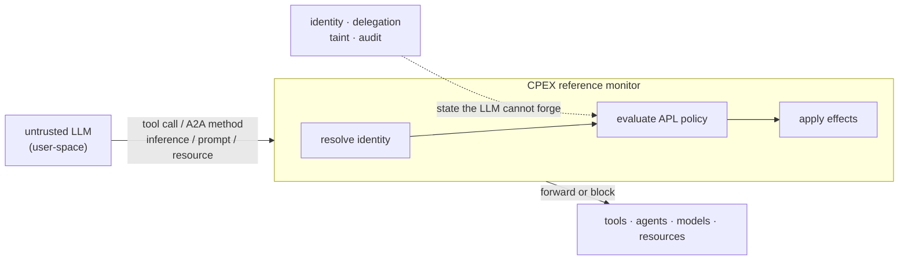
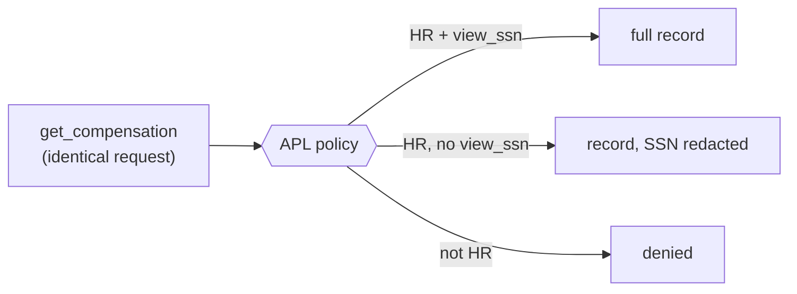
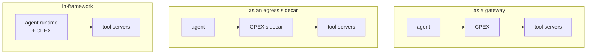

# How CPEX Works

## A running scenario

Picture one agent serving several people. It answers questions by calling tools (an HR records service, a code repository, an email sender), invoking other agents over A2A, running inference, and fetching prompts and resources. The backends are shared. The callers are not: an HR analyst, an engineer, and a support rep each drive the same agent with different identities and different entitlements.

The agent's LLM decides which operation to run. It is untrusted. CPEX sits between it and every capability, and decides what actually happens.



For each operation, CPEX resolves the caller's identity, evaluates the APL policy attached to that operation, and applies the resulting effects before anything reaches the backend. The same four phases run every time: validate arguments, evaluate policy, transform the result, run post-policy checks.

## Same request, different data

The clearest demonstration is redaction on the wire. Three callers issue the identical request, `get_compensation`. The backend returns the same record. What each caller receives differs, because policy decides per identity.

```yaml
routes:
  - tool: get_compensation
    policy:
      - "require(role.hr)"
    result:
      ssn: "str | redact(!perm.view_ssn)"
```

- An HR analyst with the `view_ssn` permission gets the full record.
- An HR analyst without `view_ssn` gets the same record with the SSN redacted before it leaves CPEX. The backend never sees the difference; the redaction happens at the boundary.
- An engineer is denied at `require(role.hr)`. The call never reaches the backend.



No application code changed between the three outcomes. The policy did.

## State that follows the session

Some controls depend on what already happened. When a caller reads compensation data, the policy above marks the session with `taint(secret, session)`. A later operation can refuse based on that label, even when its own payload is clean:

```yaml
routes:
  - tool: send_email
    policy:
      - "require(perm.email_send)"
      - "security.labels contains \"secret\": deny('session touched secret data', 'session_tainted')"
```

An email with no sensitive content in its body is still blocked if the session previously read secret data. This is a write-down control, and the LLM cannot route around it because the taint lives in CPEX, not in the conversation. See [Session Tainting]() for how labels propagate and persist.

## Where the boundary sits

CPEX is the boundary, but the boundary can be placed in more than one spot. The policy does not change; the enforcement point does.



A gateway in front of a tool server controls inbound calls. A sidecar on the agent controls its outbound calls. An in-framework integration controls operations as the runtime issues them. The same APL policy enforces in all three. [Deployment]() walks through each.

## What to read next

- [APL](): the policy language, end to end.
- [Identity](): how callers are resolved into the attributes policy reads.
- [Quick Start](): stand up CPEX and run this scenario.
