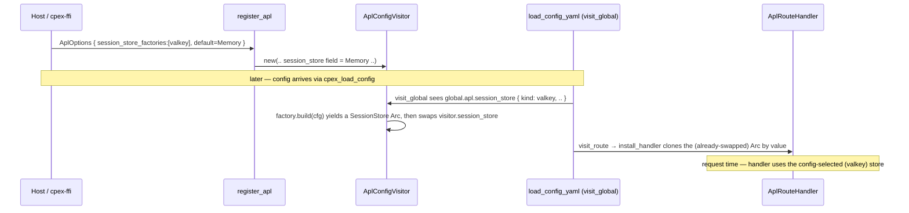
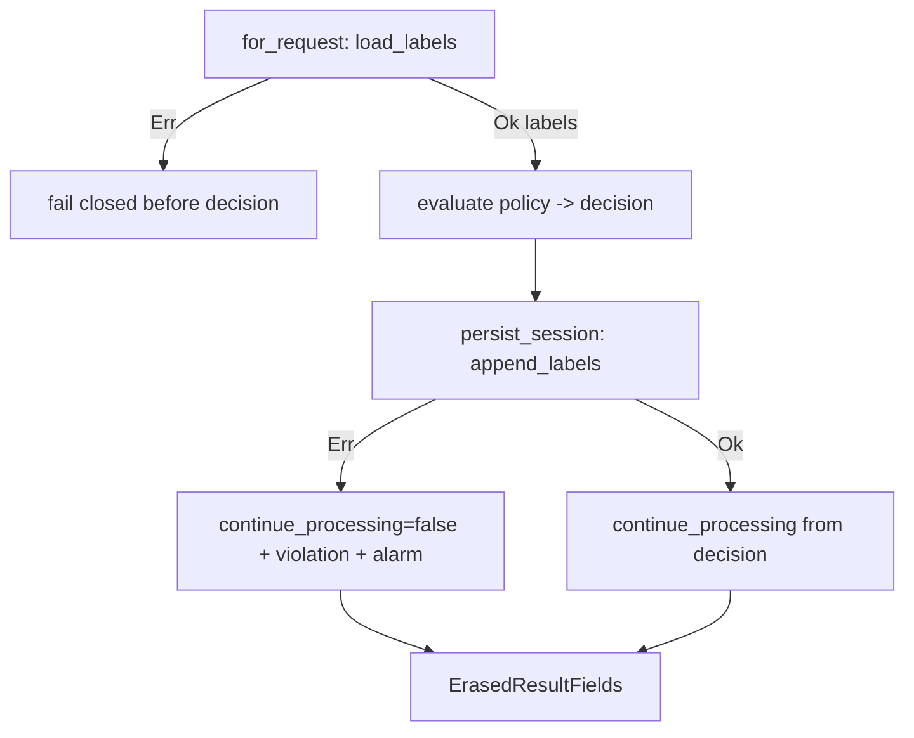

# feat: Valkey-backed SessionStore for CPEX

## Summary

Add a config-selectable, Valkey-backed `SessionStore` alongside the in-process `MemorySessionStore`, so session security labels persist across restarts and are shared across gateway nodes. The work lands in eight dependency-ordered units: make the `SessionStore` trait fallible, propagate fail-closed semantics through the CMF invoker and route handler, add a `SessionStoreFactory` config seam, build a new feature-gated `apl-session-valkey` crate (redis-rs + deadpool-redis over rustls) with an atomic-SADD store, wire the factory through the FFI, add container-backed integration tests, and write operator docs.

---

## Problem Frame

CPEX embeds in an AI gateway mediating A2A/MCP interactions. Session security labels (`extensions.security.labels` — a monotonic taint set per `session_id` driving information-flow authorization) live only in a process-local `HashMap` (`MemorySessionStore`), so they vanish on restart and are invisible across nodes — both silent, security-relevant failures. See origin for the full frame and the resolved fail-closed/TTL/selection decisions.

---

## Requirements

Carried from origin (`docs/brainstorms/valkey-session-store-requirements.md`); R-IDs trace to it.

- R1. Valkey-backed `SessionStore` implementing the trait surface, usable alongside `MemorySessionStore`.
- R2. Config-driven backend selection via a `SessionStoreFactory` (mirrors `PdpFactory`), `kind:`-tagged block under `global.apl`; host registers the factory.
- R3. Default remains `MemorySessionStore` when no session-store config block is present.
- R4. `SessionStore` trait methods return `Result`; `MemorySessionStore` adapts; all call sites (`for_request`, `persist_session`, `route_handler.rs`) propagate. Crate-local `thiserror` error type, not `anyhow`.
- R5. Unreachable/timeout/error, **and** reachable-but-undecodable/partial responses → store error (fail-closed). Distinct from a positively-confirmed key-miss (R15).
- R6. Primary-only reads (read-your-writes); no replica read-splitting.
- R7. Configurable sliding TTL refreshed on load and append; default off. Refresh-on-load is a write; define load/refresh-failure semantics.
- R8. Document the TTL soundness rule (TTL ≥ max session-identity lifetime).
- R9. Configurable key prefix/namespace (software); `noeviction` as operator runbook note + optional startup `CONFIG GET maxmemory-policy` self-check.
- R10. Single endpoint with optional password/ACL auth; **TLS required for non-localhost**.
- R11. Minimal connection config (single endpoint, TLS, auth); no pre-added Sentinel/Cluster fields.
- R12. Valkey container/compose setup for local dev and integration tests.
- R13. Own crate, feature-gated into `cpex-ffi` (`valkey = ["dep:apl-session-valkey"]`) **and** excluded from `default-members`.
- R14. Connection/client logic internal to the crate; no pre-factored shared layer for the deferred token cache.
- R15. Monotonic union semantics; unknown session (confirmed key-miss) returns empty, not error; monotonic within the TTL window.
- R16. `append_labels` is a single atomic server-side set-union; no client-side read-modify-write.
- R17. Startup WARNING when configured TTL < declared max session-identity lifetime.
- R18. Append error fails the request closed uniformly with load error (via `continue_processing` computed after `persist_session`); distinguished append-failure alarm on the selective-failure residual.

**Origin actors:** A1 (gateway node), A2 (operator), A3 (Valkey endpoint).
**Origin flows:** F1 (cross-node/cross-restart propagation), F2 (store error → fail-closed).
**Origin acceptance examples:** AE1 (R4,R5 load fail-closed), AE2 (R7 TTL refresh), AE3 (R3,R15 default unchanged), AE4 (R1,R6,R15 cross-node union), AE5 (R2 config selection), AE6 (R18 append fail-closed + alarm).

---

## Scope Boundaries

- Sentinel/Cluster support, replica read-splitting, local in-process fallback, declassification/label removal, broader session KV surface, sharing per-node compute caches through the store — all out of scope (see origin).
- OAuth/exchanged token cache (`TokenCacheControl`) — the eventual second consumer and the trigger to extract a shared connection layer; not built here, connection layer not pre-factored.
- Application-level HMAC/signing of stored labels — out of scope for v0 (see Key Technical Decisions); the trust model is TLS/ACL/`noeviction`/network isolation.

### Deferred to Follow-Up Work

- HMAC-of-stored-values: revisit only if a deployment's threat model includes a Valkey writable by a party who cannot reach the gateway's signing key.

---

## Context & Research

### Relevant Code and Patterns

- `crates/apl-cpex/src/session_store.rs` — `SessionStore` trait (`#[async_trait]`, `load_labels -> Vec<String>`, `append_labels -> ()`), `MemorySessionStore`, unit-test shape (sort-before-assert, `Arc<dyn SessionStore>`).
- `crates/apl-cpex/src/cmf_invoker.rs` — `for_request` (`-> Self`, calls `load_labels` during hydration) and `persist_session` (`-> ()`, calls `append_labels`). The only two trait call sites.
- `crates/apl-cpex/src/route_handler.rs` — builds invoker via `for_request().await`, calls `persist_session().await` after evaluation; `continue_processing` derived from `decision.decision` **after** persist. Handler returns `Result<_, Box<PluginError>>`.
- `crates/apl-core/src/step.rs` — `PdpFactory` trait (`kind()` + `build(&serde_yaml::Value) -> Result<Arc<dyn PdpResolver>, Box<dyn Error+Send+Sync>>`): the model to mirror.
- `crates/apl-cpex/src/visitor.rs` — `visit_global` walks `global.apl.pdp[]` and consults factories during the config walk; `build_pdp_from_config`. Session store, by contrast, is captured at visitor construction (`register.rs`), not built during the walk — the seam to bridge.
- `crates/apl-cpex/src/register.rs` — `AplOptions { session_store, pdp_factories, ... }`, `register_apl`; `AplOptions::in_process()` defaults to `MemorySessionStore`.
- `crates/cpex-ffi/src/apl.rs` — `cpex_apl_install` hardcodes `in_process()`, registers `pdp_factories`, receives no YAML (config arrives later via `cpex_load_config`).
- `crates/cpex-ffi/Cargo.toml` + root `Cargo.toml` — `apl-cedarling` optional-dep + `cedarling = ["dep:apl-cedarling"]` feature, plus `default-members` exclusion: the exact pattern R13 mirrors.
- `crates/apl-pdp-cel/` — reference leaf-crate layout (`Cargo.toml`, `lib.rs`, `factory.rs`, `error.rs`, `resolver.rs`, `tests/visitor_cel_config.rs`), `pub const KIND`, `thiserror` `BuildError`.
- `crates/apl-pdp-cel/tests/visitor_cel_config.rs` — canonical config-driven-backend integration-test harness (register_apl → load_config_yaml → initialize → invoke_named).
- `crates/apl-delegator-oauth/Cargo.toml`, `crates/apl-identity-jwt/Cargo.toml` — `reqwest = { default-features = false, features = ["json","rustls-tls"] }`: the rustls-over-native-tls discipline.
- `crates/cpex-core/src/error.rs` — `PluginError` (`Config { message }`, `Denied { violation }`, …) and host propagation.

### Institutional Learnings

- No `docs/solutions/` knowledge base exists; the origin requirements doc is the authoritative spec. After this lands, capture the trait-change and client decisions somewhere durable.
- PR #67 lesson: external-dependency tests silently passed as no-ops when the native module was absent. Integration tests here must skip **loudly** and be **CI-enforced** (env gate) so they cannot green-wash zero coverage.
- File-header convention (Location/Copyright/SPDX/Authors) is `make`-checked and mandatory on every new file.

### External References

- redis-rs (`redis` 1.x) docs.rs — `aio`/`tokio-comp`/`tokio-rustls-comp` features (tokio-rustls 0.26 + rustls 0.23, no native-tls), `AsyncConnectionConfig` timeouts, `ConnectionManager` reconnect/backoff, `pipe().atomic()` for MULTI/EXEC, `RedisError` predicates (`is_timeout`/`is_io_error`/`is_connection_dropped`, `ErrorKind::Parse`/`UnexpectedReturnType`).
- `deadpool-redis` 0.23 — external pool forwarding `tokio-rustls-comp`.
- Valkey docs — Transactions (MULTI/EXEC isolation), EXPIRE (refresh updates TTL; SADD leaves TTL untouched; overwrite commands clear it), Eviction (`noeviction`, `evicted_keys`), Replication (async → stale-read fail-open), ACL (least-privilege `~taint:v1:* +sadd +smembers +expire +config|get`), TLS/mTLS.
- AWS Builders' Library — timeouts/retries/backoff-with-jitter, circuit breaker, retry-storm avoidance (token-bucket budget).
- `testcontainers-modules` valkey feature.

---

## Key Technical Decisions

- **Config seam = factory + in-visitor store swap.** Add a `SessionStoreFactory` trait mirroring `PdpFactory`; the visitor consults it on a `global.apl.session_store` block during `visit_global`. Because `visit_global` runs before `install_handler` in the config walk, it can swap the visitor's own `session_store` field before any handler captures it — no per-request indirection, no handler-signature change, no new FFI entry point. (`ArcSwap` is reserved for a future live-reload need, not v0; see U3.) Rationale: truest fit for R2/AE5 and host-agnostic; the FFI-boundary alternative would not satisfy "selected via the walked YAML."
- **Client = `redis` (redis-rs) 1.x + `deadpool-redis` 0.23, `default-features=false`, `tokio-rustls-comp`.** Leanest deps, no forced crypto provider, tokio-minimal, CI-tested against Valkey 7+, `pipe().atomic()` = SADD+EXPIRE in one MULTI/EXEC. fred is the heavier batteries-included alternative; rejected on dep weight + older release cadence.
- **Key schema = `taint:v1:<hex(sha256(session_id))>` SET.** Full-width SHA-256 keeps the Valkey keyspace itself collision-free and removes raw ids from the keyspace (charset-safe). It does **not** restore entropy lost upstream: `session_id` is already a 64-bit truncated digest from `session_resolver.rs` (`short_hash`), so two subjects colliding there already share one logical session and will deterministically share one Valkey key — closing that upstream collision (a wider `short_hash`) is out of scope here (cross-referenced as a residual). `SADD` for atomic union, `SMEMBERS` for load.
- **No application-level HMAC in v0.** Signing protects against altered labels but not deletion/under-labeling (the primary risk) and only helps if the attacker can't reach the gateway's signing key. Trust Valkey within the boundary (TLS/mTLS + least-privilege ACL + `noeviction` + network isolation); document the residual.
- **Fail-closed error mapping:** `Ok(empty set)` → empty labels (unknown session, R15); `Err` where `is_timeout|is_io_error|is_connection_dropped` or `ErrorKind::Parse|UnexpectedReturnType` → store error (R5). Empty-set is never an error (SMEMBERS on a missing key returns `[]`).
- **Append fail-closed mechanism:** `persist_session` returns `Result`; `route_handler.rs` converts an append `Err` into `continue_processing = false` + a `PluginViolation` (e.g. `session.persist_failed`) **before** building `ErasedResultFields`, since that struct is constructed after persist. Emit a distinguished append-failure metric/log (R18).
- **TTL via atomic pipeline:** `pipe().atomic().sadd(...).ignore().expire(...).ignore()` for append+refresh in one round trip. On load, a separate `EXPIRE` refresh is **fail-open for the current request**: the successfully-read labels are returned `Ok`, and a refresh failure is alarmed (not failed-closed) — the read itself succeeded. Cross-request consequence (a persistently-failing refresh lets a sliding-TTL key expire → a later load returns `Ok(empty)`, silently dropping taint) is covered by the alarm and documented in U8; this is the deliberate trade for not denying a request whose labels were read correctly.
- **Timeouts/retries (committed defaults, configurable):** ship concrete defaults so behavior and tests are deterministic — connect timeout **250ms**, per-command response timeout **500ms** (never `None`), **1** jittered retry behind a token-bucket budget at a single layer, circuit-breaker opens after **N consecutive failures** (default e.g. 5) → immediate fail-closed. Operators tune these from the committed baseline; they are not left undecided.

---

## Open Questions

### Resolved During Planning

- Config-selection seam (origin deferred): resolved → factory + `arc-swap` late-bound handle (see Key Technical Decisions, U3).
- Client + pooling choice (origin deferred): resolved → redis-rs + deadpool-redis, rustls.
- Key/value representation (origin deferred): resolved → prefixed SHA-256 SET, SADD/SMEMBERS, atomic SADD+EXPIRE.
- rustls alignment (origin deferred): resolved → `tokio-rustls-comp` (tokio-rustls 0.26 + rustls 0.23), no native-tls/openssl.
- Label integrity/HMAC (origin deferred): resolved → no HMAC in v0; trust-boundary controls instead.
- Timeout/retry budget (origin deferred): resolved as configurable defaults (see Key Technical Decisions); exact production values are operator-tuned.

### Deferred to Implementation

- **Config live-reload behavior** — if `load_config_yaml` re-walks the *same* `AplConfigVisitor` on reload, the v0 in-visitor swap re-targets the field but already-installed handlers captured the prior `Arc` by value, and in-flight requests hold the prior store. v0 does **not** support session-store live-reload; if/when required, this is the one case that justifies the `ArcSwap` handle (U3). State the v0 limitation in U8.
- Whether the `CONFIG GET maxmemory-policy` self-check and the TTL-vs-lifetime warning run at factory `build()` time or at first connection — depends on when a live connection is first available.
- Exact `PluginError`/`PluginViolation` variant names and `SessionStoreError` variants — finalize against the surrounding code. The committed timeout/retry defaults (250ms/500ms/1-retry/5-failure-breaker) are tuning baselines, not open questions.
- **R14 verification** — "no public connection-layer API" is enforced by inspection (the `connection` module stays non-`pub` in `lib.rs`); there is no runtime test for it. Flag for reviewer check rather than a test assertion.

---

## Output Structure

    crates/apl-session-valkey/
      Cargo.toml
      src/
        lib.rs          # module docs, pub use surface, pub const KIND
        config.rs       # YAML config parse: endpoint, TLS, auth, prefix, TTL, timeouts
        error.rs        # thiserror BuildError (config/connection construction)
        connection.rs   # internal: redis-rs + deadpool-redis pool, rustls, timeouts, reconnect
        store.rs        # ValkeySessionStore: SADD/SMEMBERS, atomic pipeline, key schema, error mapping
        factory.rs      # ValkeySessionStoreFactory: kind()="valkey", build(&serde_yaml::Value)
      tests/
        valkey_store_integration.rs   # testcontainers valkey: union/TTL/noeviction/ACL/fail-closed
    docs/
      operations/valkey-session-store.md   # operator runbook (R8/R9/R10)
    deploy/
      valkey-compose.yml                   # local dev / integration container

---

## High-Level Technical Design

> *This illustrates the intended approach and is directional guidance for review, not implementation specification. The implementing agent should treat it as context, not code to reproduce.*

Config-selection seam — how a `kind: valkey` block becomes the active store without changing the FFI's no-YAML install contract:

Fail-closed wiring across load (pre-decision) and append (post-decision):

---

## Implementation Units

- U1. **Make `SessionStore` fallible**

**Goal:** Change the trait to return `Result` with a crate-local error type; adapt `MemorySessionStore` and its tests.

**Requirements:** R4, R15

**Dependencies:** None

**Files:**
- Modify: `crates/apl-cpex/src/session_store.rs`
- Create: `crates/apl-cpex/src/session_store_error.rs` (or an inline `SessionStoreError` in `session_store.rs`)
- Test: `crates/apl-cpex/src/session_store.rs` (existing `#[cfg(test)] mod tests`)

**Approach:**
- Define `SessionStoreError` via `thiserror` (workspace dep), variants covering connection/timeout, decode/protocol, and a generic backend message. Keep it string-friendly so non-CMF bridges can map it.
- Change `load_labels -> Result<Vec<String>, SessionStoreError>` and `append_labels -> Result<(), SessionStoreError>`. Preserve the R15 contract in the doc comment: unknown session → `Ok(empty)`, never `Err`.
- `MemorySessionStore` returns `Ok(...)`; update the four unit tests to `.await.unwrap()`.

**Patterns to follow:** `crates/apl-pdp-cel/src/error.rs` (thiserror `BuildError`); existing async-trait usage in `session_store.rs`.

**Test scenarios:**
- Happy path: `append_then_load` round-trips, returns `Ok`. Covers AE3.
- Edge case: unknown session → `Ok(empty)`, not `Err`. Covers AE3.
- Edge case: monotonic dedupe across appends still holds under the `Result` signature.

**Verification:** `apl-cpex` compiles; memory-store unit tests pass; trait doc states the unknown-session = `Ok(empty)` invariant.

---

- U2. **Propagate fail-closed through CMF invoker + route handler**

**Goal:** Thread the `Result` through `for_request`/`persist_session` and make `route_handler.rs` fail the request closed on load (pre-decision) and append (post-decision) errors, with a distinguished append-failure alarm.

**Requirements:** R4, R5, R18; F2; AE1, AE6

**Dependencies:** U1

**Files:**
- Modify: `crates/apl-cpex/src/cmf_invoker.rs` (`for_request`, `persist_session`)
- Modify: `crates/apl-cpex/src/route_handler.rs` (`invoke`)
- Create: a test-double `SessionStore` (erroring + call-recording) — none exists today (all test sites use `MemorySessionStore`); place under `crates/apl-cpex/src/session_store.rs` `#[cfg(test)]` or a shared `tests/support/` module.
- Test: `crates/apl-cpex/tests/cmf_invoker_dispatch.rs`, `crates/apl-cpex/tests/end_to_end_route.rs`

**Approach:**
- `for_request` → `Result<Self, …>`; a load error `?`-propagates as `Box<PluginError>` so the request fails closed before any decision (load runs pre-evaluation). Note: `load_labels` only runs when `session_id` is `Some` — sessionless/anonymous traffic has no state to load and is unaffected by a store outage (see blast-radius note in U8/R5).
- `persist_session` → `Result<(), …>`. In `invoke`, capture its `Result` (today it is a bare `.await;` discarding `()`), then apply this explicit **merge precedence** when building the `(continue_processing, violation)` tuple that feeds `ErasedResultFields` (a single `Option<PluginViolation>` slot):
  - decision = **Allow** + append `Ok` → `(true, None)` (unchanged).
  - decision = **Allow** + append `Err` → flip to `(false, Some(session.persist_failed violation))`.
  - decision = **Deny** + append `Err` → keep the original policy violation (preserve attribution); `continue_processing` is already `false`. The append failure surfaces **only** as the distinguished alarm/metric, not in the violation slot.
- Emit a distinguished `tracing` error + metric on append failure regardless of decision (the selective-failure residual). Note `persist_session` no-ops when no new labels were added, so the append-fail path is only reachable on label-producing requests.

**Execution note:** Start with a failing integration test asserting append-error → Deny (AE6), then wire the handler.

**Patterns to follow:** `PluginError::Config`/`Denied` construction in `route_handler.rs`; existing `end_to_end_route.rs` harness.

**Test scenarios:**
- Error path: `load_labels` returns `Err` during hydration → `invoke` fails closed, no decision computed. Covers AE1.
- Error path: decision Allow + `append_labels` `Err` → `continue_processing=false` + `session.persist_failed` violation + alarm. Covers AE6.
- Error path: decision Deny + `append_labels` `Err` → original policy violation preserved, append failure only alarmed (merge precedence).
- Happy path: both `Ok` → behavior identical to today (Allow still allows, Deny still denies). Covers AE3.
- Integration: a fake store erroring only on append (reads succeed) → request denied and alarm fired (selective-failure residual).
- Edge case: sessionless request (no `session_id`) during a simulated store outage → unaffected (no load, no append).

**Verification:** New tests pass; a store error never yields an Allow with dropped labels; existing route tests still pass with the memory store.

---

- U3. **`SessionStoreFactory` trait + config-selection seam**

**Goal:** Add config-driven backend selection mirroring `PdpFactory`, with a late-bound active-store handle so the config walk can install the selected store.

**Requirements:** R2, R3; AE3, AE5

**Dependencies:** U1

**Files:**
- Modify: `crates/apl-core/src/step.rs` (or a new `apl-core` module) — define `SessionStoreFactory`
- Modify: `crates/apl-cpex/src/register.rs` (`AplOptions.session_store_factories` + the exhaustive `AplOptions { .. }` destructure at the top of `register_apl`)
- Modify: `crates/apl-cpex/src/visitor.rs` (`visit_global` consults `global.apl.session_store`; swap the visitor's own store field)
- Modify the exhaustive `AplOptions { .. }` struct-literal sites that will otherwise fail to compile (no `..Default::default()` today): `crates/apl-cpex/tests/config_override.rs`, `crates/apl-cpex/tests/visitor_e2e.rs`, `crates/apl-cpex/tests/capability_gating.rs` (3 sites), `crates/apl-pdp-cel/tests/visitor_cel_config.rs`, `crates/apl-pdp-cedar-direct/tests/visitor_pdp_config.rs`. Consider adding `Default`/a builder for `AplOptions` so future field additions don't break literals.
- Test: `crates/apl-cpex/tests/config_override.rs` (or a new `tests/session_store_config.rs`)

**Approach:**
- `SessionStoreFactory`: `kind() -> &str`, `build(&serde_yaml::Value) -> Result<Arc<dyn SessionStore>, Box<dyn Error+Send+Sync>>` — exact shape of `PdpFactory`.
- `AplOptions.session_store_factories: Vec<Arc<dyn SessionStoreFactory>>`, registered into the visitor like `pdp_factories`. Empty list → memory default, so existing `AplOptions::in_process()` callers are unaffected.
- **Primary mechanism (simplest correct):** `visit_global` runs strictly before `visit_route`/`install_handler` during the config walk (confirmed: `visitor.rs:307` vs `381+`, ordering in `manager.rs`). So `visit_global` parses the optional `global.apl.session_store { kind, ... }`, looks up the factory, builds the store, and **swaps the visitor's own `session_store` field**; `install_handler` then clones the already-selected `Arc<dyn SessionStore>` into each handler by value, exactly as today. No per-request indirection and no handler-signature change.
- **`ArcSwap` is reserved for live config-reload only** — re-targeting *already-installed* handlers after a swap. v0 does not support session-store live-reload (see Deferred to Implementation); if added later, use `Arc<ArcSwapAny<Arc<dyn SessionStore>>>` (the inner `Arc<dyn>` must be sized) on a shared handle the handler reads. Do not pay the per-request `ArcSwap` load cost in v0.
- No block present → default memory store (R3). Unknown `kind` / malformed block → `VisitorError` failing `load_config_yaml`.

**Technical design:** see High-Level Technical Design sequence diagram (directional).

**Patterns to follow:** `build_pdp_from_config` + `register_pdp_factory` in `visitor.rs`; `PdpFactory` in `apl-core/src/step.rs`.

**Test scenarios:**
- Happy path: no `session_store` block → memory store active; load/append unchanged. Covers AE3.
- Happy path: a `kind: <test-fake>` block → the fake store is selected and observed at request time. Covers AE5 (structure; Valkey-specific selection verified in U7).
- Error path: unknown `kind` → config load fails with a clear error.
- Edge case: handle defaults to memory before the walk; after the walk the swapped store is visible to a freshly installed handler.

**Verification:** A config-selected fake store receives `append_labels`/`load_labels` calls during an end-to-end route; default path unchanged.

---

- U4. **`apl-session-valkey` crate: connection layer + config**

**Goal:** Scaffold the new feature-gated crate with config parsing and an internal redis-rs/deadpool connection module over rustls.

**Requirements:** R10, R11, R13, R14

**Dependencies:** None (parallel with U1–U3)

**Files:**
- Create: `crates/apl-session-valkey/Cargo.toml`, `src/lib.rs`, `src/config.rs`, `src/error.rs`, `src/connection.rs`
- Modify: root `Cargo.toml` (add to `members`, **not** `default-members`)
- Test: unit tests in `src/config.rs` (`#[cfg(test)]`)

**Approach:**
- `redis = { version = "1.2", default-features = false, features = ["aio","tokio-comp","tokio-rustls-comp","connection-manager"] }`, `deadpool-redis = { version = "0.23", default-features = false, features = ["rt_tokio_1","tokio-rustls-comp"] }`, `thiserror`/`serde`/`serde_yaml`/`tracing`/`async-trait` from workspace. Document the rustls/no-native-tls rationale in `Cargo.toml` (mirror oauth/jwt comments).
- `config.rs`: parse endpoint (URL or host:port), TLS settings (TLS required when host is non-localhost — reject plaintext non-localhost at parse time, R10), auth (password/ACL, sourced from config/env), key prefix, TTL (optional; default off), and timeout/retry knobs with safe defaults. `BuildError` (thiserror) for malformed config.
- `connection.rs`: build the deadpool pool with connect + response timeouts and a jittered, budgeted reconnect policy. Internal module only (R14) — no public connection-layer API.
- File headers on every file (Location/Copyright/SPDX/Authors), `*.workspace = true` package fields.

**Patterns to follow:** `crates/apl-pdp-cel/Cargo.toml` + layout; `reqwest` rustls feature lines in `apl-delegator-oauth`/`apl-identity-jwt`; `apl-cedarling` exclusion in root `Cargo.toml`.

**Test scenarios:**
- Happy path: a well-formed YAML block parses into the config struct with expected endpoint/TLS/prefix/TTL.
- Edge case: non-localhost endpoint without TLS → `BuildError` (R10).
- Edge case: missing endpoint / unknown key → `BuildError`.
- Error path: TTL present but unparseable → `BuildError`.

**Verification:** `cargo build -p apl-session-valkey` succeeds; `cargo build` (default-members) is unaffected; config unit tests pass; no native-tls/openssl in the dep tree (`cargo tree` shows rustls only).

---

- U5. **`ValkeySessionStore`: atomic union, TTL, fail-closed mapping**

**Goal:** Implement the trait against Valkey with an atomic SADD+EXPIRE, SMEMBERS load, the prefixed-SHA-256 key schema, and the R5/R15 error mapping.

**Requirements:** R1, R5, R6, R7, R8, R9, R15, R16, R17

**Dependencies:** U1, U4

**Files:**
- Create: `crates/apl-session-valkey/src/store.rs`
- Test: `crates/apl-session-valkey/tests/valkey_store_integration.rs` (U7 owns the harness; basic per-method assertions can start here)

**Approach:**
- Key = `<prefix>:<hex(sha256(session_id))>`; SET value-space.
- `append_labels`: `pipe().atomic().sadd(key, members).ignore()` and, when TTL configured, `.expire(key, ttl).ignore()` — one MULTI/EXEC round trip (R16); inspect EXEC replies and map any error to `Err`.
- `load_labels`: `SMEMBERS key` → `Ok(set)`; on configured TTL, refresh via `EXPIRE` that is **fail-open for the request** — return the read labels `Ok` and alarm on refresh failure (the read succeeded; see Key Technical Decisions). `Ok(empty)` for a missing key (R15).
- Error mapping (R5): `is_timeout|is_io_error|is_connection_dropped` or `ErrorKind::Parse|UnexpectedReturnType` → `SessionStoreError`. Primary-only connection (R6 — no replica routing).
- Startup self-checks: `CONFIG GET maxmemory-policy` → warn if not `noeviction` (R9); warn if configured TTL < declared max session-identity lifetime (R17). Exact timing per Deferred-to-Implementation.

**Execution note:** Implement append/load test-first against the U7 container harness.

**Patterns to follow:** redis-rs `pipe().atomic()` and `RedisError` predicates (External References); R15/R5 mapping sketch from the brainstorm.

**Test scenarios:**
- Happy path: append then load round-trips the union (single node). Covers AE4 (single-node leg).
- Edge case: unknown session → `Ok(empty)` (key-miss, not error). Covers R15.
- Edge case: concurrent appends from two connections → final SMEMBERS is the full union (regression test for client-side RMW). Covers R16.
- Error path: unreachable endpoint → `Err` (fail-closed). Covers AE1/R5.
- Error path: reachable but undecodable reply → `Err`, not empty. Concrete mechanism: pre-seed the key as a non-SET type so `SMEMBERS`/EXEC returns `WRONGTYPE` → maps to `ErrorKind::UnexpectedReturnType`/`Parse` → `Err`. Covers R5 (closes the gap that fake-store and unreachable-container tests both miss).
- TTL: append/load at sub-TTL refreshes expiry; SADD alone does not reset a refreshed TTL unexpectedly. Covers AE2.
- TTL refresh fail-open: load succeeds but the `EXPIRE` refresh fails (e.g. ACL-denied EXPIRE) → returns `Ok(labels)` plus an alarm, not `Err`.

**Verification:** Integration tests (U7) pass against a live container; error mapping distinguishes key-miss from connection/protocol failure.

---

- U6. **Valkey factory + feature-gated FFI wiring**

**Goal:** Implement `ValkeySessionStoreFactory` and wire it into `cpex-ffi` behind the `valkey` cargo feature.

**Requirements:** R2, R13; AE5

**Dependencies:** U3, U5

**Files:**
- Create: `crates/apl-session-valkey/src/factory.rs` (+ `pub const KIND = "valkey"` in `lib.rs`)
- Modify: `crates/cpex-ffi/Cargo.toml` (optional dep + `valkey = ["dep:apl-session-valkey"]`)
- Modify: `crates/cpex-ffi/src/apl.rs` (`#[cfg(feature = "valkey")]` register the factory into `session_store_factories`)
- Test: `crates/apl-session-valkey/tests/valkey_store_integration.rs` (selection path)

**Approach:**
- `ValkeySessionStoreFactory`: `kind() = "valkey"`, `build(cfg)` parses config (U4) and constructs `Arc<ValkeySessionStore>`.
- FFI: add the optional dependency and feature exactly like `cedarling`; under `#[cfg(feature = "valkey")]`, push the factory into `opts.session_store_factories` in `cpex_apl_install`. Default (feature off) build is byte-for-byte unchanged.

**Patterns to follow:** `CelPdpFactory`/`CedarDirectPdpFactory`; `cedarling` feature wiring in `cpex-ffi/Cargo.toml` and `apl.rs`.

**Test scenarios:**
- Happy path: `kind: valkey` config block + registered factory → `ValkeySessionStore` is the active store end-to-end. Covers AE5.
- Edge case: feature off → no Valkey symbols linked; default FFI build/test unchanged.
- Error path: malformed valkey block → config load fails with a clear error.

**Verification:** `cargo build -p cpex-ffi` (no features) unchanged; `cargo build -p cpex-ffi --features valkey` links the backend; AE5 passes.

---

- U7. **Integration tests + Valkey container**

**Goal:** Container-backed integration tests covering the cross-node and failure behaviors, skipping loudly without Docker and enforced in CI.

**Requirements:** R12; AE2, AE4; verifies R5, R6, R16, R18

**Dependencies:** U5, U6

**Files:**
- Create: `crates/apl-session-valkey/tests/valkey_store_integration.rs`
- Create: `deploy/valkey-compose.yml`
- Modify: `crates/apl-session-valkey/Cargo.toml` (`[dev-dependencies]` testcontainers-modules valkey, tokio test features)
- Modify: CI workflow (env gate `REQUIRE_VALKEY_TESTS=1`) — note in Documentation if CI config lives outside this repo

**Approach:**
- `testcontainers-modules` valkey image, tag pinned to the prod version. Tests `#[ignore]` by default, run via a dedicated `--ignored` job.
- Skip-cleanly: when Docker is absent and `REQUIRE_VALKEY_TESTS` is unset → `eprintln!` a loud SKIPPED line and return; when the env var is set (CI) → a `.start()` failure is a hard `panic!`. No silent `Ok(())`.
- Cross-node union: simulate two nodes by two pool connections appending concurrently; assert the union (AE4, R16).

**Patterns to follow:** `apl-pdp-cel/tests/visitor_cel_config.rs` harness; `mockito` skip-discipline precedent; PR #67 anti-pattern (no silent no-op).

**Test scenarios:**
- Integration: append on connection A, load on connection B → unioned labels (AE4).
- Integration: TTL refresh on load/append at sub-TTL extends expiry (AE2).
- Integration: `CONFIG GET maxmemory-policy` is asserted `noeviction` in the test container; `evicted_keys == 0`.
- Integration: restricted ACL user denied a command outside its grant (asserts the error).
- Error path: stopped/unreachable container → store returns `Err` (fail-closed, R5).
- Edge case: Docker absent without the env gate → test prints SKIPPED and returns; with the gate set → hard failure.

**Verification:** Tests pass against a live container locally and in the CI `--ignored` job; the suite cannot green-wash when the container is missing in CI.

---

- U8. **Operator documentation**

**Goal:** Runbook covering the operator-owned controls the backend depends on.

**Requirements:** R8, R9, R10

**Dependencies:** U4 (config shape stable)

**Files:**
- Create: `docs/operations/valkey-session-store.md`

**Approach:**
- Document: `maxmemory-policy noeviction` (+ `evicted_keys == 0` monitoring), least-privilege ACL (`on >secret resetchannels -@all ~taint:v1:* +sadd +smembers +expire +config|get`), TLS/mTLS setup and the non-localhost TLS requirement, the TTL soundness rule (TTL ≥ max session-identity lifetime) and the startup warning, the sliding-TTL refresh-failure alarm (a persistently-failing refresh risks silent key expiry → taint loss), credential handling/rotation (overlap rotation; mTLS auto-reload), HA via a fronting endpoint.
- **Blast radius (state precisely):** the availability tradeoff is "a Valkey outage → fail-closed denial of **session-bearing** requests." Anonymous/sessionless traffic (no resolved `session_id`) loads no state and is **not** denied by a store outage — do not overstate it as fleet-wide.

**Test scenarios:** Test expectation: none — documentation only.

**Verification:** Runbook covers every operator-owned precondition referenced by R8/R9/R10 and the Key Decisions availability tradeoff.

---

## System-Wide Impact

- **Interaction graph:** The trait change touches every `SessionStore` consumer — `MemorySessionStore`, `CmfPluginInvoker` (`for_request`, `persist_session`), `AplRouteHandler::invoke`, and all test files constructing `MemorySessionStore` (~10 under `crates/apl-cpex/tests/`, plus `apl-pdp-cel`/`apl-pdp-cedar-direct` visitor tests). The string-typed trait is also the surface future apl-mcp/apl-langgraph bridges inherit — the `Result` becomes part of their contract (intended, R4).
- **Error propagation:** Load error → `Box<PluginError>` out of `invoke` (host failure, pre-decision). Append error → `continue_processing=false` + violation (Deny, post-decision) + distinguished alarm. Build/config error → `VisitorError` failing `load_config_yaml`.
- **State lifecycle risks:** Concurrent cross-node append must be server-side SADD (U5/R16) — client-side RMW would lose labels. TTL refresh-on-load is a write; a refresh failure must not corrupt an already-successful read (R7).
- **API surface parity:** `AplOptions` gains `session_store_factories`; existing callers using `AplOptions::in_process()` are unaffected (empty factory list → memory default).
- **Integration coverage:** Cross-node union, fail-closed-on-unreachable, append-fail-closed→Deny, and key-miss→empty are not provable by unit mocks alone — covered by U2 (fake-store) and U7 (live container).
- **Unchanged invariants:** Monotonic union semantics and unknown-session→empty are preserved across both backends (R15). Default (no config) behavior is byte-for-byte unchanged (R3, AE3); default FFI artifact size unchanged when the `valkey` feature is off (R13).

---

## Risks & Dependencies

| Risk | Mitigation |
|------|------------|
| Trait `Result` change ripples to ~10 test files + bridges; noisy diff | U1 lands the signature + memory adaptation atomically; mechanical `.unwrap()`/`?` updates; CI `--workspace` catches stragglers. |
| Config-seam late-binding subtle (walk order vs request time) | `ArcSwap` handle decouples build-time from request-time; U3 tests the default-then-swap path explicitly. |
| Fail-closed couples fleet availability to one Valkey (accepted tradeoff) | Documented (origin Key Decisions + U8); bounded by connect/command timeouts, ≤1 budgeted retry, circuit breaker → immediate fail-closed. |
| Integration tests silently no-op without Docker (PR #67 lesson) | Loud SKIPPED + CI env gate (`REQUIRE_VALKEY_TESTS=1`) makes a missing container a hard CI failure. |
| Client/dep weight creeping into FFI artifact | `default-features=false` + feature gate + `default-members` exclusion (U4/U6); verify with `cargo tree` and artifact-size check. |
| `noeviction` is operator-owned; the client can't enforce it | Startup `CONFIG GET maxmemory-policy` warning (U5/R9) + runbook + `evicted_keys` monitoring (U8). |
| Config live-reload would swap the store under in-flight requests holding the prior `Arc` | v0 does not support session-store live-reload (Deferred to Implementation); documented limitation. `ArcSwap` handle is the future fix if reload is required. |
| Persistently-failing sliding-TTL refresh silently expires keys → cross-request taint loss | Refresh failure is alarmed (U5); runbook calls out the monitoring signal (U8); `noeviction` does not cover TTL expiry, so the alarm is the control. |

---

## Documentation / Operational Notes

- New operator runbook `docs/operations/valkey-session-store.md` (U8).
- New `deploy/valkey-compose.yml` for local dev/integration.
- CI gains an `--ignored` Valkey integration job with `REQUIRE_VALKEY_TESTS=1`; if CI config lives in another repo, flag the change there.
- After merge, capture the trait-change and client decisions in a durable learnings location (no `docs/solutions/` exists today).

---

## Sources & References

- **Origin document:** [docs/brainstorms/valkey-session-store-requirements.md](../brainstorms/valkey-session-store-requirements.md)
- Trait + call sites: `crates/apl-cpex/src/session_store.rs`, `crates/apl-cpex/src/cmf_invoker.rs`, `crates/apl-cpex/src/route_handler.rs`
- Factory pattern: `crates/apl-core/src/step.rs`, `crates/apl-cpex/src/visitor.rs`, `crates/apl-cpex/src/register.rs`
- Feature-gate precedent: `crates/cpex-ffi/Cargo.toml`, root `Cargo.toml`, `crates/cpex-ffi/src/apl.rs`
- Reference crate: `crates/apl-pdp-cel/` (layout, factory, error, tests)
- rustls discipline: `crates/apl-delegator-oauth/Cargo.toml`, `crates/apl-identity-jwt/Cargo.toml`
- External: redis-rs (docs.rs/redis), deadpool-redis, Valkey docs (transactions/expire/eviction/replication/acl/tls), testcontainers-modules, AWS Builders' Library (timeouts/retries/circuit-breaker)
