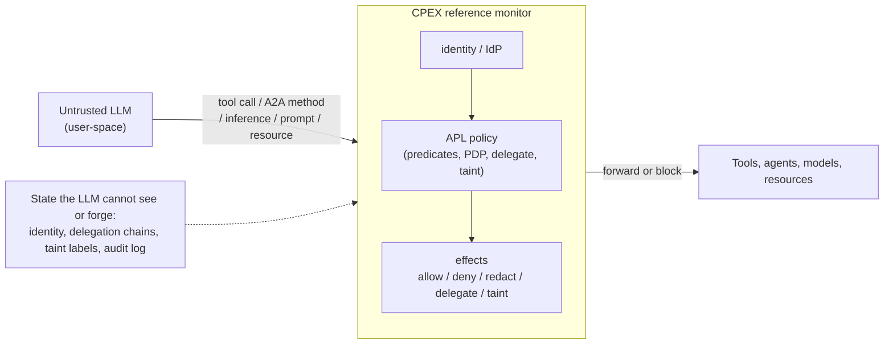

# refactor: Reposition CPEX README and docs around APL and agent authorization

## Summary

Rewrite `README.md` and the `docs/content` Hugo tree to reposition CPEX as a policy and authorization framework for agentic applications, with APL (Authorization Policy Language) leading and cpex-core demoted to the supporting execution layer. The work proceeds top-down after foundation: stand up a preserved `0.1.x` legacy section, author a shared inline-diagram set, rewrite README and the docs tree along one abstracted reference-monitor scenario, then sweep for terminology, voice, and example accuracy.

---

## Problem Frame

The `main` branch (0.2+) is a Rust workspace that has become a reference monitor between an untrusted LLM and the capabilities it invokes, but the docs still read as a Python plugin/extensibility framework and bury APL, CMF, delegation, and tainting beneath hook mechanics. The README is the project's primary landing surface, so this misread compounds on every visit (see origin: `docs/brainstorms/cpex-docs-reposition-requirements.md`).

---

## Requirements

- R1. README and `docs/content/_index.md` open by framing CPEX as a policy/authorization framework for agents (a deterministic reference monitor between an untrusted LLM and the capabilities it invokes); do not lead with "plugin" or "extensibility" as the category.
- R2. APL is the front-door concept; cpex-core (hooks, plugin manager, pipeline) is presented as the supporting mechanism that gives policies pluggable effects.
- R3. Exposition is organized around one abstracted, vendor-neutral scenario where CPEX mediates every operation an untrusted LLM triggers: tool calls, A2A methods, inference calls, prompt/resource fetches. Not tied to HR specifics.
- R4. Reader priority drives ordering/emphasis: A1 platform/security engineer, A2 evaluator/architect, A3 policy author, A4 Rust contributor (last).
- R5. Cover, gradually: identity/IdP; PDP integration (CEL, Cedar, OPA, plus the dialects the crate recognizes); delegation/token exchange as an explicit effect; session tainting and information-flow (write-down prevention); effects; sequencing/phases.
- R6. Each concept is introduced as a requirement the scenario raises, illustrated by an APL fragment, then connected to the cpex-core mechanism that executes it.
- R7. Two signature illustrations anchor the value story: (a) "same request, different data" (policy redacts a field on the wire by identity/permission); (b) a session-taint control that blocks an action after the session touched secret data, even when the action's payload is clean.
- R8. Performance and capability-gating of plugins are documented as supporting concerns, present but not competing with APL for the lead.
- R9. All `docs/content` pages are rewritten to the Rust + APL reality and new framing; no page in the main tree describes the Python 0.1.x runtime as the current system.
- R10. The current Python-era docs are preserved under a `0.1.x` section with its own menu entry; outcome is browsable, clearly labeled 0.1.x docs.
- R11. The quickstart/golden-path page walks the running scenario end to end in Rust + APL.
- R12. All APL/Rust/YAML examples are drawn from or verified against the crates' tests/examples and the demo configs; one canonical surface form is selected where sources diverge and used consistently.
- R13. Figures are specified and rendered inline as Mermaid/ASCII (no binary assets); set includes reference-monitor placement, the abstracted scenario, APL evaluation pipeline/phases, policy spectrum, delegation/token-exchange flow, taint/info-flow. Figures render on GitHub and in hugo-book.
- R14. "APL" is expanded consistently as "Authorization Policy Language" across README and all docs; prior "Attribute Policy Language" expansions are replaced. The CPEX initialism's "ContextForge Plugin Extensibility Framework" expansion (README logo alt-text, `_index.md` title) and the plugin/extensibility taglines are also retired or neutralized so the masthead does not contradict the reposition.
- R15. Voice is sharp, direct, clear, minimal commentary, no em dashes, across README and all rewritten pages.

**Origin actors:** A1 (platform/security engineer, primary), A2 (technical evaluator/architect), A3 (policy author), A4 (Rust developer/contributor, last)
**Origin flows:** F1 (README reader journey), F2 (mediated-operation scenario, the spine), F3 (concept-introduction progression)
**Origin acceptance examples:** AE1 (covers R1, R2), AE2 (covers R3, R7), AE3 (covers R7), AE4 (covers R9, R10), AE5 (covers R12)

---

## Scope Boundaries

### Deferred for later

- Standalone APL language specification beyond what user-facing docs require (e.g., a full grammar reference in `docs/specs`).
- Binary/diagram asset production (PNG/SVG) and redesign of existing images; this work uses inline Mermaid/ASCII and retires the old PNGs.
- Per-crate `rustdoc`/`lib.rs` doc-comment rewrites, except where R14 term consistency is trivially adjacent.
- Migration guides for moving a 0.1.x Python deployment to 0.2+ Rust, beyond preserving the 0.1.x docs.

### Outside this product's identity

- Any change to CPEX/APL code, crate APIs, the parser, or the demos. Docs-only; demos and crates are source material.
- Marketing/landing-site work outside the repo `README.md` and the Hugo `docs/` site.
- Repositioning CPEX as a general-purpose plugin/extensibility framework; the plugin mechanism stays documented strictly as the supporting execution layer for policy effects.

### Deferred to Follow-Up Work

- Optional CI gate that extracts ```yaml apl fenced blocks from docs and parses them with `apl-core` to enforce R12 mechanically: separate follow-up, see U9 note.

---

## Context & Research

### Relevant Code and Patterns

- **Canonical APL syntax source:** `crates/apl-core/src/parser.rs`, `crates/apl-core/src/rules.rs`, `crates/apl-core/src/step.rs`, `crates/apl-core/src/pipeline.rs`. Canonical end-to-end route YAML: `crates/apl-core/tests/yaml_end_to_end.rs` (the `get_employee` route with `require(authenticated)`, `delegation.depth > 2: deny`, `ssn: "str | redact(!perm.view_ssn)"`, `salary: "int | redact(!role.hr)"`, `employee_id: "str | mask(4)"`).
- **PDP dialects:** `PdpDialect` in `crates/apl-core/src/step.rs` = Cedar, Opa, AuthZEN, NeMo, Cel, Custom. Shipping builtin PDP resolvers: `cedar-direct`, `cel` (under `builtins/pdps/`).
- **Builtin `kind`s (verified in factory sources):** `identity/jwt`, `delegator/oauth`, `validator/pii-scan`, `audit/logger`; session store `valkey` (`builtins/session/valkey`) with in-process `MemorySessionStore` default. Registration in `crates/cpex-builtins/src/lib.rs`.
- **Cargo features:** `crates/cpex/Cargo.toml` (`builtins`, `full`, `jwt`, `oauth`, `pii`, `audit`, `cedar`, `cel`, `valkey`; `default = []` is engine-only) and `crates/cpex-builtins/Cargo.toml`.
- **Demo configs (example source per R12):** `../praxis-demos/demos/cpex/cpex.yaml` (call-form `delegate(...)`, `run(audit-log)`, Cedar `policy_text`, route `policy`/`args`/`result`); `../kagenti-extensions/authbridge/demos/hr-cpex/k8s/cpex-policy.yaml` (`apl:`-wrapped routes, `plugin(...)`, `delegate(...)`, in-cluster Keycloak). Both demos run the same policy at different enforcement points (gateway vs egress sidecar), the generalization F2 needs.
- **Hugo setup:** `docs/hugo.toml` (theme `hugo-book` via git submodule in `.gitmodules`, `BookSection = "docs"`, `markup.goldmark.renderer.unsafe = true`, `BookLogo = "images/cpex_v1.png"`, `BookEditLink` to `/edit/main/docs/{{ .Path }}`). Mermaid renders via the theme's `_markup/render-codeblock-mermaid.html` using fenced ```mermaid blocks (no config needed). Menu is auto-generated from the content file tree ordered by `weight`. Static images in `docs/static/images/`, referenced as `/cpex/images/...`.
- **Deploy/build:** `.github/workflows/docs-build.yaml` (runs `hugo --minify` on `docs/**` changes) and `.github/workflows/docs-deploy.yaml` (builds with `PAGES_BASE_URL`, publishes `docs/public/` to GitHub Pages).
- **Current docs tree (18 pages to rewrite or relocate):** `_index.md` (root, Python sample), `docs/_index.md`, `vision.md` (w5), `overview.md` (w10), `quickstart.md` (w20), `hooks.md` (w30), `hook-types.md` (w40), `execution-modes.md` (w45), `cmf.md` (w50), `extensions.md` (w60), `external-plugins.md` (w70), `isolated-plugins.md` (w80), `configuration.md` (w90), `patterns.md` (w110), `testing.md` (w120), `cli.md` (w130), `api-reference.md` (w140), `package-integrity.md` (w150).

### Institutional Learnings

- No `docs/solutions/` store exists. Binding records are `docs/brainstorms/cpex-docs-reposition-requirements.md` and `.sketchpad/cpex_rust_docs_task.md`. The task brief supplies the canonical framing sentence ("CPEX acts as a deterministic reference monitor between an untrusted LLM and the capabilities it invokes") and the optional analogy ("APL is to authz what Colang is to dialogue"). After this lands, the positioning rationale and the chosen 0.1.x mechanism are worth capturing via `/ce-compound`.
- Em dashes currently appear in 10+ `docs/content` pages and the README: R15 is active cleanup, not just avoidance.
- Stale "Attribute Policy Language" expansions exist at `README.md` (crate table, ~line 116) and `docs/content/docs/vision.md` (~line 32): the only two non-spec occurrences to fix for R14.

### External References

- None gathered. The canonical sources are in-repo (crate parser/tests, demo configs); external research adds no value here.

---

## Key Technical Decisions

- **Canonical APL surface form = demo-proven forms.** Use call-form `delegate(name, key: value, on_error: deny)` and `plugin(name)`; document that map-form `delegate:` and the `run(name)` alias exist but lead with one form. Rationale: matches the deployment demos and the parser's primary path; satisfies R12's "one canonical form" mandate.
- **Canonical route shape + parser entry point (resolves the R12/AE5 gate ambiguity).** Two parser paths exist: `apl-core`'s `compile_config` deserializes `routes:` as a map (`routes: { get_employee: {...} }`, the form `yaml_end_to_end.rs` proves), while the `apl-cpex` visitor consumes the list/`- tool:` route form via `compile_policy_block_value` on the inner block. The two demos diverge: praxis puts `policy:`/`args:`/`result:` directly under `- tool:` and uses `run(...)`; kagenti wraps them in `apl:` and uses `plugin(...)`. Decision: the deployment-facing docs lead with the `apl-cpex` `- tool:` route form with bare `policy:`/`args:`/`result:` keys (praxis style) and `plugin(...)`; the map-keyed `routes:` form appears only in the quickstart's Rust-embedding section where `compile_config` applies. The R12/AE5 parse gate states which entry point validates each fragment (apl-cpex visitor for `- tool:` fragments, `compile_config` for the map form). Demo fragments are normalized to the canonical form, so "verbatim from demos" means "normalized to canonical," not literal.
- **Predicate/deny/taint/field forms taken verbatim from the parser and `yaml_end_to_end.rs`.** Rationale: R12/AE5 require examples that actually parse; the test YAML is the safest donor.
- **PDP maturity stated honestly.** Cedar (`cedar-direct`) and CEL (`cel`) documented as shipping builtins; OPA/AuthZEN/NeMo documented as recognized dialects requiring a host-provided resolver. Rationale: R5 wants accurate coverage, not aspirational claims.
- **`0.1.x` preserved via a nested collapsible section.** Move the current Python-era pages under `content/docs/0.1.x/` with an `_index.md` carrying `bookCollapseSection: true` and a high `weight` (e.g., 900) so it sits at the bottom; optionally add a `[menu.after]` entry in `hugo.toml` for a clean labeled link. Rationale: aligns with hugo-book's auto file-tree menu, keeps one search index, minimal theme work (R10/AE4).
- **Figures are inline fenced ```mermaid (flows) and ASCII (simple structure).** Rationale: R13; version-controlled. Old PNGs are retired from content (logo `cpex_v1.png` retained). Mermaid line breaks in node labels use `<br>` (not `\n`), since GitHub and the hugo-book-vendored mermaid build are different versions and interpret `\n` inconsistently; U2 pins/previews each figure in both renderers rather than asserting identical rendering. Figures are authored inline in the first page that uses each one (no central scratch page).
- **CPEX initialism expansion is repositioned, not just APL's.** Beyond R14's "Attribute -> Authorization Policy Language" fix, the README logo alt-text and `docs/content/_index.md` title both currently expand CPEX as "ContextForge Plugin Extensibility Framework," which contradicts the reposition at the masthead. Retire or neutralize that expansion (and the `<i>` "composable enforcement framework ... safe, modular extensibility" tagline) in U3/U4. Rationale: the project's own name is the most authoritative positioning artifact a reader sees; leaving it as "Plugin Extensibility Framework" undercuts R1.
- **Top-down rewrite order tracks the audience funnel** (positioning → APL core → concepts → supporting layer → ops). Rationale: R4 ordering, and earlier pages establish the scenario that later pages reference (F2/F3).
- **Docs "tests" are verification gates** (Hugo build, internal-link resolution, ```mermaid render, APL-example parse against crate/demos, em-dash and terminology greps). Rationale: docs units have no runtime behavior; these gates are the meaningful correctness checks.

---

## Open Questions

### Resolved During Planning

- Canonical APL surface form where the parser accepts multiple: resolved to call-form `delegate(...)` + `plugin(...)` (see Key Technical Decisions).
- hugo-book mechanism for the `0.1.x` menu entry: resolved to nested collapsible section, optional `[menu.after]` label.
- Supported PDP dialects and IdP/delegation mechanisms to document: resolved from `PdpDialect` and the builtin factory `kind`s (see Context & Research).
- Final page list/TOC ordering: resolved in Output Structure below.

### Deferred to Implementation

- Exact prose split between "APL language guide" and "Effects & sequencing" pages (one may absorb the other if the language page gets long): decide while drafting U5.
- Whether "Integration/deployment" warrants one page or a short cluster (gateway vs sidecar vs framework): decide while drafting U8 from the two demos.
- Whether to add the `[menu.after]` label in addition to the nested section, or rely on the section header alone: decide in U1 once the nested section renders.

---

## Output Structure

    docs/content/
      _index.md                      # homepage (w0): reposition (R1), scenario hook, links
      docs/
        _index.md                    # docs landing (rewritten to new framing; see U4)
        vision.md                    # why CPEX / reference-monitor positioning (w5)
        overview.md                  # core model + abstracted scenario + enforcement-point placement (w10)
        quickstart.md                # end-to-end golden path in Rust + APL (w20)
        identity.md                  # identity & IdP integration (w25, precedes its use in quickstart)
        apl.md                       # APL language guide (w30)
        effects.md                   # effects & sequencing / phases (w40)
        pdp.md                       # PDP integration: Cedar/CEL/OPA/AuthZEN/NeMo (w60)
        delegation.md                # delegation & token exchange (w70)
        tainting.md                  # session tainting & information flow (w80)
        cmf.md                       # Common Message Format (w90)
        extensions.md                # extensions & capability-gating (w100)
        pipeline.md                  # plugins & execution pipeline (cpex-core, supporting) (w110)
        builtins.md                  # builtins reference + cargo features (w120)
        configuration.md             # configuration reference (w130)
        deployment.md                # integration/deployment: gateway, sidecar, framework (w140)
        patterns.md                  # patterns & best practices (w150)
        testing.md                   # testing (w160)
        reference.md                 # crate/API reference (w170)
        0.1.x/                       # preserved Python-era docs (w900, collapsed)
          _index.md                  # "0.1.x (Legacy)" section header
          *.md                       # current pages moved verbatim

Final filenames may be adjusted during drafting (e.g., merging `apl.md`/`effects.md`); per-unit Files lists are authoritative.

---

## High-Level Technical Design

> *This illustrates the intended approach and is directional guidance for review, not implementation specification. The implementing agent should treat it as context, not code to reproduce.*

The single scenario figure (reused in README and `overview.md`), expressed as the reference-monitor interposition:



Concept-introduction pattern repeated on each concept page (F3): scenario requirement -> APL fragment -> cpex-core mechanism. Example APL fragment in the canonical `- tool:` route form (normalized from the demo configs; line breaks and verbs follow the Key Technical Decisions), illustrating R7(a) redaction and delegation:

```yaml
# directional illustration; normalized to the canonical apl-cpex route form
routes:
  - tool: get_compensation
    policy:
      - "require(role.hr)"
      - "delegate(workday-oauth, target: workday-api, audience: workday-api, permissions: [read_compensation])"
      - "taint(secret, session)"
      - "plugin(audit-log)"
    args:
      ssn: "str | redact(!perm.view_ssn)"
    result:
      ssn: "str | redact(!perm.view_ssn)"
```

---

## Implementation Units

### Phase 1: Foundation

- U1. **Preserve current docs as a `0.1.x` legacy section**

**Goal:** Relocate the existing Python-era docs into a clearly labeled, collapsed `0.1.x` section so the main tree can be rewritten on a clean slate without losing 0.1.x reference.

**Requirements:** R9, R10 (AE4)

**Dependencies:** None

**Files:**
- Create: `docs/content/docs/0.1.x/_index.md` (section header: title "0.1.x (Legacy)", `weight: 900`, `bookCollapseSection: true`)
- Move: all current `docs/content/docs/*.md` leaf pages into `docs/content/docs/0.1.x/` verbatim (vision, overview, quickstart, hooks, hook-types, execution-modes, cmf, extensions, external-plugins, isolated-plugins, configuration, patterns, testing, cli, api-reference, package-integrity)
- Modify: `docs/hugo.toml` (optional `[menu.after]` entry labeling the 0.1.x section)

**Approach:**
- Use a nested collapsible section (Option A) so hugo-book's auto file-tree renders it at the bottom, collapsed.
- Verify the parent `docs/content/docs/_index.md` `bookFlatSection: true` does not flatten the nested `0.1.x/` group into loose leaves; if it does, drop `bookFlatSection` from the parent or make `0.1.x` a sibling top-level section so it renders as one collapsed group.
- Add a short continuity banner at the top of `0.1.x/_index.md`: these docs describe the Python 0.1.x runtime, which remains on the `0.1.x` branch; point to the current docs. Mirror a one-line continuity note in the README (R10) so existing adopters see the reposition is a re-architecture, not abandonment.
- Exclude the `0.1.x/` pages from the hugo-book search index (front-matter flag on `0.1.x/_index.md` / per-page) so stale Python `@hook` snippets do not surface alongside current Rust results.
- Add Hugo `aliases:` on the moved pages mapping their old `/docs/<page>/` paths to the new `/docs/0.1.x/<page>/` locations, so external inbound links do not 404 (near-zero cost).
- Leave the moved pages' content untouched in this unit; the new main-tree pages are authored in later units. Internal links inside moved pages stay relative within the `0.1.x/` subtree.

**Patterns to follow:** hugo-book front matter conventions already used in `docs/content/docs/_index.md` (`weight`, `bookFlatSection`); Hugo `aliases:` front matter for redirects.

**Test scenarios:**
- Integration: `hugo --minify` from `docs/` builds with no errors after the move.
- Happy path: the rendered left nav shows a single collapsed "0.1.x (Legacy)" group (not flattened leaves) containing the moved pages (AE4).
- Edge case: internal links between moved pages still resolve (no 404s) under the new `0.1.x/` path; old top-level page URLs redirect via `aliases:`.
- Edge case: a search for a term unique to legacy Python content does not return `0.1.x/` pages in the main result set (search exclusion works).

**Verification:** Build succeeds; legacy section is present as one collapsed group, browsable, search-excluded, with old URLs redirected; no broken links within it.

- U2. **Author the shared inline figure set**

**Goal:** Produce the reusable Mermaid/ASCII diagrams once, so README and docs reference a consistent visual language.

**Requirements:** R13 (and supports R1, R3, R5, R7)

**Dependencies:** None

**Files:**
- No committed scratch page. This unit is the figure-design and validation gate: it produces the canonical source for each figure and validates rendering. Each figure is authored inline by the unit that owns its destination page (assignment below); nothing is staged in a hidden page.

**Approach:**
- Design six figures as fenced ```mermaid (flows) or ASCII (simple structure): (1) reference-monitor placement, (2) the abstracted mediated-operation scenario, (3) APL evaluation pipeline/phases (args -> policy -> result -> post_policy), (4) policy spectrum (soft prompt-level to hard infra-level), (5) delegation/token-exchange flow, (6) taint/information-flow (write-down block).
- Figure -> destination-page assignment (each figure authored inline once, cross-referenced elsewhere): (1) reference-monitor placement -> README + `overview.md`; (2) scenario -> `overview.md` (README reuses it); (3) APL pipeline/phases -> `apl.md`/`effects.md`; (4) policy spectrum -> `vision.md`; (5) delegation flow -> `delegation.md`; (6) taint/info-flow -> `tainting.md`.
- Use `<br>` for label line breaks (not `\n`); keep syntax to the intersection of the GitHub Mermaid version and the hugo-book-vendored `mermaid.min.js` (pin/record both versions). Validate each figure renders in a local `hugo` build AND a GitHub markdown preview before the owning unit inlines it.

**Patterns to follow:** existing semantic intent of the retired PNGs (`distributed_hooks_control_plane`, `overview_vision`, `policy_spectrum`, `integration_execution_model`) reused as content guidance, redrawn inline.

**Test scenarios:**
- Happy path: each figure renders in `hugo --minify` output without mermaid parse errors.
- Happy path: each Mermaid block renders in a GitHub markdown preview (manual check) for README reuse, with `<br>` breaks displaying correctly in both renderers.
- Edge case: every one of the six figures has exactly one owning page per the assignment; no figure is left unassigned.

**Verification:** All six figures render in both contexts with no mermaid syntax errors; each has a single owning page; no hidden scratch page exists in the tree.

### Phase 2: Landing surfaces

- U3. **Full README revamp**

**Goal:** Convert the primary landing surface to the new positioning, audience-ordered, scenario-led, with APL fragments and inline figures.

**Requirements:** R1, R2, R3, R4, R7, R8, R13, R14, R15 (AE1)

**Dependencies:** U2

**Files:**
- Modify: `README.md`

**Approach:**
- Lead with the reference-monitor framing sentence and the scenario figure (R1/R3); state what becomes deterministic with the interposition point (A2 reframe).
- Section order tracks A1 -> A2 -> A3 -> A4: what CPEX is and where it sits; the scenario and what it mediates; APL as the policy surface with one redaction + one delegation fragment; how cpex-core executes effects (hooks/pipeline as support, R2/R8); install/features; workspace/crates and dev pointers demoted below positioning.
- Rewrite the masthead positioning artifacts, not just the prose: the logo alt-text and any "ContextForge Plugin Extensibility Framework" expansion are retired/neutralized, and the `<i>` tagline plus the "safe, modular extensibility" closing line are rewritten to the reference-monitor/authorization framing. The first screen must not pattern-match as a plugin/extensibility tool.
- Keep the 0.1.x note and the crates table, but fix the APL expansion (R14), add the one-line 0.1.x continuity note (re-architecture, not abandonment; see U1), and demote the crates/dev content.
- Replace any em dashes (R15).

**Patterns to follow:** current README badges/install block structure; reuse the canonical-form APL fragments (normalized per Key Technical Decisions).

**Test scenarios:**
- Covers AE1. Happy path: a reader of the first screen would describe CPEX as an authorization/policy control plane with APL, not primarily a plugin/hook framework.
- Edge case: the first-screen tagline and logo alt-text state the authorization category; no "Plugin Extensibility Framework" expansion remains anywhere in the README.
- Happy path: install/features block matches the real cargo features (`builtins`, `full`, `jwt`/`oauth`/`pii`/`audit`/`cedar`/`cel`/`valkey`).
- Edge case: every APL fragment in the README parses against the canonical forms (cross-check with `apl-core` tests/demos).
- Edge case: no em dashes present; "Authorization Policy Language" used.

**Verification:** README opens with the reposition; figures render on GitHub; examples are canonical; greps for em dash and "Attribute Policy Language" are clean.

- U4. **Positioning + scenario pages: `_index`, `vision`, `overview`**

**Goal:** Rewrite the top-of-funnel docs pages to establish category, the reference-monitor model, and the abstracted scenario that the rest of the docs reference.

**Requirements:** R1, R2, R3, R4, R6, R7, R8, R13, R14, R15 (AE1, AE2, AE3)

**Dependencies:** U1, U2

**Files:**
- Modify: `docs/content/_index.md` (homepage; remove Python sample, set `weight: 0`, rewrite the front-matter `title` away from "ContextForge Plugin Extensibility Framework", lead with reposition + scenario)
- Modify: `docs/content/docs/_index.md` (docs-section landing; rewrite the stale "build extensible AI systems ... production plugin pipelines" framing to a one-sentence reposition plus the three-link orientation block; preserve `weight`/`bookFlatSection` front matter)
- Create: `docs/content/docs/vision.md` (new main-tree version; "why CPEX" / reference monitor / policy spectrum)
- Create: `docs/content/docs/overview.md` (core model + the abstracted mediated-operation scenario + a concise enforcement-point placement view, the spine for F2/F3)

**Approach:**
- Root `_index.md`: headline reposition, scenario figure, three orientation links (get started / APL / why); retire the "Plugin Extensibility Framework" title expansion.
- `docs/content/docs/_index.md`: short reposition sentence + the same three-link orientation block (mirrors the root homepage pattern), so the `/docs/` landing is not a stale stub.
- `vision.md`: reference-monitor thesis, the state the LLM cannot forge, the policy spectrum figure; retain the Hooks/CMF/APL three-layer model but lead with APL and fix the expansion.
- `overview.md`: introduce the running scenario; carry the canonical full "same request, different data" redaction illustration here (AE2 home), and a one-screen enforcement-point placement view (gateway / sidecar / in-framework) so the A1 reader gets orientation early without waiting for `deployment.md` at w140. The taint write-down moment (AE3) appears here only as a teaser; its canonical full treatment lives in `tainting.md` (U6).

**Patterns to follow:** the surviving conceptual structure of the current `vision.md` (policy spectrum, three-layer model), reframed APL-first.

**Test scenarios:**
- Covers AE1. Happy path: both `_index.md` files' first screens convey the authorization category correctly; neither expands CPEX as "Plugin Extensibility Framework".
- Covers AE2. Happy path: `overview.md` presents the redaction "same request, different data" moment with a controlling canonical APL fragment; the taint moment is a teaser linking to `tainting.md`.
- Happy path: `overview.md` includes an enforcement-point placement view reachable on the first concept page (A1 orientation, R4).
- Edge case: no Python `@hook`/Pydantic content remains in either landing page; no em dashes; correct APL expansion.

**Verification:** Pages build and render with figures; scenario established for downstream pages; greps clean.

### Phase 3: APL core and concepts

- U5. **APL core: language guide, effects/sequencing, golden-path quickstart**

**Goal:** Document APL as the front-door language and rewrite the quickstart as an end-to-end Rust + APL walkthrough of the scenario.

**Requirements:** R2, R5, R6, R11, R12, R13, R14, R15 (AE5)

**Dependencies:** U2, U4

**Files:**
- Create: `docs/content/docs/apl.md` (predicates, `require`, comparisons, set membership, `exists`, field pipelines `redact`/`mask`/`omit`/`hash`/scan placeholders, route phases args/policy/result/post_policy)
- Create: `docs/content/docs/effects.md` (effects: allow/deny/`plugin`/`delegate`/`taint`/PDP; `sequential`/`parallel`; phase ordering and halt-on-deny)
- Create: `docs/content/docs/quickstart.md` (golden path: register APL over cpex-core in Rust, load a policy, run the scenario)

**Approach:**
- Draw every fragment from `crates/apl-core/tests/yaml_end_to_end.rs` and the demo configs; lead with the canonical forms (call-form `delegate`, `plugin()`), note aliases once.
- `apl.md` enumerates only the field-pipeline stages the current parser actually accepts (str/int/bool/float/email/url/uuid, len, enum, regex, mask, redact, omit, hash, pii.redact, pii.detect, injection.scan, plugin/run, taint). Treat the parser body as ground truth over its stale top-of-file comment; explicitly mark `validate(...)` (named-validator dispatch) as unimplemented and point readers to `regex("...")` or `plugin(...)` so no documented stage fails the R12 gate.
- The quickstart shows the minimal Rust wiring (`install_builtins` / `register_apl`-style flow, described, not full code) plus a runnable APL route in the map-keyed `routes: { ... }` form that `compile_config` accepts (this is the one place the map form is canonical, per Key Technical Decisions). Because the scenario uses `require(authenticated)`/`require(role.hr)`, the quickstart forward-references `identity.md` (now at w25, before `apl.md`) for how those predicates are populated.
- `apl.md` introduces the language; `effects.md` covers composition/sequencing. If `apl.md` grows too large, fold `effects.md` into it (Deferred-to-Implementation note).

**Patterns to follow:** canonical test YAML; README install/features block for the Rust wiring snippet shape.

**Test scenarios:**
- Covers AE5. Edge case: every APL fragment across the three pages parses against `apl-core` (cross-check with crate tests / demo configs).
- Happy path: the quickstart's policy reproduces a scenario requirement (e.g., redaction by permission) and a reader can follow it end to end (R11).
- Error path: deny forms (`deny('reason','code')`) and `require` desugaring are shown with their actual semantics.
- Edge case: no em dashes; correct APL expansion.

**Verification:** Pages build; fragments are canonical and parse; quickstart is end-to-end and scenario-aligned.

- U6. **Concept pages: identity/IdP, PDP, delegation, tainting/info-flow**

**Goal:** Introduce each core authorization concept gradually, each anchored to the scenario, illustrated by an APL fragment, then tied to the cpex-core mechanism.

**Requirements:** R5, R6, R7, R12, R13, R14, R15 (AE2, AE3, AE5)

**Dependencies:** U5

**Files:**
- Create: `docs/content/docs/identity.md` (identity resolution, `identity/jwt`, IdP/issuer/JWKS, subject/roles/perms/claims into the attribute bag)
- Create: `docs/content/docs/pdp.md` (PDP integration: `cedar-direct` and `cel` shipping; OPA/AuthZEN/NeMo as recognized dialects needing host resolvers; `on_allow`/`on_deny` reactions)
- Create: `docs/content/docs/delegation.md` (RFC 8693 token exchange as an explicit effect; `delegator/oauth`; post-delegation checks on granted scopes)
- Create: `docs/content/docs/tainting.md` (session taint, scopes, write-down/write-after-secret block, session stores `valkey`/memory)

**Approach:**
- Each page follows F3: scenario requirement -> APL fragment -> mechanism. Reuse the relevant figure from U2 (delegation flow -> `delegation.md`; taint/info-flow -> `tainting.md`).
- Binding illustration homes: `tainting.md` is the canonical home for the AE3 write-down illustration (full treatment); `overview.md` (U4) is the canonical home for the AE2 redaction illustration. `identity.md` and `apl.md` cross-reference the AE2 fragment rather than duplicating it. This prevents the two signature moments from being duplicated or dropped across pages (R7).
- `pdp.md` states maturity honestly (R5 decision), framing the dialect set as a deliberate pluggable-resolver surface (APL speaks the dialects; Cedar/CEL ship as builtin resolvers; OPA/AuthZEN/NeMo are host-provided) rather than a maturity checklist.
- Use real `kind`s and demo fragments throughout (R12).

**Patterns to follow:** demo configs `cpex.yaml` / `cpex-policy.yaml` for identity, delegation, Cedar, and taint route fragments.

**Test scenarios:**
- Covers AE2, AE3. Happy path: redaction-by-permission and taint write-down are each shown with a controlling, canonical APL fragment.
- Covers AE5. Edge case: all fragments parse; all `kind` strings match the builtin factories.
- Error path: PDP `on_deny` and delegation `on_error: deny` behaviors are documented accurately.
- Edge case: no em dashes; correct APL expansion.

**Verification:** Four pages build with figures; concepts are scenario-anchored; fragments and kinds are accurate.

### Phase 4: Supporting layer and operations

- U7. **Supporting-layer pages: CMF, extensions/capability-gating, pipeline, builtins, configuration**

**Goal:** Document cpex-core and its surfaces as the supporting execution layer beneath APL, including the builtin catalog and config reference.

**Requirements:** R2, R8, R9, R12, R14, R15

**Dependencies:** U5

**Files:**
- Create: `docs/content/docs/cmf.md` (Common Message Format as the context envelope APL evaluates; rewritten free of Python `@hook` examples)
- Create: `docs/content/docs/extensions.md` (typed extensions + capability-gating as a security/correctness support concern, R8)
- Create: `docs/content/docs/pipeline.md` (plugins, plugin manager, hooks, execution modes; framed as the mechanism that executes APL effects, R2)
- Create: `docs/content/docs/builtins.md` (catalog: `identity/jwt`, `delegator/oauth`, `validator/pii-scan`, `audit/logger`, PDPs `cedar-direct`/`cel`, session store `valkey`; cargo features)
- Create: `docs/content/docs/configuration.md` (YAML config reference: plugins, routes, `global` PDP/session_store, capabilities)

**Approach:**
- `pipeline.md` consolidates the old hooks/hook-types/execution-modes content, reframed as support for policy effects rather than the headline.
- `builtins.md` and `configuration.md` use only verified `kind`s, features, and config shapes from the crates and demos.
- Capability-gating is presented as how plugins get filtered extension access (supporting, not front-matter).

**Patterns to follow:** current `cmf.md`/`extensions.md`/`execution-modes.md` structure for completeness, reframed and de-Pythoned; `crates/cpex-builtins/src/lib.rs` and the two Cargo.toml feature blocks for the catalog.

**Test scenarios:**
- Happy path: builtin catalog lists exactly the shipping `kind`s and features; config examples match demo `global`/route shapes.
- Edge case: no page presents the Python runtime as current (R9); no `@hook`/Pydantic/venv as present API.
- Edge case: no em dashes; correct APL expansion.

**Verification:** Five pages build; cpex-core framed as support; catalog/config accurate; no stale Python framing.

- U8. **Operations pages: integration/deployment, patterns, testing, crate reference**

**Goal:** Serve the primary A1 engineer with where/how CPEX deploys and the operational reference, generalized from the two demos.

**Requirements:** R3, R4, R8, R9, R12, R14, R15

**Dependencies:** U6, U7

**Files:**
- Create: `docs/content/docs/deployment.md` (enforcement-point placement: gateway (Praxis), egress sidecar (Kagenti AuthBridge), in-framework; same policy, different point)
- Create: `docs/content/docs/patterns.md` (production patterns: layered pipeline, shadow/audit rollout, input/output guardrails, cross-request taint)
- Create: `docs/content/docs/testing.md` (testing policies and integrations in the Rust runtime)
- Create: `docs/content/docs/reference.md` (crate/API reference: `cpex`, `cpex-core`, `cpex-sdk`, `cpex-builtins`, `apl-core`/`apl-cmf`/`apl-cpex`, `cpex-ffi`)

**Approach:**
- `deployment.md` is the A1 payoff: generalize the demos into "CPEX is direction-agnostic; move the enforcement point, keep the policy." Base the "same policy at two enforcement points" illustration on the `get_compensation` route, which is identical across both demos modulo the `apl:` wrapper and `run`/`plugin` alias; do not use `send_email`, whose steps and ordering differ between the demos.
- The 0.2 supply-chain story is not dropped: the Python `package-integrity.md` (PyPI SHA256) is Python-specific and moves to 0.1.x, but `reference.md` (and `deployment.md` where relevant) documents the 0.2 mechanism, signed prebuilt FFI artifacts (`crates/cpex-ffi/RELEASE.md`), so the A1 security reader still finds a supply-chain/trust story in the main tree.
- `testing.md` and `reference.md` replace the Python `testing.md`/`api-reference.md`/`cli.md` with Rust-accurate content; the Python-only pages (isolated-plugins, external-plugins-as-Python, package-integrity) remain only in 0.1.x.

**Patterns to follow:** the two demo READMEs/configs for the deployment narrative; current `patterns.md` for the pattern catalog reframed to Rust + APL; `crates/cpex-ffi/RELEASE.md` for the artifact-signing story.

**Test scenarios:**
- Happy path: deployment page shows the same policy at two enforcement points using the `get_compensation` route (verified identical across both demos), gateway vs sidecar.
- Happy path: the main tree documents the 0.2 FFI artifact-signing supply-chain story (no security capability is silently lost by moving the Python page to 0.1.x).
- Edge case: reference page lists only crates that exist in the workspace; no Python module references.
- Edge case: no em dashes; correct APL expansion.

**Verification:** Four pages build; deployment narrative is demo-accurate; reference matches the workspace.

### Phase 5: Consistency sweep

- U9. **Terminology, voice, example-accuracy, and nav sweep**

**Goal:** Enforce the cross-cutting requirements across the whole new tree and finalize navigation.

**Requirements:** R12, R13, R14, R15 (AE4, AE5)

**Dependencies:** U1, U2, U3, U4, U5, U6, U7, U8

**Files:**
- Modify: all new `docs/content/docs/*.md`, `docs/content/_index.md`, `README.md`
- Modify: `docs/hugo.toml` (finalize menu/weights if needed)
- Delete: orphaned PNGs in `docs/static/images/` that are no longer referenced (keep `cpex_v1.png`). No scratch figure page exists to remove (figures are authored inline per U2).

**Approach:**
- Grep gates: zero em dashes; zero "Attribute Policy Language"; zero "Plugin Extensibility Framework" expansion; APL fragments cross-checked against canonical forms.
- Verify all internal links resolve and nav weights produce the intended order (main tree first, 0.1.x collapsed at bottom, search-excluded).
- Remove unreferenced PNGs.

**Execution note:** Run this as a final verification pass after all content units land; treat the grep/build/link gates as the acceptance bar.

**Patterns to follow:** the verification gates defined in Key Technical Decisions.

**Test scenarios:**
- Covers AE5. Edge case: every ```yaml apl block across the tree is spot-checked against the canonical forms by parsing through the matching `apl-core` entry point (apl-cpex visitor for `- tool:` fragments, `compile_config` for the map form). Mechanical CI extraction/parsing remains a deferred follow-up (see Scope Boundaries), so this gate is a manual spot-check, not an automated CI step.
- Covers AE4. Happy path: nav shows the rewritten main tree with the single collapsed 0.1.x group at the bottom.
- Edge case: `grep` for em dash, "Attribute Policy Language", and "Plugin Extensibility Framework" across `README.md` and `docs/content` returns nothing.
- Integration: full `hugo --minify` build is clean; no broken internal links anywhere; no hidden scratch page remains in the tree.

**Verification:** All gates pass; site builds clean; tree is consistent, accurate, and on-voice.

---

## System-Wide Impact

- **Interaction graph:** `.github/workflows/docs-build.yaml` and `docs-deploy.yaml` run on `docs/**` changes; the rewrite triggers a Pages redeploy. README changes affect the GitHub repo landing and crates.io/docs.rs surfaces that mirror it.
- **Error propagation:** A malformed ```mermaid block or broken relref fails the Hugo build; U9 gates and per-unit build checks catch these before merge.
- **State lifecycle risks:** Moving pages into `0.1.x/` changes their published URLs; external inbound links to old doc paths may break. Accepted (0.1.x is legacy); optionally note in U1 whether redirects are warranted (deferred).
- **API surface parity:** README and `docs/content/_index.md` must tell the same story; U3/U4 are kept consistent and re-checked in U9.
- **Integration coverage:** Only a full `hugo --minify` build plus link resolution proves the cross-page nav and relrefs; unit-level page checks do not.
- **Unchanged invariants:** No crate, parser, demo, or CI logic changes; the Hugo theme submodule and deploy workflow are unchanged except optional `hugo.toml` menu/weights.

---

## Risks & Dependencies

| Risk | Mitigation |
|------|------------|
| Invented or drifted APL syntax in examples | All fragments sourced from `apl-core` tests and demo configs; U9 parse cross-check (AE5); canonical-form decision recorded |
| Moving pages to `0.1.x/` breaks external inbound links | Accept for legacy; consider redirects as a deferred follow-up; banner points readers to current docs |
| Mermaid renders in hugo-book but not identically on GitHub (or vice versa) | U2 validates each figure in both contexts before reuse |
| Scope creep into a full APL grammar spec | Explicitly out of scope; docs cover only user-facing forms |
| Over-large `apl.md` | Allowed to split/merge with `effects.md` during U5 (deferred decision) |
| Em-dash/terminology regressions slip through | U9 grep gates run across the whole tree as the acceptance bar (em dash, "Attribute Policy Language", "Plugin Extensibility Framework") |
| Existing 0.1.x Python adopters read the reposition as abandonment | README + 0.1.x section carry a one-line continuity note (re-architecture, 0.1.x stays on its branch); migration-guide deferral is an accepted, recorded adoption risk, not a silent gap |
| Moving 18 pages to `0.1.x/` breaks external inbound links | Hugo `aliases:` on moved pages forward old `/docs/<page>/` URLs at near-zero cost (U1); residual deep links accepted as legacy |
| Demo policies are not identical across both demos | "Same policy, two enforcement points" illustration uses the `get_compensation` route (verified identical modulo wrapper/alias); `send_email` is not used for that claim |

---

## Documentation / Operational Notes

- After merge, capture two durable learnings via `/ce-compound`: the positioning rationale (plugin-framework -> authorization framework) and the chosen hugo-book `0.1.x` versioning mechanism, since both are non-obvious and likely to recur.
- Confirm the GitHub Pages deploy succeeds post-merge and the `0.1.x` section is reachable in production.

---

## Sources & References

- **Origin document:** [docs/brainstorms/cpex-docs-reposition-requirements.md](docs/brainstorms/cpex-docs-reposition-requirements.md)
- Task brief: `.sketchpad/cpex_rust_docs_task.md`
- APL source of truth: `crates/apl-core/src/parser.rs`, `crates/apl-core/src/step.rs`, `crates/apl-core/tests/yaml_end_to_end.rs`
- Builtins/features: `crates/cpex-builtins/src/lib.rs`, `crates/cpex/Cargo.toml`, `crates/cpex-builtins/Cargo.toml`
- Demo configs: `../praxis-demos/demos/cpex/cpex.yaml`, `../kagenti-extensions/authbridge/demos/hr-cpex/k8s/cpex-policy.yaml`
- Hugo: `docs/hugo.toml`, `.github/workflows/docs-build.yaml`, `.github/workflows/docs-deploy.yaml`
