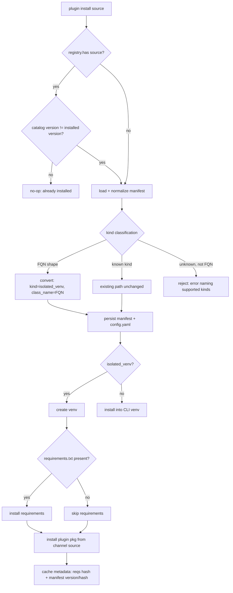

# feat: Auto-convert bare-FQN Python plugins to isolated_venv at install time

## Summary

Make the `cpex` / `mcpplugins` CLI installer recognize bare-FQN Python plugins — those
whose manifest `kind` is a Python class path (e.g. `cpex_pii_filter.pii_filter.PIIFilterPlugin`)
rather than a known kind — and auto-convert them into `isolated_venv` plugins during
install. Convert the FQN into `default_config.class_name`, set `kind: isolated_venv`,
make `requirements.txt` optional throughout venv init, install the plugin package into the
venv from each channel's own source, persist the converted form to both the on-disk
manifest and `plugins/config.yaml`, and trigger venv reinstall on manifest version/hash
change including on repeat `install`. Python-installer only; no Rust changes.

---

## Problem Frame

Today the installer only drives the isolated-venv path when a manifest declares
`kind: isolated_venv` + `default_config.class_name`. Existing FQN Python plugins declare
`kind` *as* the class path with no `class_name` and often no `requirements.txt`, so they
install into the CLI's own venv and cannot be run through the Rust `PluginManager`'s
isolated-venv adapter that the 0.2.x work depends on.

Two coupled code realities confirmed during research:
- `install_from_pypi`, `install_from_git`, and `install_from_local` all normalize their
  manifest through `PluginCatalog._normalize_manifest_data` (`cpex/tools/catalog.py`),
  but the monorepo path `install_folder_via_pip` branches on `manifest.kind` directly and
  never calls normalize.
- `IsolatedVenvPlugin.initialize` (`cpex/framework/isolated/client.py:213`) does a raw
  `self.config.config["requirements_file"]` access, and `_initialize_isolated_venv`
  (`cpex/tools/catalog.py:1121`) copies a requirements file into the plugin path — both
  assume `requirements.txt` exists. The venv cache key
  (`_compute_requirements_hash`) is derived only from that file, so a no-requirements
  plugin has a constant empty hash and never invalidates.

This plan is **Option 1** from `crates/cpex-hosts-python/README.md`.

---

## Requirements Traceability

Origin: `docs/brainstorms/2026-07-13-fqn-plugin-auto-conversion-requirements.md`

| Req | Description | Units |
| --- | --- | --- |
| R1 | Detect FQN kind (dotted-path shape + not a known kind; reject typos) | U1 |
| R2 | Convert FQN → `kind: isolated_venv` + `class_name`; normalize `default_configs` | U2 |
| R3 | Persist converted form to manifest + `config.yaml` | U2, U5 |
| R4 | `requirements.txt` optional throughout venv init | U3 |
| R4a | Install plugin package into venv per channel source | U4 |
| R5 | Reinstall trigger by manifest version + hash (alongside requirements hash) | U5 |
| R6 | Repeat `install` compares versions and reinstalls on mismatch | U6 |
| R7 | Regression (test-plugin) + FQN-fixture conversion + hook execution | U7 |

---

## Key Technical Decisions

**KTD1 — Converter lives in `_normalize_manifest_data`, plus a parallel monorepo hook.**
`install_from_pypi` / `install_from_git` / `install_from_local` all pass through
`_normalize_manifest_data`, so placing detection + conversion there covers three of four
channels with one change. The monorepo path (`install_folder_via_pip`) bypasses normalize
and branches on `manifest.kind`, so it gets the same conversion applied to the manifest it
loads from the catalog before the kind check. Rationale: single conversion concept, minimal
duplication, no new pre-install wrapper layer. (Alternative in Alternatives Considered.)

**KTD2 — FQN detection is shape-based, no import.** A `kind` is an FQN-to-convert when it
is not in the known set **and** matches a dotted-path shape: 2+ dot-separated segments,
each a valid Python identifier, final segment starting uppercase (class convention).
Anything else unknown is rejected with an error naming the supported kinds. No venv or
import at detection time — importability is proven by U7's fixture, not the detector
(see origin R1).

**KTD3 — Known-kind set is a single shared constant.** Introduce one authoritative
constant for `{builtin, native, wasm, external, isolated_venv, PDP}` and reference it from
the detector and the rejection error. Planning assumption from origin: confirm no existing
constant already encodes this before adding a new one (search `cpex/framework/constants.py`
and `models.py`); reuse if present.

**KTD4 — `requirements_file` becomes optional via safe access + skip.** Replace the raw
`config["requirements_file"]` access with a `.get()` that tolerates absence; when absent,
venv creation and caching still run but requirements installation is skipped. Converted
plugins get no synthesized `requirements_file` — the package reaches the venv via KTD5.

**KTD5 — Package enters the venv from the channel's resolved source (R4a).** After venv
creation, install the plugin package into the isolated venv using the same source the
channel already has: `pip install <pkg><constraint>` (pypi, test-pypi via index URL), the
`git+…` URL (git — mirrors existing `install_from_git` isolated branch), `-e <path>`
(local), the monorepo subdirectory URL (monorepo). When a `requirements.txt` is present it
still layers on top, unchanged for existing isolated_venv plugins.

**KTD6 — Cache key composes manifest version+hash alongside requirements hash.** Extend the
venv cache metadata (`IsolatedVenvPlugin._save_cache_metadata` / `_is_venv_cache_valid`) to
also record and compare the plugin manifest version and a hash of the persisted
`plugin-manifest.yaml`. Cache is valid only if **both** the requirements hash and the
manifest version+hash are unchanged; either changing forces reinstall. Preserves existing
requirements-driven behavior. (see origin R5)

**KTD7 — Repeat-install version compare against the registry's recorded version (R6).** In
the `plugin install` command (`cpex/tools/cli.py`), replace the "already installed →
return" short-circuit: when `registry.has(source)`, compare the resolved catalog/manifest
version against the registry's recorded installed version (`PluginRegistry` stores
`version` per plugin) and proceed to reinstall when they differ; otherwise no-op as today.
**Cross-cutting (intentional):** this changes repeat-`install` for all plugin kinds, not
only converted ones — flagged in the origin and noted in System-Wide Impact.

---

## High-Level Technical Design

Install-time flow for a Python plugin, showing where conversion and the reinstall gate sit:

Cache validity (KTD6): reinstall when `reqs_hash changed OR manifest_version changed OR manifest_hash changed`.

---

## Implementation Units

### U1. FQN kind detection + known-kind constant

**Goal:** Classify a manifest `kind` as known / FQN-to-convert / rejected.
**Requirements:** R1
**Dependencies:** none
**Files:**
- `cpex/framework/constants.py` (or reuse existing constant if found — KTD3)
- `cpex/framework/models.py` or `cpex/tools/catalog.py` — detection helper (place near where conversion will consume it, U2)
- `tests/unit/cpex/tools/test_catalog.py` (or a focused new test module for the helper)

**Approach:** Add a known-kind constant (KTD3) and a pure classification function that
returns one of `known` / `fqn` / `reject` given a `kind` string. FQN test: not in known
set AND dotted-path shape (2+ identifier segments, final segment uppercase-initial). No
import/venv. The rejection case surfaces a clear error listing supported kinds; wire the
raise at the conversion call site (U2), keeping the classifier itself side-effect-free.

**Patterns to follow:** existing validators in `cpex/framework/models.py` (e.g.
`check_config_and_external`), module-level constants style in `cpex/framework/constants.py`.

**Test scenarios:**
- Known kinds (`builtin`, `native`, `wasm`, `external`, `isolated_venv`, `PDP`) each classify as `known`.
- `cpex_pii_filter.pii_filter.PIIFilterPlugin` classifies as `fqn`. Covers AE-equivalent of R1.
- Single-segment `PIIFilterPlugin` (no dots) → `reject` (not a dotted path).
- Typo `isolate_venv` → `reject`.
- Lowercase-final-segment dotted path `a.b.c` → `reject` (not class-shaped).
- Empty / whitespace `kind` → `reject`.

**Verification:** classifier returns the correct bucket for the table above with no filesystem or import side effects.

---

### U2. Convert FQN manifest to isolated_venv in normalize path

**Goal:** When a manifest's kind is FQN, rewrite it to `kind: isolated_venv` with
`default_config.class_name` set, preserving other fields; reject non-FQN unknowns.
**Requirements:** R2, R3 (in-memory conversion feeding persistence)
**Dependencies:** U1
**Files:**
- `cpex/tools/catalog.py` — `_normalize_manifest_data` (and `_transform_manifest_data` for the monorepo/catalog-update path)
- `tests/unit/cpex/tools/test_catalog.py`

**Approach:** In `_normalize_manifest_data`, after the existing `default_configs` →
`default_config` normalization, classify `kind` (U1). On `fqn`: move the FQN string into
`default_config["class_name"]` (do not overwrite an existing `class_name`; if present and
mismatched, prefer the explicit `class_name` and log), set `kind = "isolated_venv"`. On
`reject`: raise with the supported-kinds message. On `known`: unchanged. Apply the same
conversion in the catalog-update transform so the persisted catalog manifest reflects the
converted kind. Do not synthesize `requirements_file` here (KTD4/KTD5).

**Patterns to follow:** existing `default_configs` normalization already in
`_normalize_manifest_data` and `_transform_manifest_data`.

**Test scenarios:**
- FQN manifest (legacy `default_configs`, no `class_name`) → `kind == isolated_venv`, `default_config.class_name == <FQN>`, other fields preserved. Covers R2.
- Manifest already `isolated_venv` with `class_name` → untouched (idempotent).
- Manifest with both an FQN kind AND a pre-existing `class_name` → keeps explicit `class_name`, kind becomes `isolated_venv`.
- Manifest with unknown non-FQN kind → raises with message naming supported kinds.
- `default_configs` (plural) present → normalized to `default_config` before conversion reads it.

**Verification:** normalized `PluginManifest` for an FQN input is a valid isolated_venv manifest consumable by `_handle_plugin_installation` with no further edits.

---

### U3. Make requirements.txt optional in venv init

**Goal:** Venv initialization succeeds when the plugin has no `requirements.txt`.
**Requirements:** R4
**Dependencies:** none (independent of U1/U2; enables U4)
**Files:**
- `cpex/framework/isolated/client.py` — `IsolatedVenvPlugin.initialize`, cache-hash helpers
- `cpex/tools/catalog.py` — `_initialize_isolated_venv` (the requirements-copy step)
- `tests/unit/cpex/framework/isolated/test_client.py`

**Approach:** Replace the raw `self.config.config["requirements_file"]` access with a
tolerant lookup (default absent). When no requirements file is configured or the resolved
path does not exist: still create the venv and write cache metadata, but skip
`install_requirements`. In `_initialize_isolated_venv`, guard the requirements-copy so a
converted plugin without a requirements file does not error. `create_venv` already handles
a missing file via the empty-hash path; confirm and keep that behavior.

**Execution note:** Add a failing test for `initialize()` with no `requirements_file` in config before changing the access, to lock the KeyError regression.

**Patterns to follow:** existing `create_venv` / `_is_venv_cache_valid` empty-file handling in `cpex/framework/isolated/client.py`.

**Test scenarios:**
- `initialize()` with no `requirements_file` key in config → venv created, no raise, requirements install skipped.
- `initialize()` with `requirements_file` pointing at a non-existent path → skipped gracefully, no raise.
- `initialize()` with a valid `requirements_file` → requirements installed (existing behavior preserved).
- `_initialize_isolated_venv` with a manifest lacking a requirements file → no copy attempted, no error.

**Verification:** an isolated_venv plugin with no requirements initializes its venv without error; a plugin with requirements still installs them.

---

### U4. Install plugin package into venv from channel source

**Goal:** Ensure the converted plugin's FQN module is importable in the isolated venv by
installing the package from each channel's resolved source.
**Requirements:** R4a
**Dependencies:** U2, U3
**Files:**
- `cpex/tools/catalog.py` — `install_from_pypi`, `install_from_git`, `install_from_local`, `install_folder_via_pip` (monorepo), and/or `_handle_plugin_installation`
- `tests/unit/cpex/tools/test_catalog.py`

**Approach:** After venv init for an isolated_venv plugin that has no self-referencing
requirements, install the plugin package into the venv using the channel source:
`pip install <pkg><constraint>` for pypi/test-pypi (test-pypi via `--index-url`), the
`git+…` URL for git (the git path already does this — extend it to the converted case),
`-e <source>` for local, the monorepo subdirectory URL for monorepo. Centralize the
"install into venv python" step so all channels share it (venv python resolved via
`_get_venv_python_executable`). When a requirements file is present, this layers after
requirements install.

**Patterns to follow:** existing isolated-venv install in `install_from_git`
(`cpex/tools/catalog.py:1542-1555`) and venv-python resolution `_get_venv_python_executable`.

**Test scenarios:**
- pypi channel, converted no-requirements plugin → package installed into venv with the version constraint applied (subprocess args asserted; pip mocked).
- test-pypi channel → install invoked with the test index URL.
- git channel → package installed into venv from the `git+` URL (existing behavior holds for converted plugins).
- local channel → editable install (`-e`) into venv.
- monorepo channel → package installed into venv from the subdirectory source.
- Plugin *with* a requirements file → requirements install AND package install both occur (layering).

**Verification:** after install, the plugin's FQN module resolves inside `plugins/<name>/.venv` (asserted end-to-end in U7).

---

### U5. Persist converted manifest + manifest-based cache key

**Goal:** Persist the converted form to `plugins/<name>/plugin-manifest.yaml` and
`plugins/config.yaml`, and extend the venv cache key to include manifest version + hash.
**Requirements:** R3, R5
**Dependencies:** U2, U3
**Files:**
- `cpex/tools/catalog.py` — `_persist_manifest`, `_finalize_plugin_installation`, `_initialize_isolated_venv`
- `cpex/tools/cli.py` — `update_plugins_config_yaml` (converted config lands in config.yaml)
- `cpex/framework/isolated/client.py` — `_save_cache_metadata`, `_is_venv_cache_valid`, cache-hash helpers
- `tests/unit/cpex/tools/test_catalog.py`
- `tests/unit/cpex/framework/isolated/test_client.py`

**Approach:** Confirm the converted manifest is written under `plugins/<name>/plugin-manifest.yaml`
(the stable diff record) in addition to the catalog copy, and that the converted
`PluginConfig` (kind=isolated_venv + class_name) flows into `plugins/config.yaml` via the
existing `update_plugins_config_yaml`. Extend cache metadata (KTD6) to record
`manifest_version` and `manifest_hash` (hash of the persisted manifest). `_is_venv_cache_valid`
returns valid only when requirements hash AND manifest version AND manifest hash all match;
any mismatch invalidates.

**Test scenarios:**
- Converting + installing an FQN plugin writes `plugins/<name>/plugin-manifest.yaml` with `kind: isolated_venv` + `class_name`. Covers R3.
- The generated entry in `plugins/config.yaml` carries `kind: isolated_venv` and `config.class_name`. Covers R3.
- Cache valid when manifest version+hash and requirements hash all unchanged → no reinstall.
- Manifest version bump with identical requirements → cache invalid → reinstall triggered. Covers R5.
- Manifest content change at same version → manifest hash differs → cache invalid.
- No-requirements plugin: manifest version+hash is the sole invalidation signal (requirements hash constant) → version bump still reinstalls.

**Verification:** a version bump to a no-requirements converted plugin invalidates the venv cache; an unchanged manifest reuses the cached venv.

---

### U6. Repeat-install version compare

**Goal:** Repeat `install` of an already-registered plugin reinstalls when the version
differs, instead of a no-op.
**Requirements:** R6
**Dependencies:** U5
**Files:**
- `cpex/tools/cli.py` — `plugin` command (the `registry.has(source)` short-circuit) and/or `install`
- `tests/unit/cpex/tools/test_cli.py`

**Approach:** Replace the early `return` when `registry.has(source)` with a version
comparison: resolve the target version (catalog/manifest for the requested source) and
compare against the registry's recorded installed version (`PluginRegistry` stores
`version`). Equal → keep the "already installed" no-op message. Different → fall through to
the normal install path (which now re-runs conversion + venv reinstall via U5's cache key).
Note the cross-cutting effect in the command help / release notes.

**Test scenarios:**
- Repeat install, same version already registered → no-op, "already installed" message, no reinstall side effects.
- Repeat install, catalog version greater than registered version → proceeds to install/reinstall.
- Repeat install, source not yet registered → normal install (unchanged).
- Applies uniformly to a non-converted (`isolated_venv` or native) plugin — version compare is kind-agnostic. Covers the R6 cross-cutting note.

**Verification:** installing a plugin, bumping its catalog version, and re-running `install` triggers a reinstall; re-running at the same version does not.

---

### U7. Acceptance: regression + FQN-fixture conversion with hook execution

**Goal:** Prove existing isolated_venv install is unregressed and the new FQN conversion
path works end-to-end through the isolated worker.
**Requirements:** R7
**Dependencies:** U1–U6
**Files:**
- `tests/unit/cpex/fixtures/plugins/isolated/test_plugin/` (existing regression fixture)
- `tests/unit/cpex/fixtures/plugins/` — new synthetic bare-FQN fixture (unknown FQN `kind`, no `requirements.txt`, a plugin class + `plugin-manifest.yaml`)
- `tests/unit/cpex/framework/isolated/test_integration.py` and/or `tests/unit/cpex/tools/test_catalog.py`

**Approach:** (1) Regression: existing `cpex-test-plugin` isolated fixture installs,
initializes venv, and loads unchanged. (2) Conversion: a synthetic FQN fixture (kind is a
class path, no requirements.txt) installs via a real-ish channel (local/`-e` against the
fixture dir is the cheapest real path), auto-converts to `isolated_venv` + `class_name`,
gets its package into `plugins/<name>/.venv`, is persisted to both the manifest and
`config.yaml`, and **executes a hook through the isolated worker** returning the expected
result. Use controlled fixtures (no live third-party package).

**Execution note:** Start from the conversion acceptance test as a failing end-to-end test that drives U1–U6 integration.

**Test scenarios:**
- Regression: `cpex-test-plugin` fixture installs and loads with no behavior change. Covers R7(1).
- Conversion: FQN fixture (no requirements) → persisted manifest + config.yaml show `isolated_venv` + `class_name`; venv exists at `plugins/<name>/.venv`; FQN module importable. Covers R7(2), R3, R4a.
- Hook execution: a hook invoked on the converted plugin through the isolated worker returns the expected `PluginResult`. Covers R7(2).
- Reinstall: bump the FQN fixture manifest version, re-install → venv reinstalled (ties U5 + U6 together).

**Verification:** full test suite green; the FQN fixture runs a hook via the isolated worker after auto-conversion, and the test-plugin regression passes unchanged.

---

## Scope Boundaries

**In scope:** Python installer changes on `feat/python_plugin_compat_0.1.x` covering R1–R7.

**Deferred for later** (from origin):
- README **Option 2** (`migration.md` manual-edit path).
- An explicit `--force` / `upgrade` action — superseded by U6's version compare.

**Outside this product's identity / this branch** (from origin):
- Any Rust-side changes (`crates/cpex-hosts-python`, 0.2.x). Correctness of the Rust
  runtime consuming the converted `config.yaml` is validated separately in that work.

**Deferred to Follow-Up Work** (plan-local):
- Plugins distributed only as loose source with no installable package (out of R4a's
  channel-source model).

---

## System-Wide Impact

- **Repeat-install behavior changes for ALL plugin kinds** (U6/KTD7), not just converted
  FQN plugins: a repeat `install` becomes install-with-upgrade-on-version-change rather
  than an unconditional no-op. Intentional per origin; call out in command help and any
  release notes so operators relying on the no-op are not surprised.
- **`plugins/config.yaml` and persisted manifests** gain converted `isolated_venv` entries
  for previously-FQN plugins; the Rust `PluginManager` reads these unchanged.
- **Venv cache invalidation** now also keys on manifest version/hash — a manifest edit at
  the same version now invalidates where before only requirements changes did.

---

## Alternatives Considered

- **Standalone pre-install conversion pass wrapping all channels** (instead of KTD1's
  normalize-path placement). Rejected: adds a new layer duplicating the manifest-load
  step, and three of four channels already funnel through `_normalize_manifest_data`. The
  monorepo path is the only bypass and is handled with a small parallel hook.
- **Synthesize a one-line `requirements.txt` for converted plugins** (origin's alternative
  to R4a). Rejected as the default: reusing each channel's resolved source is more direct,
  avoids inventing a file the user never wrote, and matches the existing git isolated
  install; the synthesized-file approach remains a fallback if a channel's source proves
  hard to install directly.

---

## Risks & Dependencies

- **Detection false-positives/negatives (R1).** A class-path-shaped but non-plugin `kind`
  could be misclassified. Mitigated by the strict shape rule (KTD2) and U7's real hook
  execution catching a bad conversion; importability is proven at test time, not asserted
  by the detector.
- **Cache-key composition regressions (KTD6).** Changing `_is_venv_cache_valid` risks
  invalidating healthy caches for existing isolated_venv plugins. Mitigated by U5 scenarios
  asserting unchanged-manifest cache reuse and by keeping the requirements-hash check intact.
- **Assumption — known-kind constant.** Confirm during U1 whether an authoritative
  known-kind constant already exists (`cpex/framework/constants.py`, `models.py`) and reuse
  it rather than introducing a divergent list.
- **Assumption — FQN package is installable from its channel source (R4a).** Loose-source
  plugins are deferred.

---

## Open Questions (deferred to implementation)

- Exact home of the detection helper (models vs. catalog module) — place it where U2
  consumes it with least import coupling.
- Whether the manifest hash in KTD6 hashes the raw file bytes or the normalized model dump
  — settle when wiring `_save_cache_metadata`; prefer hashing the persisted file for a
  stable on-disk diff signal.
- Whether U4's per-channel install-into-venv is best centralized in
  `_handle_plugin_installation` or kept per-channel — decide once the git path's existing
  isolated install is refactored to be shared.

---

## Sources & Research

- Origin requirements: `docs/brainstorms/2026-07-13-fqn-plugin-auto-conversion-requirements.md`
- `crates/cpex-hosts-python/README.md` — Option 1.
- Installer: `cpex/tools/cli.py` (`plugin`, `install`, `update_plugins_config_yaml`, `registry.has` short-circuit).
- Catalog: `cpex/tools/catalog.py` (`_normalize_manifest_data`, `_transform_manifest_data`, `_handle_plugin_installation`, `_initialize_isolated_venv`, `install_from_pypi`/`install_from_git`/`install_from_local`/`install_folder_via_pip`, `_finalize_plugin_installation`, `_persist_manifest`, `_get_venv_python_executable`).
- Isolated client: `cpex/framework/isolated/client.py` (`initialize`, `create_venv`, `_compute_requirements_hash`, `_is_venv_cache_valid`, `_save_cache_metadata`).
- Models/registry: `cpex/framework/models.py` (`PluginManifest`, `create_instance_config`), `cpex/tools/plugin_registry.py` (`PluginRegistry.has`, per-plugin `version`).
- Test conventions: `tests/unit/cpex/tools/test_catalog.py`, `tests/unit/cpex/tools/test_cli.py`, `tests/unit/cpex/framework/isolated/{test_client.py,test_integration.py,conftest.py}`, fixture at `tests/unit/cpex/fixtures/plugins/isolated/test_plugin/`.
