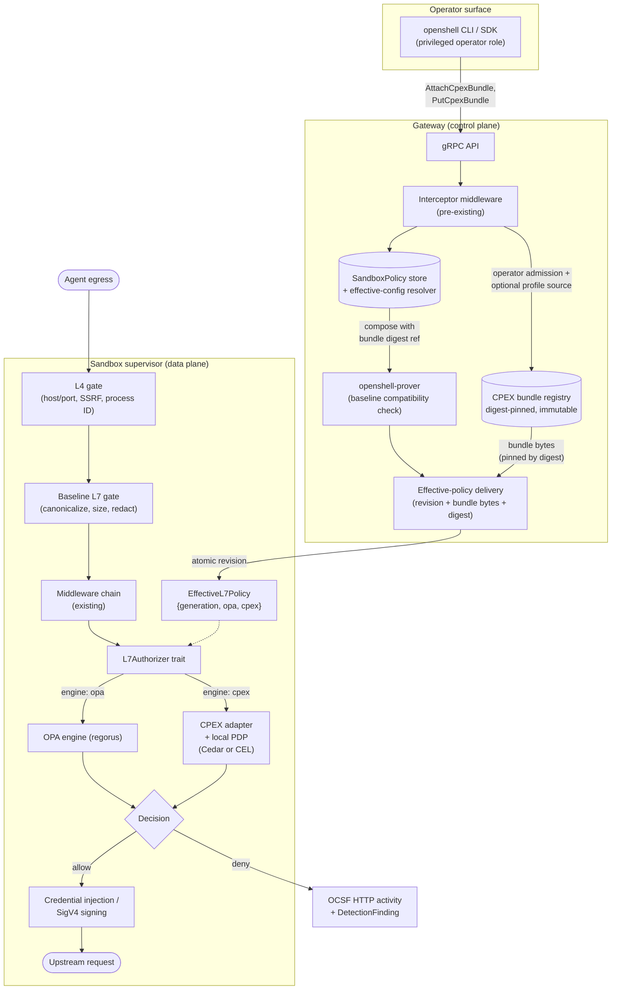

# Proposal: CPEX-backed Authorization for OpenShell L7 Egress

> **Status: solicitation for feedback.** This proposal explores an optional,
> operator-owned CPEX authorization adapter for OpenShell L7 egress. It proposes
> a Phase 0 compatibility and threat-model spike before any in-tree product
> integration. Community and maintainer feedback is requested on the ownership,
> control-plane, identity, and PDP choices described below.

## Proposal summary

This proposal explores whether CPEX can provide a valuable *optional,
operator-owned* identity and fine-grained authorization layer for OpenShell's
L7 egress proxy. Its Cedar/CEL, delegation, elicitation, response transformation, and
session-state model align with the project's policy, provider, middleware, and multi-tenant roadmaps.

This is **not** presented as a drop-in replacement for the existing OPA/
`regorus` policy path. The proposed boundaries are:

- OpenShell still needs its local L4 host/port, IP/SSRF, process-identity, and
  baseline L7 protections. Those are enforcement invariants, not merely an
  authorization PDP.
- CPEX's current `main` / 0.2.x release declares Rust **1.96**. OpenShell pins
  Rust **1.95.0** (`rust-toolchain.toml`) and has workspace MSRV **1.90**
  (`Cargo.toml`). Cargo will reject this dependency today.
- OpenShell policies are typed `SandboxPolicy` protobufs sent between gateway,
  drivers, and supervisor; arbitrary top-level YAML cannot simply be read from
  `policy_local.rs` or passed through a Rego data map.
- A bearer token observed in outbound HTTP is not automatically a trustworthy
  user or agent identity. It may be an API key, a credential placeholder, an
  opaque token, or agent-controlled input. Using it as identity without
  verification would be unsafe.

If the Phase 0 gates pass, the proposed first product increment is a narrow
**CPEX authorization adapter** for REST request admission, with a well-defined
trusted identity source and one local PDP. It does not include OAuth exchange or
CPEX's full plugin set. Each later capability requires its own threat model and
approval.

## Current implementation context

### OpenShell integration context

- L4 and L7 evaluation currently share the embedded `regorus`-based
  `TunnelPolicyEngine` in `crates/openshell-supervisor-network/src/opa.rs`.
  L4 endpoint selection and L7 rule evaluation are different queries over the
  same generated policy data.
- `L7EndpointConfig` is extracted from a `regorus::Value` in
  `crates/openshell-supervisor-network/src/l7/mod.rs`, not parsed directly from
  a free-form YAML file. The relays live in `l7/relay.rs`, with additional
  direct evaluations in `l7/websocket.rs` and `proxy.rs`.
- The externally managed policy shape is `SandboxPolicy` in
  `proto/sandbox.proto`; `openshell-policy` uses strict serde
  (`deny_unknown_fields`) to convert policy YAML to/from that protobuf. Any
  endpoint option or policy reference must cross proto generation, policy
  parsing/serialization, composition/merge, gateway validation, and supervisor
  conversion.
- Policy reload already has a `PolicyGenerationGuard`. A CPEX configuration
  must join the *same atomic effective-policy generation*, rather than use an
  independently long-lived runtime.
- The proxy already has valuable security ordering: canonicalization and secret
  redaction before evaluation, then credential injection/signing only after an
  allow decision. That ordering must remain intact.

### CPEX integration context

- CPEX is Apache-2.0 and its 0.2.x facade supports granular `jwt`, `cedar`,
  and `cel` features. It offers an HTTP CMF hook (`cmf.http_request`), not the
  proposed ready-made `CpexRuntime::evaluate(policy_ref, cmf)` API.
- CPEX expects its own structured APL configuration (`global`, routes,
  plugins/PDPs, session stores) to be registered with `PluginManager` and
  invoked via the CMF hook. A `cpex: policies: name: | ...` map and opaque
  `cpex_policy_ref` are an OpenShell adapter design, not CPEX's native schema;
  the adapter must define and validate the mapping.
- CPEX is active but immature for a security-critical dependency: its public
  repository is recently created (December 2025), has low adoption, and its
  README calls it under active development. Pin an exact reviewed release and
  require normal dependency/security approval rather than using a broad
  `version = "0.2"` range.

## Where CPEX fits in the architecture

CPEX is proposed as a **supervisor-side authorizer** with **gateway-side
control-plane surface**. Neither component alone is sufficient: the supervisor
is the only place with process identity, canonicalized request view, and
per-request latency budget; the gateway is the only place with authenticated
operator identity, durable bundle storage, and cross-sandbox composition.



**Placement rationale:**

- Per-request authorization must run inside the supervisor. Only the supervisor
  sees the calling binary identity, canonicalized request view, and redacted
  header set. Round-tripping every L7 request to the gateway would violate
  OpenShell's local-enforcement invariant and add unacceptable latency.
- CPEX cannot preempt the L4/baseline path. The `L7Authorizer` trait fires
  only after L4, canonicalization, redaction, and baseline L7 gates admit the
  request — matching invariant #2 (deny always wins, CPEX never widens).
- The gateway owns bundle authorship. Bundles are large, digest-pinned, and
  operator-signed; they belong in durable gateway state, not inline in
  `SandboxPolicy`. Delivery is atomic within a policy revision so the
  supervisor never runs a CPEX bundle whose OPA companion is stale.
- Delivery is one direction. The supervisor never reaches back to fetch a
  bundle at request time — that would put CPEX bundle egress inside the same
  sandbox network namespace the proxy is guarding.

## Can CPEX ride the gateway interceptor middleware?

The gateway interceptor middleware
(`crates/openshell-gateway-interceptors/`, `proto/gateway_interceptor.proto`)
was merged to let external governance services evaluate **gateway control-plane
operations** — `CreateSandbox`, `SetPolicy`, `UpdateProvider`, and similar
allowlisted RPCs — through phases `MODIFY_OPERATION`, `VALIDATE`, and
`POST_COMMIT`. It is not a data-plane request-authorization mechanism.

### Where the interceptor mechanism *is* a good fit

The interceptor system is genuinely useful for two of the CPEX integration's
control-plane needs:

1. **Bundle vending via `SnapshotProviderProfiles` precedent.** The manifest
   already advertises `provider_profiles = true` to expose a snapshot RPC that
   returns a revision-pinned catalog. The same pattern — a new
   `SnapshotCpexBundles` RPC or a shared "artifact catalog" abstraction —
   would let an external CPEX authoring service vend digest-pinned bundles to
   the gateway on the same manifest, freshness, and duplicate-detection path
   used by provider profiles today. The gateway remains the authoritative
   source; the interceptor is a trusted upstream.
2. **Operator admission for CPEX management RPCs.** New privileged operations
   like `PutCpexBundle`, `AttachCpexBundle`, or `SetCpexIssuer` should be added
   to the interceptable-method allowlist. This gives operators a familiar path
   to reject bundle attachments that violate site policy (e.g. "no bundle
   without SBOM annotation") using `VALIDATE` phase.

Both uses are within the interceptor system's design intent: control-plane
governance, ProtoJSON payloads, `fail_open`/`fail_closed` bindings, secret
field elision, atomic per-binding modifications.

### Where the interceptor mechanism is *not* the right vehicle

CPEX's **per-request L7 admission** — the value the proposal is chasing —
cannot run through gateway interceptors:

| Constraint | Why it rules out gateway interceptors |
|---|---|
| Locus of enforcement | Interceptors run in the gateway process; every agent egress request would need to round-trip out of the sandbox, through the supervisor session, into the gateway, through the interceptor gRPC, and back. That path currently does not exist. |
| Latency budget | Interceptors are unary RPCs to an external service. Per-request L7 admission needs p95 in the low-milliseconds range with in-process locality. |
| Visible context | The interceptor payload is a ProtoJSON view of a *gateway operation*, with secret fields elided by the middleware. It is not the sandbox `L7RequestInfo` — no calling-binary identity, no canonicalized request view, no trusted identity provenance. Reshaping it would create a parallel, weakly-typed data plane. |
| Trust boundary | Interceptors are gateway-configured trusted sources. A per-request PDP call would give the interceptor read access to redacted request views for every sandbox on the gateway, breaking tenant isolation. |
| Reload semantics | The immutable `EffectiveL7Policy { generation, opa, cpex }` snapshot must be constructed atomically per sandbox. An out-of-process interceptor cannot join that generation guard. |

### Recommendation

Treat the interceptor system as the **control-plane distribution channel** for
CPEX artifacts and management admission, and keep per-request authorization
in the supervisor via the `L7Authorizer` trait. Phase 1 RFC should specify
whether a new `SnapshotCpexBundles` RPC is added to the existing manifest
service or a broader "trusted artifact source" abstraction is introduced —
either way, do not overload provider profile snapshotting with bundle
distribution semantics.

## How a CPEX policy is stored in the data model

CPEX bundles are **not** stored inline in `SandboxPolicy`. They live in a
separate gateway-owned registry and are referenced by digest from endpoint
configuration. This mirrors the pattern already established by provider
profile catalogs and interceptor-vended sources: reference in policy, bytes in
a versioned catalog with duplicate-ID detection.

### New protobuf surface (illustrative, Phase 1 RFC to finalize)

```proto
// openshell.sandbox.v1
message NetworkEndpoint {
  // ... existing fields ...

  // Optional L7 authorization engine selection. When unset, endpoint uses
  // the existing OPA-generated L7 rules path. Mutually exclusive with the
  // `access` preset and inline `rules`.
  L7Authorization authorization = 20;
}

message L7Authorization {
  oneof engine {
    // Explicit "use OPA" — no bundle reference required.
    OpaEngine opa = 1;
    // Reference to a gateway-registered CPEX bundle by content digest.
    CpexBundleReference cpex = 2;
  }
}

message OpaEngine {}

message CpexBundleReference {
  // Immutable content digest of the registered bundle: "sha256:...".
  // Validated at policy load; unresolved digests reject the revision.
  string digest = 1;

  // Local PDP kind selected for this endpoint. The gateway rejects the
  // revision if the digest's bundle does not declare a matching PDP.
  CpexPdpKind pdp = 2;

  // Optional bundle version tag for audit/UX only. The digest is authoritative.
  string version_tag = 3;
}

enum CpexPdpKind {
  CPEX_PDP_KIND_UNSPECIFIED = 0;
  CPEX_PDP_KIND_CEDAR = 1;
  CPEX_PDP_KIND_CEL = 2;
}
```

### Durable storage (gateway)

Two logically separate tables, both operator-owned:

| Table | Purpose | Ownership |
|---|---|---|
| `cpex_bundle` | Immutable, content-addressed bundle blobs keyed by digest. Rows are append-only. Columns: `digest` (PK), `bytes`, `pdp_kind`, `size`, `sbom_ref`, `signature`, `uploaded_by`, `uploaded_at`. | Written only by `PutCpexBundle` operator RPC. Not writable by sandboxes, policy proposals, or agent-editable paths. |
| `cpex_bundle_attachment` | Which sandbox / gateway scope may use which bundle. Enforces that `SandboxPolicy` revisions can only reference an attached bundle. Columns: `scope` (`gateway` or `sandbox:<id>`), `digest`, `attached_by`, `attached_at`. | Written by `AttachCpexBundle` operator RPC. Detachment leaves the bundle row in place but rejects new revisions referencing it. |

Bundle bytes are never modified in place. Rotation is "upload new digest,
attach it, update endpoint reference, detach old digest." This gives the
policy advisor and audit trail a stable per-revision identity.

### Sandbox-policy revision lifecycle

1. Operator uploads bundle → `cpex_bundle(digest=sha256:abc…, bytes=…)`.
2. Operator attaches → `cpex_bundle_attachment(scope='sandbox:s-42', digest=sha256:abc…)`.
3. Agent or operator submits a `SandboxPolicy` revision with an endpoint
   whose `authorization.cpex.digest = "sha256:abc…"`.
4. Gateway policy validator checks:
   - digest exists in `cpex_bundle`;
   - digest is attached to the target scope;
   - declared `pdp` matches `cpex_bundle.pdp_kind`;
   - baseline compatibility gate (openshell-prover) still passes.
5. Effective config resolver bundles the revision **plus** the referenced
   bundle bytes into the same policy generation payload sent to the
   supervisor. Delivery is atomic per generation.
6. Supervisor's effective-policy constructor compiles the OPA engine, then
   compiles the CPEX runtime from the delivered bundle bytes, then publishes
   `EffectiveL7Policy { generation, opa, cpex }` under the existing
   `PolicyGenerationGuard`. Any failure keeps the last-known-good generation.

### Why not inline the bytes in `SandboxPolicy`

- **Size.** Bundles can be tens of kilobytes of Cedar/CEL plus schema. Inline
  APL bloats every policy revision, every policy proposal message, every
  policy YAML round trip, and the mechanistic mapper's audit history.
- **Attribution.** Bundle authorship must survive policy revision churn.
  Content-addressed storage separates "who authored this bundle" from
  "which sandbox is currently using it."
- **Agent-proposal safety.** `SubmitPolicyAnalysis` accepts proposals from
  agents. Inline APL would let an agent-authored chunk change the effective
  policy engine. Digest reference plus attachment table forces bundle changes
  through the operator-only path.
- **Cache and reuse.** Two sandboxes attached to the same bundle digest
  share compiled CPEX runtime state (per supervisor) and the same audit
  identity across supervisors.

### Interaction with policy advisor

The policy advisor pipeline (`openshell-prover` + auto-approval gate) treats a
CPEX-referenced endpoint as a first-class rule. The prover already answers
categorical questions about baseline reach; it does not evaluate Cedar/CEL
semantics. Phase 1 must decide whether the prover treats any endpoint with
`authorization.cpex` as an implicit `capability_expansion` (safer default,
forces manual review) or extends its model to reason about attached-bundle
allow sets (more accurate but larger scope). The proposal recommends the
former for v1: any policy revision that adds or changes a CPEX bundle
reference bypasses auto-approval.

## Proposed design constraints

The following constraints define the proposal from the outset. They are intended
to focus community discussion on a secure, supportable integration rather than
to prescribe an implementation prematurely.

| Design area | Constraint and rationale | Proposed approach |
|---|---|---|
| Dependency compatibility | CPEX declares `rust-version = 1.96`; OpenShell uses 1.95.0. | First obtain a CPEX release compatible with OpenShell's supported Rust baseline, or upgrade OpenShell through its normal MSRV process. Do not raise the MSRV for this feature alone. |
| Policy configuration | `policy_local.rs` serves the in-sandbox advisor API; it is not policy ingestion. `SandboxPolicy` proto and strict YAML types reject that field. | Define a typed, versioned protobuf/config surface and propagate it through gateway, supervisor, serialization, merge and proposal validation—or use a separately distributed, operator-owned bundle. |
| Baseline enforcement | L4 routing/SSRF/process checks and the existing generated L7 rules remain OPA-backed. A CPEX endpoint with no conventional rules may be denied before the proposed dispatch executes. | Specify a composition contract: **OpenShell baseline gate AND selected authorization engine**. Add an explicit safe baseline mode for CPEX endpoints, never an implicit empty-rule bypass. |
| Identity provenance | Outbound credentials are not authenticated identity and may be agent-controlled, opaque, or secret. Treating them as identity could permit spoofing or disclosure. | Accept identity only from a configured trusted source: verified gateway/supervisor attestation, validated issuer/audience/JWKS with bounded cache, or an explicitly configured mTLS/SPIFFE identity. Treat all outbound authorization headers as secrets; do not log, persist, or use them as identity by default. |
| Policy reload | An independently long-lived runtime can evaluate a stale policy after reload; an OPA guard alone does not prove CPEX configuration is coherent with it. | Build an immutable `EffectiveL7Policy { generation, opa, cpex }`, atomically swap it, and make every evaluation use one snapshot/generation. Close/retry or finish according to explicit reload semantics. |
| Enforcement coverage | There are additional direct calls in WebSocket and forward-proxy paths. An async CPEX path also changes call signatures and error paths. | First inventory and centralize all request-admission paths behind a single engine-neutral interface; prove coverage with tests before enabling CPEX. |
| Initial PDP scope | More code and configuration than the first value needs; no issuer/PDP operation model is supplied. | Start with **one local PDP** (recommend Cedar *or* CEL after benchmark/expressiveness spike), no JWT plugin unless verified identity is a tested requirement. |
| Initial decision surface | Predeclaring mutation outputs would create a misleading public contract before wire and ownership semantics are designed. | Keep the first decision type minimal. Design each mutating capability in a later RFC/spike with explicit ownership, rollback, timeout, and secrecy semantics. |
| Session state | Session keys must be authenticated, tenant/sandbox scoped, bounded, expiry-managed, and reliable under restart/HA. | Treat stateful taint as a separate distributed-security feature, not a mechanical backend substitution. |

## Target architecture

### Invariants

1. **OpenShell controls reachability.** L4 allowlisting, DNS/IP validation,
   process binding, TLS behavior, request canonicalization, and credential
   protection execute before any externalized authorization decision.
2. **CPEX cannot widen the baseline.** A CPEX `allow` only permits a request
   already admitted by OpenShell's fixed baseline gate. Deny always wins.
3. **Operator ownership is explicit.** Only an operator-authorized immutable or
   signed policy bundle can select CPEX, PDP configuration, issuers, JWKS
   origins, routes, and limits. Agent policy proposals cannot add/change these.
4. **Identity is authenticated and provenance-labelled.** Every principal
   attribute has a source (`gateway_attested`, `spiffe_verified`,
   `jwt_verified`) and CPEX policy can require one. Absence is not substituted
   with a parsed bearer token.
5. **Failure is closed in enforce mode.** Parse, configuration, identity,
   runtime, timeout, and PDP errors deny. Audit mode logs a distinguishable
   would-deny result; it never converts a failed initialization into a silent
   allow.
6. **No secret disclosure.** Raw authorization/cookie headers, JWTs, exchanged
   tokens, and sensitive claims never enter OCSF messages, policy denial
   responses, metrics labels, or persistent CPEX session/audit state unless a
   separately approved redaction design permits it.

### Evaluation order (initial REST scope)

```text
CONNECT L4: process + hostname + port + resolved-IP/SSRF gate (existing OpenShell)
  -> TLS termination / HTTP parsing / canonicalization (existing)
  -> redact placeholders and construct a minimal non-secret request view
  -> baseline L7 structural gate (method/path/body/header limits; existing)
  -> supervisor middleware chain (existing; per-entry fail_open/fail_closed)
  -> selected authorization engine:
       OPA: existing generated L7 rules
       CPEX: immutable CPEX adapter + one local PDP, using trusted identity
  -> deny/audit decision and OCSF event
  -> existing token grant injection and SigV4 signing
  -> upstream request
```

CPEX sees a purpose-built request view: method, canonical path, selected
non-secret headers, host/port, request size, trusted workload identity, and
(optional) verified subject claims. Header allowlisting is mandatory; forwarding
all raw headers is not.

### Configuration ownership and shape

Do **not** make raw APL an inline field in tenant/agent-editable sandbox policy.
Choose one of these only after Phase 0:

1. **Preferred initial model — gateway-owned bundle registry:** An operator
   registers a CPEX bundle by immutable digest and limited configuration. A
   typed endpoint reference names that registered bundle. The gateway validates
   it and sends an already-approved, digest-pinned payload to the supervisor.
2. **Typed sandbox-policy model:** Add a small protobuf `L7Authorization`
   message and `CpexBundleReference` with an enum engine, opaque *validated*
   bundle ID/digest, and no inline APL. This requires compatibility/versioning
   work across API clients and all policy serialization paths.

Neither model permits endpoint data to configure arbitrary JWKS URLs, PDP URLs,
plugin kinds, or session stores. Those remain operator configuration.

The configuration must be validated transactionally: collect every endpoint
reference, resolve all bundles/PDPs/trusted issuers, compile/initialize CPEX,
validate endpoint/bundle protocol compatibility, then publish the new effective
policy generation. Any failure rejects the policy revision; it must not result
in one endpoint silently falling back to OPA or audit mode.

### Minimal internal interface

First refactor request admission around an engine-neutral, synchronous-or-async
interface, rather than making each protocol relay know CPEX details:

```rust
struct RequestAuthorizationInput<'a> {
    endpoint: &'a L7EndpointConfig,
    request: &'a L7RequestInfo,
    // Canonical, redacted, header-allowlisted representation only.
    request_view: &'a AuthorizedRequestView,
    identity: &'a TrustedIdentity,
    policy_generation: u64,
}

struct AuthorizationDecision {
    effect: AllowOrDeny,
    reason_code: &'static str, // stable, non-secret code
    policy_id: Option<PolicyId>,
    engine: AuthorizationEngine,
}

trait L7Authorizer: Send + Sync {
    async fn authorize(&self, input: RequestAuthorizationInput<'_>)
        -> Result<AuthorizationDecision, AuthorizationError>;
}
```

`AuthorizationDecision` has no token, raw claims, mutable headers, redaction
patches, or session taints in v1. OCSF records the engine and non-secret policy
identifier in structured fields while keeping the existing HTTP activity event
shape. Use a stable engine value such as `cpex-cedar` rather than overloading
`firewall_rule.rule_uid` with an engine name.

## Delivery plan and decision gates

### Phase 0 — compatibility and threat-model spike (no product surface)

**Goal:** prove that a maintainable and safe embedding exists before changing
OpenShell policy schemas. The spike is a decision gate, not a commitment to adopt CPEX.

1. Create an isolated branch/crate that attempts to compile the exact reviewed
   CPEX release with OpenShell's Rust 1.95.0 toolchain, Linux targets, current
   dependency/license/vulnerability gates, and supervisor image constraints.
2. Implement a 50–100 line host prototype using CPEX's real API:
   `PluginManager`, `register_apl`, `load_config_yaml`, and invocation of
   `cmf.http_request`. Demonstrate a single static allow and deny with the
   intended HTTP CMF fields.
3. Compare one Cedar and one CEL policy for expressiveness, deterministic
   behavior, latency, binary/image size, memory, and error behavior. Select
   exactly one for v1—or stop if neither fits.
4. Write a threat model covering attacker control of request headers/body,
   sandbox process identity, policy update path, JWKS/PDP availability, CPEX
   bundle supply chain, cross-tenant/session contamination, and log disclosure.
5. Establish identity provenance. The prototype must demonstrate a verified
   trusted identity, an absent identity deny, an invalid signature deny, issuer
   and audience mismatch denies, JWKS timeout/cache-expiry denial, and a bearer
   API key that is **not** misclassified as identity.
6. Decide whether CPEX can run fully in-process. If any PDP/JWKS call is
   networked, define separate operator-controlled egress, DNS/IP pinning,
   timeout/concurrency limits, cache behavior, and recursion avoidance. Do not
   let it use the sandbox's own egress proxy path implicitly.

**Exit criteria (all required):** compatible released CPEX artifact or approved
OpenShell MSRV plan; exact dependency lock and security approval; local PDP
prototype; signed-off threat model; p95 authorization latency and resource
budgets; no raw credentials in fixtures/logs; maintainer agreement on ownership
and engine composition. Failure means reject/defer rather than workaround in
production code.

### Phase 1 — policy/control-plane design RFC

**Goal:** settle durable public semantics before implementation.

- Define the baseline-gate/CPEX composition semantics, precedence, audit mode,
  denial reason taxonomy, reload behavior, identity sources, and retention.
- Choose the gateway-owned bundle registry or typed protobuf reference model.
  Include proto compatibility, policy YAML round trips, `PolicyMergeOperation`,
  provider policy composition, policy advisor visibility, and SDK/CLI impacts.
- Define authorization boundaries: only privileged gateway/operator APIs can
  create/update bundles, issuers, PDP configuration, or attach a CPEX bundle.
  Ensure agent proposals and provider profiles cannot widen them.
- Define a narrow bundle format that maps OpenShell endpoint identity to CPEX's
  actual HTTP hook/config model. Pin digest and version; disallow arbitrary
  plugins and external endpoints.
- Produce an operational runbook: startup/reload errors, safe rollback,
  cache clearing/key rotation, metrics, alert conditions, policy provenance,
  and emergency disable.

**Exit criteria:** security review approval, gateway/supervisor API review,
backward-compatible serialization plan, migration/rollback plan, and a named
maintainer for CPEX version/CVE response ownership.

### Phase 2 — internal refactor and test harness

**Goal:** make the existing L7 path safely extensible without enabling CPEX.

- Centralize every REST request-admission site, including shared-route,
  forward-proxy, WebSocket-upgrade, and direct proxy paths, behind the new
  authorization interface. Preserve byte-for-byte OPA decisions and existing
  audit/enforce behavior.
- Introduce an immutable `EffectiveL7Policy` snapshot with a single generation
  covering endpoint config, OPA engine, and optional authorizer registry.
- Add a test-only fake authorizer to exercise permit, deny, timeout, malformed
  request view, reload race, and audit-mode behavior without a CPEX dependency.
- Add structured, redaction-verified OCSF fields and metrics:
  decisions/errors/timeouts by engine and reason code; bounded cardinality;
  no principals/tokens/paths as metric labels.

**Exit criteria:** full existing L7 suite passes unchanged; tests prove all
entry points invoke the same abstraction; reload never evaluates a mixed
OPA/CPEX generation; fuzz/property tests preserve canonicalization and header
redaction guarantees.

### Phase 3 — feature-gated REST/CPEX authorization pilot

**Goal:** ship only a small, reviewable capability behind an off-by-default
build and operator feature gate.

- Add an optional, exact-pinned CPEX dependency only after Phase 0 passes.
  Keep its enabled feature set minimal: core + the selected local PDP. Do not
  enable JWT, OAuth, PII, audit, Valkey, or CPEX `full` by default.
- Implement the adapter against CPEX's real CMF HTTP hook and approved bundle
  format. Compile/load during effective-policy construction, never per request.
- Enable `engine: cpex` only for `protocol: rest`, only when a valid
  operator-owned bundle reference is supplied, and only in an allowlisted
  pilot deployment. All other protocol/feature combinations reject the policy
  revision clearly.
- Run in *shadow* mode first: execute CPEX without affecting traffic, record
  redacted decision-difference telemetry, and require a bounded observation
  period. Promotion to audit then enforce is operator-controlled per bundle.
- Fail closed in enforce mode for runtime/PDP/identity/timeouts; use short,
  bounded deadlines and concurrency controls. Do not silently fall back to
  OPA because the CPEX runtime is unavailable.

**Exit criteria:** integration/e2e tests across gateway-to-supervisor policy
propagation; one allow, deny, authenticated subject, unauthenticated subject,
reload, rollback, timeout, and OPA regression scenario; documented pilot SLOs;
security sign-off before enforce mode.

### Phase 4 — separately approved follow-ups

Each needs a new design review and independently deployable tests:

1. Verified JWT identity from an explicit trusted source, including issuer,
   audience, algorithm allowlist, key rotation/cache policy, clock skew, and
   claim minimization.
2. Additional protocols (GraphQL, JSON-RPC/MCP, WebSocket) after each gets an
   accurate non-secret CMF mapping and correct per-message semantics.
3. Response inspection/redaction with bounded buffering, compression and
   transfer-encoding correctness, content-length updates, streaming behavior,
   and a fail-safe response policy.
4. OAuth/RFC 8693 exchange only through OpenShell's credential-provider
   boundary. Tokens must be `Zeroizing`, never available to arbitrary APL or
   logs, audience/scopes must be attenuated, and cancellation/retry semantics
   must be defined.
5. Cross-request taint/session state only after authenticated session ownership,
   tenant/sandbox namespacing, bounded TTL/size, atomic persistence, restart/HA
   behavior, and deletion/retention semantics are approved.
6. Human-in-the-loop elicitation based on CIBA: policy-gated egress requests
   suspended pending an out-of-band approval bound to the concrete request. Requires
   its own design for pending-decision semantics on a proxied HTTP request (hold
   vs. deny-and-retry), bounded pending state with timeout-as-deny, an operator-owned
   out-of-band channel separate from the sandbox egress path, verified approver identity,
   and no request secrets in elicitation prompts.

## Validation matrix

| Area | Required proof |
|---|---|
| Build/supply chain | OpenShell supported Rust builds; locked exact CPEX version; license/SBOM/advisory review; Linux image size and cross-target checks. |
| Baseline security | CPEX cannot bypass L4, DNS/IP, process, canonicalization, path, request-size, or credential-redaction guards. |
| Identity | Missing/invalid/expired/wrong issuer/wrong audience/unknown key identity denies; arbitrary outbound bearer values never grant identity. |
| Authorization | Allow, deny, PDP error, malformed bundle, missing bundle, duplicate route, timeout, and audit/enforce actions have deterministic non-secret outcomes. |
| Reload | Old and new configurations do not mix; bad revision leaves prior revision active or follows explicitly documented fail-safe behavior; rollback works. |
| Secrets/observability | Snapshot tests and log scans show no authorization/cookie/token/body leakage; OCSF maintains policy provenance and decision attribution. |
| Operations | Cold start, reload, PDP/JWKS outages, cache expiry, concurrency exhaustion, and emergency disable meet stated SLOs. |
| Compatibility | Existing OPA endpoint behavior and policy YAML/protobuf round trips are unchanged when CPEX is disabled. |

## Community context and questions for feedback

This proposal is intentionally scoped as an operator-owned authorization adapter,
not a broad replacement of OPA or an attempt to deliver JWT validation, token
exchange, Cedar/CEL, PII, response transformation, and taint tracking in one
change. The following existing issues suggest relevant demand and design
precedent. They also identify questions the community should help resolve:

- Should CPEX be explored as an in-process adapter, an implementation of the
  existing egress-middleware direction, or not adopted until its ecosystem and
  Rust compatibility mature?
- Is a gateway-owned, digest-pinned bundle registry the appropriate initial
  ownership model, or should a typed `SandboxPolicy` reference be preferred?
- Which trusted identity source and which single local PDP—Cedar or CEL—best
  match OpenShell deployments and operational constraints?
- What pilot users, traffic classes, and success/failure SLOs would make a
  shadow-mode evaluation useful?

Relevant alignment and precedent:

- **Positive alignment:**
  - [#2143](https://github.com/NVIDIA/OpenShell/issues/2143), inbound caller
    authentication/authorization;
  - [#1736](https://github.com/NVIDIA/OpenShell/issues/1736), dynamic identity
    sources for OAuth token exchange;
  - [#1756](https://github.com/NVIDIA/OpenShell/issues/1756), scope attenuation;
  - [#1987](https://github.com/NVIDIA/OpenShell/issues/1987), user-subject
    dynamic token grants;
  - [#1884](https://github.com/NVIDIA/OpenShell/issues/1884), session and
    conversation lifecycle;
  - [#1043](https://github.com/NVIDIA/OpenShell/issues/1043), Privacy Guard;
  - [#2109](https://github.com/NVIDIA/OpenShell/issues/2109), managed maximum
    policies.
- **Strong design precedent:** [#1733](https://github.com/NVIDIA/OpenShell/issues/1733)
  (sandbox egress middleware), [#2282](https://github.com/NVIDIA/OpenShell/issues/2282)
  (operator-controlled middleware bindings), and
  [#2217](https://github.com/NVIDIA/OpenShell/issues/2217) (manifest digest
  pinning) support an extension model only when operator authority and manifest
  drift are constrained.
- **Design concerns this proposal intends to address:** [#1842](https://github.com/NVIDIA/OpenShell/issues/1842)
  (signed frozen policy bundles), [#1942](https://github.com/NVIDIA/OpenShell/issues/1942)
  (stale-policy proxy race), and the active L7 security bugs such as
  [#2251](https://github.com/NVIDIA/OpenShell/issues/2251) indicate that
  reload atomicity, policy provenance, and basic proxy correctness will be
  scrutinized before another authorization runtime is trusted.

### Requested feedback

Please comment on the proposed Phase 0 exit criteria, the baseline-gate/CPEX
composition rule, bundle ownership and distribution, trusted identity sources,
PDP selection, and the shadow-to-enforce rollout. Feedback that identifies a
simpler path through the existing identity, credential, or egress-middleware
work is especially welcome. This proposal does not claim token exchange, PII,
response redaction, or taint support until those capabilities have separately
approved designs.

## Explicit initial non-goals

- Replacing `regorus` / OPA for L4 routing, IP/SSRF checks, process identity,
  or existing baseline L7 controls.
- Reading identity from an unverified outbound `Authorization` header.
- Inline arbitrary APL, PDP, JWKS, plugin, or session-store configuration in
  agent-editable sandbox policy.
- Remote PDP/JWKS access through the sandbox data path without an approved
  control-plane egress design.
- OAuth exchange, credential replacement, PII scanning, response mutation,
  body redaction, taint/session persistence, Valkey, GraphQL, JSON-RPC, MCP,
  WebSocket, and SQL support in the pilot.
- A public schema/API change before Phase 1 approval.

## Proposed next step

Solicit feedback on this proposal, then open a small **Phase 0 spike** if there
is maintainer agreement on the problem statement and ownership model. Its
deliverables are a compatibility report, host prototype, threat model,
benchmark, and RFC decision—not production CPEX code. If the spike cannot
establish compatibility with OpenShell's Rust baseline or meet the trusted
identity and control-plane requirements, it should document that outcome and
recommend whether the existing middleware or provider-roadmap work is a better
path.
