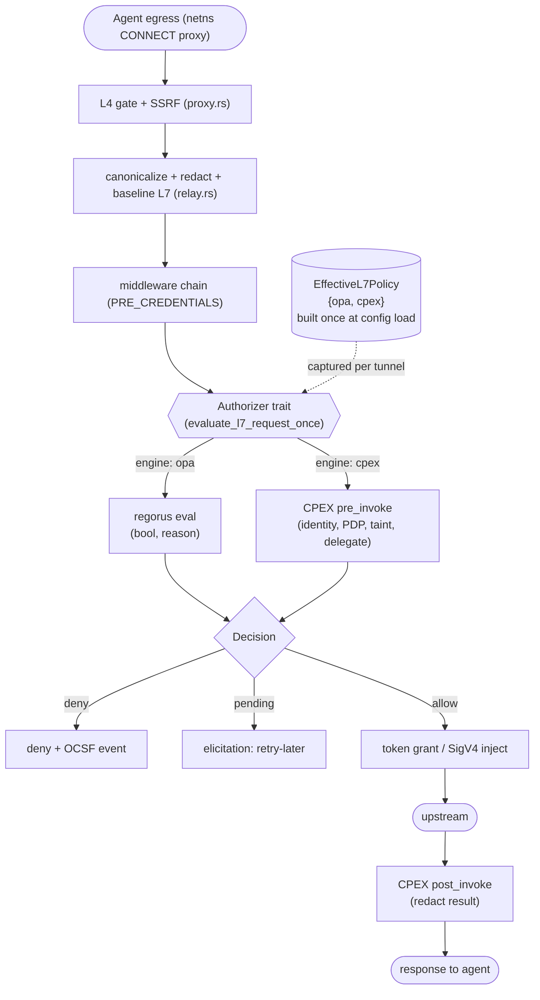

# CPEX in OpenShell (Path 2): Proof-of-Feasibility

**Target repos:** two repos are touched. `openshell:` prefixes paths in the OpenShell fork (`../OpenShell`); `cpex:` prefixes paths in this repo (`./cpex`, branch `feat/openshell_integration`). Unprefixed paths are in the plan's home repo (`cpex`).

## Summary

Embed CPEX in-process in the OpenShell fork as an engine-neutral L7 authorizer peer to OPA, inserted at the single relay choke point (`evaluate_l7_request_once`), compiled into the same policy generation as regorus, and driven by a promoted CPEX embedding API. Then prove it with a deterministic scripted agent in a real sandbox running the capstone scenario over REST and MCP: identity gate, field redaction, RFC 8693 delegation, cross-call taint exfil block, Cedar/CEL swap, and CIBA elicitation.

---

## Problem Frame

OpenShell's L7 egress evaluates each request statelessly against transport coordinates and cannot express identity-aware redaction, per-operation credential attenuation, or cross-call exfiltration control. The CPEX integration proposal argues an in-process embed closes these gaps but has never been shown running inside OpenShell against its real egress path, baseline gates, and policy lifecycle. This plan builds that demonstration. Full motivation, actors, and scope live in the origin requirements doc (see Sources & References).

---

## Requirements

Carried from origin (see origin doc for full text):

- R1. Engine-neutral authorizer seam; CPEX peer to OPA, selected per endpoint.
- R2. CPEX consulted only after L4 + baseline gates; can only narrow; deny wins.
- R3. CPEX joins the atomic effective-policy generation; compiled at construction, never per request; failure keeps last-known-good.
- R4. Feature-gated, off by default; OPA path unchanged when disabled.
- R5. Bundle loads directly from supervisor config; no gateway control-plane.
- R6. Promote a supported CPEX embedding entry point (construct, load, evaluate) instead of reusing the tutorial `mediate()` harness.
- R7. Fully in-process with in-memory session state; no Valkey.
- R8. Enforcement covers REST and MCP; MCP demonstrates protocol-semantic authorization.
- R9. Per-request human identity from a trusted Keycloak-issued JWT validated by CPEX, per-session; raw bearer never trusted as identity.
- R10. Identity-gated allow/deny.
- R11. Identity-aware response redaction (post-invocation).
- R12. Per-operation delegation / RFC 8693 token exchange.
- R13. Cross-call exfil block via session taint.
- R14. Cedar↔CEL PDP swap, same outcome.
- R15. CIBA elicitation: suspend then resume.
- R16. Deterministic scripted agent in a real sandbox; critical steps fire every run.
- R17. Reuse Praxis/capstone scenario content, personas, policies, mock backends.
- R18. Demo runnable in a few commands; exercises the full matrix in one pass.
- R19. No requirement/plan doc ID references in source, rustdoc, comments, or commits.

**Origin actors:** A1 Bob (HR role), A2 Alice (no HR role), A3 Eve (partial perms), A4 scripted agent, A5 OpenShell supervisor/proxy (PEP), A6 CPEX runtime, A7 operator (owns bundle/config), A8 Keycloak (IdP).
**Origin flows:** F1 cross-call exfil block, F2 identity-gated access + redaction, F3 delegation/token exchange, F4 CIBA elicitation.
**Origin acceptance examples:** AE1 (R2,R13,R16), AE2 (R10,R11), AE3 (R12), AE4 (R14), AE5 (R15), AE6 (R8), AE7 (R4).

---

## Scope Boundaries

- Path 1 (remote gRPC middleware) and path 3 (extended-contract RFC) are not built.
- No upstreaming and no real MSRV reconciliation; the 1.96 fork bump is a PoC shortcut.
- No production hardening: no Helm, HA, multi-node, or performance SLOs.
- No gateway control-plane: no operator bundle RPCs, digest-pinned object store, attach/detach, or prover/advisor integration.
- No formal threat-model sign-off, security review, or shadow-to-audit-to-enforce rollout; the PoC runs in enforce mode.
- No multi-tenant/workspace identity resolution or SPIFFE delegation chains beyond demo needs.
- No protocols beyond REST and MCP.
- No body-transforming middleware on `engine: cpex` endpoints (avoids the synchronous `transformed_body_validator` re-eval island; keeps the async bridge clean).
- No live CPEX bundle hot-reload or staleness reconciliation; the CPEX bundle is fixed per process and bundle changes (including the Cedar/CEL swap for AE4) require a restart. OpenShell's own OPA reload path is untouched.
- No streaming response redaction; the redaction path assumes bounded response bodies.
- No production credential-provider/token-custody redesign; token exchange hits the demo Keycloak directly.

### Deferred to Follow-Up Work

- Real MSRV reconciliation (CPEX lowers to 1.95 or OpenShell advances through its process): tracked for upstreaming, not this PoC.
- Gateway control-plane bundle machinery (`PutCpexBundle`/`AttachCpexBundle`, digest-pinned `objects` store): separate work per the integration proposal.

---

## Context & Research

### Relevant Code and Patterns

**OpenShell fork (`../OpenShell`):**
- `openshell: crates/openshell-supervisor-network/src/l7/relay.rs` — `evaluate_l7_request_once` (~line 1919) is the single sync choke point every relay converges on; returns `Result<(bool, String)>`. `L7EvalContext` (~line 38) carries host/port/binary_path/ancestors/token_grant_resolver. The OPA input JSON assembled here (`{network, exec, request}`) is the feature set for CMF mapping.
- `openshell: crates/openshell-supervisor-network/src/l7/mod.rs` — `L7EndpointConfig`, `L7RequestInfo` (method/target/query/graphql/jsonrpc; no headers/identity), `L7Decision` (lightweight, currently unused on the eval path), `parse_l7_config`.
- `openshell: crates/openshell-supervisor-network/src/opa.rs` — `OpaEngine` (holds `generation: Arc<AtomicU64>`), `TunnelPolicyEngine`, `PolicyGenerationGuard`, `clone_engine_for_tunnel` (~line 749), `reload_*` (~475-558; hold-lock-then-replace + `fetch_add`). No `EffectiveL7Policy` type today.
- `openshell: crates/openshell-supervisor-network/src/l7/jsonrpc.rs` — `parse_mcp_call`, `JsonRpcCallInfo { method, params, tool }` per-call view for MCP→CMF.
- `openshell: crates/openshell-supervisor-network/src/l7/token_grant_injection.rs` — `TokenGrantResolver` async trait + `SpiffeTokenGrantResolver` (RFC 8693 exchange), injected after allow. Delegation rides this seam.
- `openshell: crates/openshell-sandbox/src/lib.rs` — `run_sandbox` (~line 84); egress via netns CONNECT proxy at `127.0.0.1:3128`.
- `openshell: e2e/rust/src/harness/sandbox.rs` — `SandboxGuard::create(... -- <command>)`; models `e2e/rust/tests/forward_proxy_jsonrpc_l7.rs`, `forward_proxy_graphql_l7.rs`; upstream server helper `ContainerHttpServer::start_python` in `openshell: e2e/rust/src/harness/container.rs`; MCP via `e2e/mcp-conformance/`. Gated behind `feature = "e2e"`.
- Toolchain pins: `openshell: rust-toolchain.toml` (1.95.0), `openshell: mise.toml`, `openshell: mise.lock`, `openshell: .github/workflows/release-vm-kernel.yml`; workspace `rust-version = "1.90"`, edition 2024. Strict workspace lints (pedantic+nursery warn). License allowlist in `openshell: about.toml`.
- Feature-gating precedent: `openshell: crates/openshell-sandbox/Cargo.toml` (`default = ["telemetry"]`, features forward to sub-crates). `openshell-supervisor-network` has no `[features]` section yet.

**CPEX (`./cpex`):**
- `cpex: examples/tutorial/src/mediate.rs` — the enforcement loop to promote: identity.resolve → `cmf.tool_pre_invoke` → backend → `cmf.tool_post_invoke`; outcomes `Allowed{result}` / `Denied{code,reason}` / `Pending{elicitation_id,approver}`; `modified_payload` carries redactions, `modified_extensions` carries delegated tokens/session labels; elicitation surfaces as violation code `elicitation.pending`.
- `cpex: crates/cpex-ffi/src/apl.rs` — canonical construction: `register_builtins` → `AplOptions::in_process()` + `pdp_factories = builtin_pdps()` (cedar-direct, cel) + session_store_factories → `register_apl` → `load_config_yaml` → `initialize`.
- `cpex: crates/apl-cpex/src/register.rs` — `AplOptions`, `in_process()` (defaults `MemorySessionStore`, empty pdp_factories), `register_apl`.
- `cpex: crates/apl-cpex/src/visitor.rs` — `hook_pair_for_entity(entity_type)` maps entity_type → (pre, post) CMF hooks; routes keyed `entity_type:entity_name[@scope]`.
- `cpex: crates/apl-cpex/src/session_resolver.rs`, `session_store.rs` — session key derivation, `SessionStore` trait (`load_labels`/`append_labels`), `MemorySessionStore`.
- `cpex: crates/cpex-core/src/cmf/constants.rs` — `HOOK_CMF_HTTP_REQUEST = "cmf.http_request"` (request-phase), `HOOK_CMF_TOOL_PRE_INVOKE` / `HOOK_CMF_TOOL_POST_INVOKE` (pre+post; post enables redaction).
- `cpex: examples/tutorial/policies/capstone.yaml` — the demo scenario policy verbatim; `examples/tutorial/idp/` (Keycloak realm + docker-compose); `examples/tutorial/src/backends.rs` (mock HR/repo/email).
- `cpex: crates/cpex/Cargo.toml` — facade features (`jwt`, `oauth`, `pii`, cedar, cel, `builtins`, `full`); `full` adds Valkey (not needed).

### Institutional Learnings

- `cpex: docs/dev/issue19_implementation_plan.md` — canonical embedding sequence; `register_apl` MUST run before `load_config`, and use `load_config_yaml` (not `load_config`) so `apl:` blocks are walked. `crates/cpex-ffi/src/lib.rs` is a reference host.
- `cpex: docs/plans/2026-06-17-001-feat-valkey-session-store-plan.md` — `SessionStore` seam; `MemorySessionStore` labels are process-local and vanish on restart (acceptable for single-node PoC, R7).
- `cpex: docs/specs/cpex-go-spec.md` — process-singleton tokio runtime (`OnceLock`), worker-thread knob set before first manager, shutdown/invoke locking discipline. Applies to a long-lived host embed.
- `cpex: docs/specs/plugin-framework-spec.md` — pipeline is deny-wins and halts on first deny; this is the mechanical property the seam must preserve so CPEX never widens the baseline (R2).

### External References

None. Authoritative patterns live in the two repos; the RFC 8693 / AuthZen specs are already realized in `token_grant_injection.rs` and the CPEX builtins.

---

## Key Technical Decisions

- **Seam at `evaluate_l7_request_once`**: every protocol relay (REST, GraphQL, JSON-RPC/MCP, WebSocket, forward-proxy) converges here, so a single engine-neutral trait insertion covers all protocols without touching each relay. Rationale: minimizes surface area and guarantees no relay bypasses the authorizer (mirrors the enforcement-integrity concern in origin).
- **The embed API is hook-agnostic; the OpenShell adapter chooses the CMF tool hooks.** The reusable embed surface (U1) mediates any host-defined hook via `invoke(hook_name, payload, extensions)`; it does not bake in the CMF-tool hooks. The *adapter* (U5-U7) chooses to map each egress op onto the CMF **tool** entity (`cmf.tool_pre_invoke` / `cmf.tool_post_invoke`) rather than the request-only `cmf.http_request`, because response redaction (R11) needs the post phase and the capstone does redaction on `tool:` routes via the `result:` pipeline. The adapter derives the tool entity_name from the MCP `tools/call` name directly, or from a REST host+path→tool mapping declared in the bundle, calls the embed `invoke` on the pre hook before forwarding and on the post hook against the response. This reuses the capstone policy unchanged and makes MCP the clean semantic showcase (R8).
- **CPEX is built once at config load, not a live-reloaded parallel runtime**: at effective-policy construction, compile the CPEX runtime from the configured bundle alongside the existing OPA engine and hold both behind one `EffectiveL7Policy { opa, cpex }` handle (an `ArcSwap` for a clean atomic publish; `arc-swap` is used in `openshell-server` but must be added to this crate, see U2/U4). A failed CPEX bundle compile fails construction and leaves the prior policy active (no partial publish). This satisfies R3's atomicity literally: a request never sees a half-built OPA/CPEX pair.
- **Live CPEX bundle hot-reload is out of PoC scope** (see Scope Boundaries): OpenShell's OPA reload path is left untouched — its existing generation counter and per-tunnel `clone_engine_for_tunnel` behavior are unchanged. The CPEX bundle is fixed for the process lifetime; changing it (including the Cedar↔CEL swap for AE4) is done by restarting with a different config. This avoids retiring OpenShell's generation counter or reconciling CPEX with its staleness machinery, and removes the per-tunnel-vs-per-operation capture question entirely. Recorded not-chosen alternatives for a future live-reload design: per-operation snapshot re-capture (tightening reloads take effect mid-tunnel) or snapshot-pinned tunnels.
- **OPA cloned per tunnel, CPEX shared by reference**: OPA keeps its existing per-tunnel clone (mutex-free eval); the CPEX runtime is a process-lifetime singleton shared by reference, since its session/taint state must span tunnels. The session/taint store is process-lifetime; a process restart clears it (acceptable for the single-node in-memory PoC).
- **Async authorizer trait, awaited at the relay call sites; no `block_on` on the relay runtime**: the trait is `async` and awaited where the relay is already async. `tokio::runtime::Handle::block_on` on the shared relay runtime is prohibited — it panics ("cannot block the current thread from within a runtime") or starves the worker while CPEX's process-singleton invoke lock serializes. The seam call is wrapped in a bounded timeout so a stuck PDP/identity/JWKS fetch cannot pin a relay task; timeout fails closed. For the PoC, body-transforming middleware on `engine: cpex` endpoints is out of scope (see Scope Boundaries), which avoids the one remaining synchronous call site (`transformed_body_validator`). Recorded alternative if a sync bridge is ever unavoidable: a dedicated CPEX runtime with a `oneshot` handoff, never `block_on` on the relay runtime.
- **Delegation reuses `TokenGrantResolver` with an explicit intent carrier**: a CPEX `delegate(...)` decision from pre-invocation produces a typed delegation intent that the relay carries in a local across the upstream round-trip and passes explicitly into the injection step. OpenShell keeps credential custody. On a delegated route, injection **fails closed** if the intent is absent (no fallback to the broad credential — that would be a silent fail-open on attenuation). The delegated token is audience/scope-bounded to the operation and keyed/cached by subject+session+operation, never by endpoint alone (the existing cache is endpoint-keyed and would otherwise serve one principal's token to another); for the PoC, caching of CPEX-driven grants may simply be disabled.
- **Identity threading is new work, from a dedicated header only**: raw headers are absent from the eval input, so the adapter adds a header field to the request view and populates it at the request-assembly site (`openshell: crates/openshell-supervisor-network/src/proxy.rs`, ~L4240). Identity is read only from a single dedicated header (e.g. `X-CPEX-Identity`) distinct from any credential-carrying header; the adapter never falls back to `Authorization` or any header the relay injects credentials into. The JWT is validated by CPEX's `identity/jwt` plugin (Keycloak issuer/JWKS); no raw bearer is ever treated as identity (R9). The dedicated identity header and the elicitation resume header are added to OpenShell's credential-redaction allowlist before any logging/OCSF emission **and are stripped from the request before it is forwarded upstream** (OpenShell forwards headers verbatim otherwise, leaking the caller's JWT to the backend). Subject-binding of session keys must be preserved (the existing `session_resolver.rs` guard); anonymous/identity-less requests get no session, so taint (F1) is load-bearing on identity resolution succeeding. The `session_id` is derived from the trusted sandbox session (netns/tunnel identity), never an agent- or request-controllable value — otherwise an agent could rotate `session_id` to shed a taint label and evade the F1 exfil block.
- **Non-secret reason codes only**: denial and pending reasons come from a fixed non-secret code enum. No request argument value, response field value, JWT, or token ever appears in a reason string, OCSF event, log line, or elicitation prompt.
- **Bundle from config**: a supervisor config field points at the APL bundle file; loaded once at effective-policy construction. No control-plane (R5).

---

## Open Questions

### Resolved During Planning

- Where does the seam go? `evaluate_l7_request_once` — single convergence point (research-confirmed).
- Does an `EffectiveL7Policy` type exist? No; generation lives in `OpaEngine`. Plan introduces an `EffectiveL7Policy { opa, cpex }` handle built once at config load, leaving OPA's reload path untouched.
- Is the middleware contract (path 1) enough for redaction? No; it is request-only (`HTTP_REQUEST/PRE_CREDENTIALS`), confirming path 2 is required.
- Which CMF hook enables redaction? The tool pre/post pair, not `cmf.http_request`. Adapter maps to tool entities.
- Which session store? `MemorySessionStore` via `AplOptions::in_process()` (default).
- How do OPA and CPEX stay coherent? Both are built into one `EffectiveL7Policy { opa, cpex }` handle at config load (a failed CPEX compile fails construction). Live CPEX hot-reload is out of PoC scope, so there is no reload race; OPA keeps its per-tunnel clone, CPEX is shared by reference (decided — see U4).
- Async mechanism at the seam? Async trait awaited at the relay call sites; `Handle::block_on` on the relay runtime is banned; the call is timeout-bounded (decided — see U6).
- REST host+path→tool mapping shape? A closed, explicit `(host, path, method) → tool` enumeration co-located with the APL bundle, no wildcards, validated at construction that every mapped name resolves to a declared route; an unmapped `engine: cpex` route fails closed (decided — see U5).

### Deferred to Implementation

- Exact config field names for the per-endpoint engine selector and the bundle-path setting.
- The internal shape of the buffering response relay mode (U7), beyond the bounded-body assumption.
- The JSON-RPC/MCP encoding of the retry-later (Pending) signal the scripted MCP client parses and resumes from — the riskiest part of AE5/AE6 over MCP (U9). REST can use an HTTP retry status; the MCP shape is unspecified.
- Whether post-invocation redaction requires buffering the full response body in the relay and how that interacts with streaming (bounded-body assumption for the demo backends).

---

## High-Level Technical Design

> *This illustrates the intended approach and is directional guidance for review, not implementation specification. The implementing agent should treat it as context, not code to reproduce.*

Seam placement (path 2, in-process, peer to OPA):



Marquee flow F1 (cross-call exfil block), showing state that OpenShell cannot express today:

```mermaid
sequenceDiagram
    participant Ag as Scripted agent (A4)
    participant PX as Supervisor proxy (A5)
    participant CX as CPEX (A6)
    participant BE as Mock backend
    Ag->>PX: get_compensation (REST/MCP)
    PX->>CX: pre_invoke (identity=Bob)
    CX->>CX: require(role.hr) PASS; taint(secret, session)
    CX-->>PX: allow
    PX->>BE: forward (delegated scoped token)
    BE-->>PX: record (ssn, salary)
    PX->>CX: post_invoke (redact by perm)
    CX-->>PX: redacted result
    PX-->>Ag: result
    Ag->>PX: send_email(external, body=salary)
    PX->>CX: pre_invoke (identity=Bob, same session)
    CX->>CX: security.labels contains "secret" -> DENY
    CX-->>PX: deny (session_tainted)
    PX-->>Ag: blocked + OCSF audit
```

---

## Implementation Units

### Phase A — CPEX embedding API (`./cpex`)

- U1. **Promote a supported CPEX embedding/authorizer API**

**Goal:** Replace ad-hoc `mediate()` reuse with a real, supported, **hook-agnostic** entry point a host calls to construct the runtime once and mediate operations against any hook it defines. Satisfies R6.

**Requirements:** R6, R7 (supports R10-R15 downstream).

**Dependencies:** None.

**Files:**
- Create: `cpex: crates/cpex/src/embed.rs`
- Modify: `cpex: crates/cpex/src/lib.rs` (gated `pub mod embed` behind `cpex-builtins`)
- Modify: `cpex: crates/cpex/Cargo.toml` (add `serde_json` dep; `tokio` dev-dep)
- Test: `cpex: crates/cpex/tests/embed_authorizer.rs`

**Approach:**
- Wrap the construction sequence (`register_builtin_plugins` → `AplOptions::in_process()` with cedar+cel `pdp_factories` → `register_apl` → `load_config_yaml` → `initialize`) behind one constructor (`from_bundle_yaml`) taking bundle YAML and an **injected process-lifetime `SessionStore`** (so the host controls its lifetime; taint labels must outlive individual operations). Use the facade's renamed symbols (`register_builtin_plugins`, `builtin_pdp_factories`, `builtin_session_store_factories`). Gated on `cpex-builtins`.
- **The core surface is hook-agnostic**, matching how CPEX mediates any host-defined hook: `invoke(hook_name, payload: Box<dyn PluginPayload>, extensions) -> Outcome` over `PluginManager::invoke_by_name`, where `Outcome` is `Allow { extensions, payload } | Deny { code, reason } | Pending { elicitation_id, approver }`. Do **not** bake in the CMF-tool hooks or tool-message construction — that mapping is the OpenShell adapter's choice (U5), not the embed API's. Provide a `resolve_identity(token, extensions)` convenience for the near-universal identity step and a `manager()` escape hatch for `invoke_named`/custom hooks.
- Background tasks (e.g. session-label persistence for taint) are awaited before returning, so state a policy committed during the hook is durable once the host sees `Allow`.
- **No fabricated raw fallback (fail-closed-friendly)**: `Allow.payload` is the pipeline's own resulting payload (transformed when a rule fired, otherwise the input carried through), never a copy the API substitutes for the input the way `mediate()`'s `…unwrap_or(raw_result)` does. The redaction-eligible fail-closed *decision* (deny when a route that should redact yields no usable payload) belongs to the host adapter (U7), which knows which routes are redaction-eligible.
- **Session-store load failure fails closed**: this is CPEX-internal (the session resolver treats a `SessionStore::load_labels` `Err` as a deny, not "no labels"). The embed API relies on that and does not swallow it; verify in the adapter/e2e path (U6).
- Keep it host-agnostic; do not import OpenShell types. Preserve deny-wins semantics (first denying step halts).

**Patterns to follow:** `cpex: examples/tutorial/src/mediate.rs` (loop shape — but correct its `unwrap_or(raw_result)` fail-open and generalize off the tool hooks), `cpex: crates/cpex-ffi/src/apl.rs` (construction/lifecycle).

**Test scenarios:** (host builds tool-CMF payloads to drive the generic `invoke`; structural policy only, no IdP)
- Construction: malformed bundle YAML fails with a clear error (not a panic).
- Happy path: an open route allows.
- Error path: `require(authenticated)` denies an anonymous caller.
- Error/happy: an args-conditional `deny(...)` denies on the matching arg and allows otherwise (exercises arg flow).
- Happy path: a `result:` redaction route transforms the payload; non-redacted fields pass through.
- Edge: a route with no `result:` pipeline allows and carries content through unchanged (the API surfaces the pipeline's payload, never a fabricated raw copy).
- (Identity-, delegation-, taint-, and elicitation-dependent flows need Keycloak and are exercised in U10, not here.)

**Verification:** A host can construct the runtime once and mediate allow/deny/pending over any hook without touching tutorial harness code; `mediate()` could be reimplemented on top of the API; the API never fabricates a raw fallback.

---

### Phase B — OpenShell seam and policy lifecycle (`../OpenShell` fork)

- U2. **Toolchain bump + off-by-default `cpex` dependency**

**Goal:** Make the fork build against CPEX at Rust 1.96 behind a feature gate, with no behavior change when disabled. Satisfies R4 (build half) and the 1.96 PoC shortcut.

**Requirements:** R4.

**Dependencies:** U1 (dependency target exists).

**Files:**
- Modify (toolchain pins — bump all together): `openshell: rust-toolchain.toml`, `openshell: mise.toml`, `openshell: mise.lock`, `openshell: .github/workflows/release-vm-kernel.yml`, and `openshell: tasks/python.toml` (`RUST_TOOLCHAIN_SCOPE` default `rustup-1.95.0`). The deploy/docker Dockerfiles also pin 1.95.0 but are outside the PoC build path — leave them and note the exclusion.
- Modify: `openshell: Cargo.toml` (workspace deps; optional `rust-version`; **add `arc-swap` to `[workspace.dependencies]`** — it is not there today, only in `openshell-server`), `openshell: crates/openshell-supervisor-network/Cargo.toml` (add `[features] cpex = ["dep:cpex", ...]`, omit from default; add the `arc-swap` dependency for U4), `openshell: about.toml` (license allowlist if any transitive dep needs it)

**Approach:**
- Bump all toolchain pins to 1.96. Add `cpex` as an optional workspace dependency with only the features needed (`jwt`, `oauth`, `pii`, cedar, cel; not `full`/Valkey).
- Introduce a `cpex` feature on `openshell-supervisor-network` (greenfield `[features]` section), off by default, forwarding to the dep.

**Patterns to follow:** `openshell: crates/openshell-sandbox/Cargo.toml` feature style.

**Test scenarios:**
- Covers AE7. Build with default features: compiles, and existing OPA behavior is unaffected (no cpex symbols linked).
- Build with `--features cpex`: compiles against CPEX at 1.96.
- Edge: license check (`cargo about`) passes with CPEX transitive deps, or the offending license is surfaced.

**Verification:** Both feature configurations build; default build links no CPEX code.

---

- U3. **Introduce the engine-neutral authorizer seam (OPA parity first)**

**Goal:** Refactor `evaluate_l7_request_once` behind a trait both engines implement, with OPA as the sole impl initially and byte-for-byte identical decisions. Satisfies R1 structurally.

**Requirements:** R1, R2, R4.

**Dependencies:** U2.

**Files:**
- Create: `openshell: crates/openshell-supervisor-network/src/l7/authorizer.rs` (trait + OPA impl)
- Modify: `openshell: crates/openshell-supervisor-network/src/l7/relay.rs` (`evaluate_l7_request_once` and its wrappers `evaluate_l7_request` ~L1671, `evaluate_jsonrpc_l7_request_for_log` ~L1699 delegate to the trait), `openshell: crates/openshell-supervisor-network/src/l7/mod.rs` (reuse/extend `L7Decision`)
- Modify (call sites moving to the async signature): the async relays `relay_rest`/`relay_graphql` (via `relay.rs:1394`) and the WebSocket path — note the leaf sites `l7/websocket.rs` (~L550/617) sit inside the sync helpers `inspect_websocket_text_message`/`inspect_graphql_websocket_message` (caller ~L504), which must become async, and `l7/graphql.rs:818` is a `#[cfg(test)]` site, not production. Verify the exact call-site census against the code at implementation time rather than trusting these line numbers.

**Approach:**
- Define an **async** trait (e.g. `L7Authorizer`) taking the existing `(L7EvalContext, L7RequestInfo)`-equivalent input and returning a decision struct (allow/deny + non-secret reason code + engine tag). Wrap current regorus logic as the OPA impl. Adopt the async signature now (not later) so characterization tests pin the final shape and every async call site moves once.
- **Do not force the whole seam async.** `reevaluate_transformed_body` (`relay.rs` ~L1789, sync) calls `evaluate_l7_request` and hands a **synchronous** closure (`transformed_body_validator`, ~L1852) into `TransformedBodyPolicy::Reevaluate` in the `openshell-supervisor-middleware` crate. Body-transform middleware is out of scope for `engine: cpex` endpoints, but OPA endpoints still use this sync path, so it cannot take an async authorizer. Keep OPA's transformed-body re-eval as a **sync, OPA-only** evaluation; the async trait is the primary-decision seam, and `engine: cpex` never enters the sync re-eval closure. Name `reevaluate_transformed_body`, `transformed_body_validator`, and the `openshell-supervisor-middleware` crate in scope.
- Route every primary call site through the trait; keep deny-wins ordering relative to the baseline gate. Batch splitting stays in the wrappers (per-call synthesized request), so the seam still sees one call.
- Map errors to the seam's existing `miette::Result`, failing closed.

**Execution note:** Characterization-first — add inline `#[cfg(test)]` tests in `relay.rs`/`opa.rs` pinning current OPA allow/deny outcomes before refactoring, since this is a security-critical existing path.

**Patterns to follow:** existing `OpaEngine` decision shapes in `openshell: crates/openshell-supervisor-network/src/opa.rs`.

**Test scenarios:**
- Covers AE7. Existing L7 REST allow/deny cases produce identical decisions through the trait.
- MCP/JSON-RPC per-call evaluation unchanged (batch splitting preserved).
- GraphQL and WebSocket message eval paths still route through the seam.
- OPA transformed-body re-eval (`reevaluate_transformed_body`) still evaluates synchronously and yields identical decisions; `engine: cpex` endpoints never enter this sync path.
- Edge: baseline hard-deny still precedes engine eval.

**Verification:** Full existing L7 suite passes unchanged; all relays invoke the trait.

---

- U4. **Build CPEX into an `EffectiveL7Policy` handle at config load (no live hot-reload)**

**Goal:** Compile the CPEX runtime from the config-supplied bundle alongside OPA and hold both behind one `EffectiveL7Policy { opa, cpex }` handle, built once at effective-policy construction. Live bundle hot-reload is out of PoC scope. Satisfies R3, R5, R7.

**Requirements:** R3, R5, R7.

**Dependencies:** U1, U3.

**Files:**
- Create: `openshell: crates/openshell-supervisor-network/src/l7/effective_policy.rs` (`EffectiveL7Policy { opa, cpex }` handle + `ArcSwap` holder)
- Create: `openshell: crates/openshell-supervisor-network/src/l7/cpex_runtime.rs` (owns the CPEX embedding handle from U1; `#[cfg(feature = "cpex")]`)
- Modify: `openshell: crates/openshell-supervisor-network/src/opa.rs` (`from_*` builders assemble the handle; OPA's existing generation counter and `clone_engine_for_tunnel` are left unchanged)
- Modify: supervisor config surface that constructs the engine (bundle path field) — exact file located during impl (near `run_sandbox` / `load_policy`, `openshell: crates/openshell-sandbox/src/lib.rs`)

**Approach:**
- At effective-policy construction, compile the CPEX runtime from the configured bundle (U1 API) alongside the OPA engine and assemble one `EffectiveL7Policy { opa, cpex }` published behind an `ArcSwap`. A failed CPEX compile fails construction and leaves the prior policy active (no partial publish) — this is R3's atomicity.
- **No live CPEX hot-reload for the PoC.** Leave OpenShell's OPA reload path untouched (its generation counter and per-tunnel `clone_engine_for_tunnel` are unchanged). The CPEX bundle is fixed for the process lifetime; the Cedar↔CEL swap (AE4) and any bundle change are done by restarting with a different config. This deliberately avoids retiring the generation counter or reconciling CPEX with OPA's staleness machinery.
- OPA keeps its per-tunnel clone (mutex-free eval); the CPEX runtime is a process-lifetime singleton shared by reference (session/taint state spans tunnels). Hold the `SessionStore` for the process lifetime; a restart clears it (acceptable for the in-memory PoC).

**Patterns to follow:** `arc-swap` usage in `openshell: crates/openshell-server/src/tls.rs`; the existing engine-construction path in `opa.rs` (extended to also build the CPEX half).

**Test scenarios:**
- Happy path: with a bundle configured, the constructed `EffectiveL7Policy` holds a coherent OPA+CPEX pair; tunnels see both.
- Error path: a bad bundle fails construction and leaves the prior policy active (no CPEX-only or OPA-only mixed state).
- Edge: no bundle configured → no CPEX runtime, OPA-only (parity with U3).
- Cedar/CEL (AE4): starting with the CEL bundle vs the Cedar bundle (config change + restart) yields identical outcomes for the same request.

**Verification:** CPEX and OPA are always constructed as a coherent pair; a bad bundle never takes effect; no live-reload machinery is introduced; the Cedar/CEL swap works across restarts.

---

### Phase C — CPEX enforcement capabilities (`../OpenShell` fork)

- U5. **Request-view → CMF mapping (REST + MCP) with verified identity threading**

**Goal:** Translate an OpenShell egress operation into a CPEX tool-entity CMF operation, including a verified JWT subject. Satisfies R8, R9; foundation for R10-R15.

**Requirements:** R8, R9.

**Dependencies:** U4.

**Files:**
- Create: `openshell: crates/openshell-supervisor-network/src/l7/cpex_adapter.rs` (mapping + identity extraction; `#[cfg(feature = "cpex")]`)
- Modify: `openshell: crates/openshell-supervisor-network/src/l7/mod.rs` (add a header field to `L7RequestInfo`; add the per-endpoint `engine` selector + REST→tool map to `L7EndpointConfig` and parse them in `parse_l7_config`)
- Modify: `openshell: crates/openshell-supervisor-network/src/proxy.rs` (~L4240, populate the new identity-header field at the request-assembly site — headers are dropped before eval today); extend the credential-redaction allowlist to cover the identity + resume headers
- Modify: `openshell: crates/openshell-supervisor-network/src/l7/jsonrpc.rs` (reuse `JsonRpcCallInfo.tool` for the MCP tool name)

**Approach:**
- **Engine selection + REST map live in endpoint config, not just the global bundle path.** Add the per-endpoint `engine: opa|cpex` selector and the REST→tool map to `L7EndpointConfig`/`parse_l7_config` (prerequisite for U6 to route per endpoint). The global APL bundle path stays in the sandbox policy-load surface (U4).
- MCP: map `tools/call` name (`JsonRpcCallInfo.tool`) directly to the CMF tool entity_name; method/params → args. This is the semantic showcase.
- REST: a **closed, explicit** `(host, path, method) → tool` enumeration (no wildcards/patterns) co-located with the APL bundle so tool names cannot drift from the `tool:` routes; validate at construction that every mapped name resolves to a declared route. The method is part of the tool identity (GET vs POST → different tools). An `engine: cpex` request that maps to **no** tool **denies** (fail closed — no unevaluated bytes).
- REST arg extraction is **required, not just the tool name**: the mapping must also project the REST request's query parameters and JSON body fields into the CMF tool `args` so args-reading policies work. The capstone's `search_repos` CEL reads `args.visibility`; over MCP `params → args` maps for free, but without a REST query/body→args projection `args.visibility` is undefined and the REST leg denies/errors while MCP passes, breaking AE6 (outcomes match across REST and MCP) and overclaiming "capstone verbatim" (R17). Each REST tool mapping declares which query/body fields map to which arg keys.
- Recorded alternative for scale: an attribute-based mapping (generic tool entity, host/method/path as args, policy matches on attributes) that avoids a second matcher but drops verbatim capstone-route reuse; name-based is the right PoC choice for R17.
- Strip the identity and resume headers from the request before it is forwarded upstream (see Key Technical Decisions — identity), so the caller's JWT never reaches the backend.
- Identity: read the JWT only from a single dedicated header distinct from any credential-carrying header (never fall back to `Authorization`); validate via the embed API's `resolve_identity` (Keycloak issuer/JWKS from the bundle), which folds the subject into the extensions; attach `session_id` to the CMF extensions. Absence yields no subject. Preserve subject-binding of session keys (`session_resolver.rs`); do not stuff a client-controlled value into `session_id` without a resolved subject.

**Patterns to follow:** `cpex: examples/tutorial/src/mediate.rs` extension construction (Meta/Agent/Http); `openshell: l7/jsonrpc.rs` MCP parsing; `openshell: l7/mod.rs` `parse_l7_config` for the config surface.

**Test scenarios:**
- Covers AE6. Same logical operation maps to the same CMF tool entity over REST and over MCP.
- Happy path: a valid Keycloak JWT in the dedicated header resolves to the expected subject/roles.
- Error path: missing/invalid/expired/wrong-issuer/wrong-audience JWT yields no trusted subject (denies identity-gated ops).
- Security: an outbound `Authorization: Bearer <valid-non-identity-JWT>` with no identity header present yields no subject (no fallback to `Authorization`); a raw non-JWT bearer is never accepted as identity.
- Security: a captured OCSF event and log line for an identity-gated request contain no JWT substring (redaction allowlist covers the new headers).
- Covers AE6. `search_repos` with `visibility=internal` over REST projects `args.visibility = "internal"` into the CMF; the CEL decision matches the MCP leg's outcome.
- Fail-closed: an `engine: cpex` request mapping to no tool denies rather than forwarding.
- Construction: a bundle whose REST map names a tool with no declared route is rejected at load.
- Security: the identity and resume headers are absent from the request forwarded upstream.
- Edge: session_id carried so two calls share session state.

**Verification:** REST and MCP produce equivalent CMF (including args) for the same operation; only a verified JWT from the dedicated header establishes identity; unmapped cpex requests deny; the new headers never leak to logs/OCSF or upstream.

---

- U6. **Wire CPEX pre-invocation decision at the seam (allow/deny, deny-wins)**

**Goal:** For `engine: cpex` endpoints, run CPEX pre-invocation and enforce allow/deny after the baseline gate. Satisfies R2, R10; realizes R1 on the CPEX side of the seam; exercises R14 (Cedar/CEL swap is a bundle change); introduces the async bridge.

**Requirements:** R1, R2, R10, R13, R14.

**Dependencies:** U5.

**Files:**
- Modify: `openshell: crates/openshell-supervisor-network/src/l7/authorizer.rs` (CPEX impl of the async trait), `openshell: crates/openshell-supervisor-network/src/l7/cpex_adapter.rs`, and the relay wrappers plus the external async callers already listed in U3 (`proxy.rs`, `l7/graphql.rs`, `l7/websocket.rs`) where the `.await` point lands

**Approach:**
- CPEX impl calls the embed API's `invoke` on the `cmf.tool_pre_invoke` hook with the mapped CMF payload, maps `Outcome` to allow/deny with a stable non-secret reason code + engine tag. Deny always wins; a CPEX allow only proceeds because the baseline already admitted.
- Async bridge: `await` CPEX from the already-async relay call sites (the per-call loop in the wrappers). Do **not** `Handle::block_on` on the relay runtime (panic/starvation). Wrap the CPEX call in a bounded timeout.
- **Fail closed on every error path**, enumerated: PDP error, identity-resolution error, JWKS/issuer fetch failure or timeout, session-store load error, async-bridge timeout, CPEX runtime panic/unavailable. None may be treated as allow or as "no labels".
- **Session taint (R13) is a pre-invocation effect here, not a post-phase one.** The capstone applies `taint(secret, session)` in `get_compensation`'s `pre_invocation`, so the label is appended during this pre-invocation step and must be committed durably to the session store before the seam returns allow — so a fast follow-up `send_email` on the same session sees it (F1). The embed `invoke` awaits its background tasks (label persistence) before returning `Allow`, so the label is durable. Result-derived taint (tainting on a value seen only in the response) is a post-phase capability the capstone does not use and is out of PoC scope.
- Cedar↔CEL (R14) is a bundle change only; verify both PDPs are wired via `builtin_pdp_factories()` (the facade name).

**Patterns to follow:** deny-wins pipeline (`cpex: docs/specs/plugin-framework-spec.md`); OCSF deny emission on the existing path; `miette::Result` error mapping.

**Test scenarios:**
- Covers AE2 (allow/deny part). Bob (role.hr) allowed; Alice denied on the same operation.
- Covers AE1 (taint half). A `get_compensation` pre-invocation appends the `secret` label durably before allow returns; an immediate `send_email` on the same session is denied with no race window.
- Covers AE4. Same decision on Cedar and CEL bundles yields identical allow/deny.
- Error path (enumerated): PDP error, identity error, JWKS-unreachable, session-store load `Err`, and seam timeout each fail closed (deny), not open.
- Edge: CPEX allow on an endpoint the baseline would deny still results in deny (never widens); a property-style check asserts the composed decision is a subset of the baseline decision.
- Integration: deny emits an OCSF event with engine + non-secret reason code and no argument/field values or tokens.

**Verification:** Identity-gated allow/deny works over the real proxy path; every enumerated failure denies; no `block_on` on the relay runtime.

---

- U7. **Post-invocation response redaction**

**Goal:** After upstream returns, run CPEX post-invocation to redact response fields by identity. Satisfies R11. This is the path-2-only capability.

**Requirements:** R11.

**Dependencies:** U6.

**Files:**
- Modify: `openshell: crates/openshell-supervisor-network/src/l7/relay.rs` (a **buffering response relay mode** for `engine: cpex` tool endpoints — distinct from the streaming `relay_http_request_with_options_guarded`, which streams bytes and does inline credential signing/rewrite), `openshell: crates/openshell-supervisor-network/src/l7/cpex_adapter.rs`

**Approach:**
- This is a distinct relay mode, not a hook on the streaming path: for a bounded response body, buffer it, build the CMF tool-result payload, run post-invocation, substitute `modified_payload` when redaction fired, and define ordering relative to the inline signing/body-credential rewrite that path performs.
- Redaction fails closed at the adapter: the embed `invoke` never fabricates a raw payload (it returns the pipeline's own payload or `None`), so when a redaction-eligible route's post hook yields no usable payload the adapter denies rather than leaking the raw body.
- Taint is **not** owned here. The capstone taints in `get_compensation`'s `pre_invocation` (committed in U6 before allow), so the F1 block does not depend on the response phase. This unit is redaction-only. (Result-derived taint — appending a label based on a value seen only in the response — is a post-phase capability out of PoC scope.)
- Carry `modified_extensions` from pre-invocation (delegated token, session labels) into post-invocation, mirroring `mediate()`.
- Post-phase is a **read-shaping** control executed after upstream side effects: for a mutating op, failing closed on the response does not roll back the upstream call; the agent simply gets a fail-closed error. State this bound rather than implying transactional safety.
- Bounded-body assumption for demo backends; streaming is out of scope.

**Patterns to follow:** `cpex: examples/tutorial/src/mediate.rs` steps between pre and post (but fail closed, not `unwrap_or(raw)`); existing relay response handling in `openshell: l7/relay.rs`.

**Test scenarios:**
- Covers AE2 (redaction part). Eve receives `ssn`/`salary` redacted; Bob (role.hr) sees full fields.
- Happy path: no redaction rule → response passes through (bounded body reassembled correctly).
- Edge: redaction produces a well-formed body.
- Error path: post-invocation failure fails closed and does not leak the unredacted body.
- Security: neither the buffered body nor its fields appear in any log/OCSF emission on the post path.

**Verification:** Same tool, same host, different response contents by identity; no unredacted leak on error.

---

- U8. **Delegation / RFC 8693 token exchange driven by CPEX**

**Goal:** A CPEX `delegate(...)` decision drives OpenShell's existing token-grant exchange to inject a down-scoped token. Satisfies R12.

**Requirements:** R12.

**Dependencies:** U6.

**Files:**
- Modify: `openshell: crates/openshell-supervisor-network/src/l7/token_grant_injection.rs` (accept a CPEX-derived delegation intent; scope the grant cache key), `openshell: crates/openshell-supervisor-network/src/l7/relay.rs` (carry the intent in a local across the upstream round-trip to the injection point), `openshell: crates/openshell-supervisor-network/src/l7/cpex_adapter.rs`

**Approach:**
- Pre-invocation returns a **typed delegation intent** (target/audience/scopes from the CPEX delegation extension). The relay holds it in a local from the seam through to the post-allow injection step and passes it explicitly into injection — `inject_if_needed` today derives grants only from `ctx.dynamic_credentials` by host/port/path and has no channel for a per-request intent, so an unthreaded intent would silently no-op and fall back to the broad credential.
- On a delegated (`engine: cpex` + delegation-intent) route, injection **fails closed** if the intent is absent: no fallback to the broad credential.
- The delegated token is audience/scope-bounded to the operation and keyed/cached by subject+session+operation, never endpoint-only (the existing cache is endpoint-keyed and TTL-cached, which would serve one principal's token to another or reuse it past the operation). For the PoC, caching of CPEX-driven grants may simply be disabled.
- OpenShell retains token custody; CPEX only expresses intent. The exchange hits the demo Keycloak token endpoint (the capstone's `workday-oauth` delegator).

**Patterns to follow:** `TokenGrantResolver`/`SpiffeTokenGrantResolver` and `inject_if_needed` in `openshell: l7/token_grant_injection.rs`; the no-delegation variant `cpex: examples/tutorial/policies/capstone-nodeleg.yaml` for the "no intent" case.

**Test scenarios:**
- Covers AE3. An allowed `get_compensation` call injects a short-lived token whose audience/scope are attenuated to the operation.
- Happy path: no delegation intent (nodeleg bundle) → existing injection behavior unchanged.
- Error path: token-exchange failure fails closed (no broad-credential fallback).
- Fail-closed: a delegated route with a missing/undelivered intent denies rather than injecting the broad credential.
- Security: a token minted for principal A is never injected on principal B's request to the same endpoint; the requested scope/audience cannot exceed what the bundle authorizes for that operation.
- Integration: injected delegated token reaches upstream; the broad admin credential does not.

**Verification:** Upstream receives least-privilege delegated credentials on the delegated route; absent intent denies; no cross-principal token reuse.

---

- U9. **CIBA elicitation (suspend then resume)**

**Goal:** A policy-gated operation suspends pending out-of-band approval and resumes against the concrete request. Satisfies R15.

**Requirements:** R15.

**Dependencies:** U5 (resume-header threading), U6.

**Files:**
- Modify: `openshell: crates/openshell-supervisor-network/src/l7/authorizer.rs` / `cpex_adapter.rs` (handle Pending), `openshell: crates/openshell-supervisor-network/src/l7/relay.rs` (protocol-aware retry-later response), `openshell: crates/openshell-supervisor-network/src/l7/mod.rs` (surface the resume header alongside the identity header, via U5's mechanism)

**Approach:**
- On a `Pending` decision, do not forward; return a protocol-aware retry-later signal carrying the elicitation id.
- **The resume header needs the same request-view threading U5 builds for identity** (depends on U5). `L7RequestInfo` drops headers today, so the agent's echoed `X-Policy-Elicitation-Id` must be surfaced into the CMF `HttpExtension` the elicitation plugin reads — exactly the plumbing U5 adds for the identity header. Without it CPEX never sees the echo, opens a fresh elicitation on every retry, and the op re-pends forever (AE5 fails). Add the resume header to U5's surfaced-header set.
- **Approver authentication / channel isolation.** The tutorial approver (`cpex: examples/tutorial/src/approvals.rs`) has `validate()` return `true` unconditionally and unauthenticated approve/deny endpoints, so any caller reaching the port can resolve any pending elicitation. For the PoC, the approval port must be unreachable from the sandbox network namespace the scripted agent runs in (so the agent cannot self-approve and defeat the separation-of-duty claim); state that network boundary explicitly, or add a minimal approver binding check. The channel stays out-of-band, separate from the sandbox egress path.

**Patterns to follow:** `cpex: examples/tutorial/src/mediate.rs` Pending handling and `approvals.rs`; U5's header-threading mechanism for the resume header.

**Test scenarios:**
- Covers AE5. A gated op returns retry-later; the echoed resume header reaches CPEX; after approval, a resuming request proceeds and returns the result.
- Edge: unapproved resume still pends; the operation never runs before approval.
- Edge: a retry without the resume header (or a header that never reaches CPEX) is the failure mode to guard against — assert the resume header is present in the CMF the plugin sees.
- Security: the approval port is not reachable from the sandbox netns (agent cannot self-approve); no secrets in the retry-later signal.

**Verification:** The suspend→approve→resume loop works end to end over the proxy, and the agent cannot approve its own gated action.

---

### Phase D — Demo and regression

- U10. **End-to-end demo: capstone bundle + Keycloak + backends + scripted agent + scenario matrix**

**Goal:** A deterministic scripted agent in a real sandbox runs the full matrix over REST and MCP, reproducibly. Satisfies R16, R17, R18 and exercises F1-F4.

**Requirements:** R8, R10-R18.

**Dependencies:** U7, U8, U9.

**Files:**
- Create: `openshell: e2e/rust/tests/cpex_capstone_e2e.rs` (or an `e2e/cpex-demo/` dir; decided in impl), demo bundle adapted from `cpex: examples/tutorial/policies/capstone.yaml` (+ a Cedar variant for AE4), mock backends adapted from `cpex: examples/tutorial/src/backends.rs`, Keycloak from `cpex: examples/tutorial/idp/`
- Create: a small deterministic agent program run as the sandbox command (read comp → attempt exfil, plus the other scenario steps)
- Modify: `openshell: e2e/rust/Cargo.toml` to add a `cpex` feature forwarding to `openshell-supervisor-network/cpex` (no `cpex` feature exists on the e2e crate today)
- Create: a run script (a few commands) that boots Keycloak, launches the sandbox, and runs the matrix

**Approach:**
- Reuse the capstone policy verbatim where possible; add the closed REST `(host, path, method)→tool` mapping (with arg projection) for the REST leg. Run each scenario over both REST and MCP.
- **Annotate the adapted bundle as PoC-only.** The capstone's `workday-oauth` plugin ships a literal `client_secret: gateway-dev-secret` and `insecure_http: true` for the JWKS/token endpoints. Copied verbatim into the fork's committed bundle, these read like a leaked credential to a reviewer or secret scanner. Add an explicit non-production warning next to the bundle (mirroring the tutorial's `idp/docker-compose.yml` warning) so the fake dev secret and demo-only insecure transport are clearly signposted.
- Model on `openshell: e2e/rust/tests/forward_proxy_jsonrpc_l7.rs` and the harness `openshell: e2e/rust/src/harness/sandbox.rs`; upstream server via `ContainerHttpServer::start_python` in `openshell: e2e/rust/src/harness/container.rs`; gate behind `feature = "e2e"` + the new `cpex` feature.

**Execution note:** The critical steps (sensitive read, exfil send) are scripted, not model-driven, so the blocked-exfil moment fires every run.

**Patterns to follow:** existing e2e harness tests; `cpex: examples/tutorial` personas (Bob/Alice/Eve) and Keycloak realm.

**Test scenarios:**
- Covers AE1, F1. Bob reads comp then attempts external email → blocked on taint, audited (both REST and MCP).
- Covers AE2, F2. Bob full / Alice denied / Eve redacted on the same operation.
- Covers AE3, F3. Delegated down-scoped token minted on the allowed call.
- Covers AE4. Cedar and CEL bundles yield identical outcomes.
- Covers AE5, F4. Elicitation suspends then resumes.
- Covers AE6. Every scenario runs over REST and MCP with matching outcomes.

**Verification:** One command sequence runs the full matrix; the exfil block fires on every run; outcomes match across REST and MCP.

---

- U11. **OPA regression + feature-off verification**

**Goal:** Prove the OPA path is unchanged when CPEX is disabled and when endpoints select `engine: opa`. Satisfies R4 and R1 (validates the engine-neutral seam for both code paths).

**Requirements:** R4, R1.

**Dependencies:** U6 (CPEX wired, so both engines coexist).

**Files:**
- Modify: `openshell: e2e/rust/tests/` (add a default-features regression run), CI config as needed

**Approach:**
- Run the existing L7 suite with default features (no `cpex`) and with `cpex` enabled but endpoints on `engine: opa`; assert identical outcomes.

**Test scenarios:**
- Covers AE7. Existing OPA endpoint suite passes unchanged with CPEX disabled.
- Edge: with CPEX compiled but `engine: opa` selected, decisions match the CPEX-absent baseline.

**Verification:** No OPA regression in either configuration.

---

## System-Wide Impact

- **Interaction graph:** the seam sits after the middleware chain (PRE_CREDENTIALS) and before credential injection; every relay (REST/GraphQL/JSON-RPC/MCP/WebSocket/forward-proxy) funnels through it via the wrappers `evaluate_l7_request` / `evaluate_jsonrpc_l7_request_for_log`. Redaction adds a distinct buffering response relay mode.
- **Error propagation:** every CPEX error path fails closed (deny) in enforce mode — PDP error, identity error, JWKS/issuer fetch failure or timeout, session-store load `Err`, async-bridge timeout, runtime panic, post-invocation error. Post-invocation errors must not leak the unredacted body. Post-phase is read-shaping: it does not roll back an upstream side effect already performed.
- **State lifecycle risks:** `MemorySessionStore` labels are process-local and reset on restart (acceptable for single-node PoC); with no live CPEX hot-reload, the store simply lives for the process. Taint keys are subject+session scoped so one principal cannot poison another (`session_resolver.rs` guard preserved), and `session_id` is bound to the trusted sandbox session; taint is committed in pre-invocation before the seam returns allow.
- **API surface parity:** the async trait signature moves the relay wrappers and the external callers (`proxy.rs`, `graphql.rs`, `websocket.rs`) together; U3 pins parity against the final async signature.
- **Integration coverage:** the demo (U10) is the cross-layer proof unit tests cannot give — real sandbox, real proxy, real IdP, real exchange.

**Security invariants (must hold across all units):**
- **CPEX never widens the baseline.** No CPEX outcome — allow *or* delegate — can permit an action the baseline gate would deny; the composed decision is always a subset of the baseline decision. Delegation cannot grant upstream authority exceeding the baseline.
- **No unevaluated bytes on `engine: cpex` endpoints.** Every forwarded byte passed pre-invocation and every returned body passed post-invocation; an operation mapping to no tool denies.
- **Identity is trusted-source only.** Read solely from a dedicated header distinct from any credential-carrying header; never `Authorization`; only a validated JWT establishes a subject; subject-binding of sessions is preserved.
- **No secret disclosure.** No argument value, response-field value, JWT, or token appears in a reason string, OCSF event, log line, metric label, or elicitation prompt; the dedicated identity + resume headers are in the credential-redaction allowlist.
- **Fail-closed, never fail-open.** No error path (including redaction-payload extraction and session-store load) resolves to allow or to "no labels".
- **Unchanged baseline:** L4/SSRF/process-identity/canonicalization/baseline-L7/credential-redaction all run before CPEX and are untouched; with CPEX disabled the OPA path is byte-for-byte unchanged (U11).

---

## Risks & Dependencies

| Risk | Mitigation |
|------|------------|
| `Handle::block_on` on the shared relay runtime panics ("cannot block the current thread") or starves the worker | Async trait awaited at the already-async relay call sites; timeout-bound the CPEX call; if a sync bridge is ever unavoidable use a dedicated CPEX runtime + `oneshot` handoff, never `block_on` on the relay runtime (U6) |
| Fail-open on delegation: pre→injection intent not carried, so the broad credential is silently used | Typed delegation-intent carrier threaded to injection; delegated route fails closed if intent is absent (U8) |
| Dropped taint on post-failure defeats the F1 exfil block intermittently | Commit session labels before the response is written, independent of redaction/post outcome; await label persistence (U7) |
| Endpoint-keyed, TTL-cached token grant serves a delegated token cross-principal or past its operation | Key/scope the grant cache by subject+session+operation, or disable caching for CPEX-driven grants in the PoC (U8) |
| Redaction fail-open inherited from `mediate()`'s `unwrap_or(raw_result)` leaks the unredacted body | Promoted API fails closed when a redaction-eligible post phase yields no well-formed payload (U1/U7) |
| CPEX and OPA constructed incoherently (half-built pair) | Build both into one `EffectiveL7Policy` at config-load; a failed CPEX compile fails construction and keeps the prior policy; live hot-reload is out of scope so there is no reload race (U4) |
| Identity/resume headers not in the credential-redaction set leak JWTs to logs/OCSF | Extend the header-redaction allowlist before any logging/OCSF emission; test no-JWT-substring (U5) |
| Session-store load error treated as "no taint" (fail-open) | Load `Err` fails the request closed; only `Ok(empty)` is "no labels" (U1/U6) |
| CPEX transitive licenses fail OpenShell's `about.toml` allowlist | Audit with `cargo about` in U2; CPEX is Apache-2.0, surface any offending transitive dep early |
| Response redaction requires buffering bodies; large/streaming responses break assumptions | Bounded-body demo backends; body-transform middleware and streaming redaction declared out of scope; document the bound (U7) |
| 1.96 bump breaks the fork's build/CI beyond the toolchain files | Bump all pins together (`rust-toolchain.toml`, `mise.toml`, `mise.lock`, release workflow); PoC-only shortcut, not upstreamed |
| Strict pedantic+nursery lints reject new CPEX-adapter code | Write to the workspace lint bar or add scoped `#[allow(...)]` with justification; SPDX headers on new modules |

---

## Phased Delivery

- **Phase A (U1):** CPEX embedding API — unblocks everything, no OpenShell change.
- **Phase B (U2-U4):** seam + toolchain + generation binding — CPEX reachable and lifecycle-correct, still OPA parity until U6.
- **Phase C (U5-U9):** the differentiators — mapping/identity, allow/deny, redaction, delegation, elicitation.
- **Phase D (U10-U11):** the e2e demo and OPA regression.

Marquee de-risking: F1 (exfil block) needs only U1-U6 + taint (a bundle feature already in the capstone), so it can be demoed before redaction/delegation/elicitation land.

---

## Alternative Approaches Considered

- **Attribute-based REST→CMF mapping (vs the chosen closed name enumeration).** Instead of mapping `(host, path, method)` to named logical tools, map every REST egress to a generic tool entity carrying host/method/path as args and let the APL policy match on attributes (as Rego already does). Pro: no second matcher, no tool-name drift, scales to parameterized paths. Con: drops verbatim reuse of the capstone's `tool:` routes (R17). Rejected for the PoC because R17 wants the capstone reused as-is; recorded as the scalable follow-up path.
- **Dedicated CPEX runtime + `oneshot` handoff for a synchronous bridge (vs async trait at the call sites).** If a sync call site ever must invoke CPEX (e.g. the `transformed_body_validator` closure), run CPEX on a dedicated runtime and hand off via a `oneshot` rather than `block_on` on the relay runtime. Rejected as the primary mechanism because the PoC scopes out body-transform middleware on cpex endpoints (removing the only sync site); recorded as the sanctioned fallback if that scope changes.
- **Live CPEX bundle hot-reload (vs build-once + restart, chosen).** Two live-reload designs were considered: per-operation snapshot re-capture (a tightening reload takes effect mid-tunnel, matching OPA's staleness-close) and snapshot-pinned tunnels (one generation per tunnel, simpler but a long-lived tunnel ignores a tightening reload). Both require retiring or reconciling OpenShell's generation counter and staleness machinery. Rejected for the PoC because no acceptance example or the demo exercises a live reload; build-once-at-config-load with restart-to-swap satisfies R3 literally without that refactor. Recorded as the follow-up path if live CPEX reload is ever needed.

---

## Documentation / Operational Notes

- Update `openshell: architecture/` docs and the supervisor-network crate README for the new authorizer seam and `cpex` feature (per the fork's AGENTS.md conventions), scoped to PoC status.
- Note the demo run steps (boot Keycloak, launch sandbox, run matrix) in a demo README under the e2e demo dir.
- SPDX headers and Conventional Commits + DCO per the fork's AGENTS.md; no AI attribution. No requirement/plan doc IDs in code or commits (R19).

---

## Sources & References

- **Origin document:** [docs/brainstorms/2026-07-27-cpex-openshell-path2-poc-requirements.md](docs/brainstorms/2026-07-27-cpex-openshell-path2-poc-requirements.md)
- Integration proposal: `docs/plans/2026-07-17-001-feat-cpex-openshell-integration.md`
- CPEX embedding sequence: `docs/dev/issue19_implementation_plan.md`
- Session store seam: `docs/plans/2026-06-17-001-feat-valkey-session-store-plan.md`
- CPEX host lifecycle: `docs/specs/cpex-go-spec.md`, `docs/specs/plugin-framework-spec.md`
- Demo assets: `examples/tutorial/policies/capstone.yaml`, `examples/tutorial/idp/`, `examples/tutorial/src/`
- OpenShell seam: `openshell: crates/openshell-supervisor-network/src/l7/relay.rs`, `opa.rs`, `l7/mod.rs`, `l7/jsonrpc.rs`, `l7/token_grant_injection.rs`; harness `openshell: e2e/rust/src/harness/sandbox.rs`
