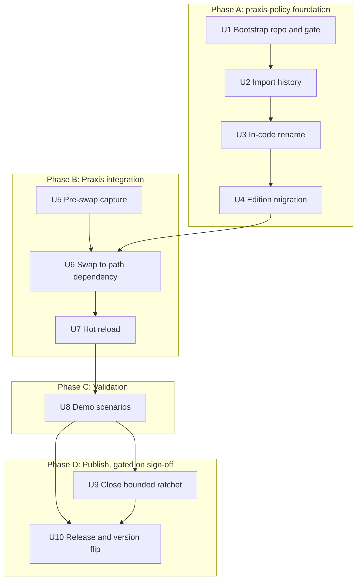

# feat: Port CPEX core into the Praxis Policy Engine

**Target repos.** This plan lives in the CPEX repo but the work lands in three
others, all assumed to sit as adjacent siblings of this one:

- `praxis-policy` (`praxis-proxy/policy`), branch `main`: the engine's new home.
- `praxis`, branch `feat/ppe`: the consumer.
- `praxis-demos`, branch `feat/ppe`: the acceptance surface.

Paths below are prefixed with the repo they belong to, for example
`praxis: server/src/watcher.rs`. Unprefixed paths belong to `praxis-policy`.

## Summary

Bootstrap `praxis-policy` with Praxis's quality gate and CPEX's release
machinery, import the engine with its history via `git-filter-repo`, rename it in
place, then wire Praxis to it through a temporary path dependency and add hot
reload for the policy document. Publishing and the lint ratchet move to a final
phase gated on maintainer sign-off, which keeps them off the path to a working
demo.

---

## Problem Frame

The engine is named for another project, lives in another org, and releases on
its own cadence, so Praxis cannot treat as a core capability something it does
not publish, name, or gate. Separately, a policy change today requires a restart,
because the config watcher only reacts to the main config file. Full context in
the origin document (see Sources & References).

---

## Requirements

Traced to the origin document. Origin R-IDs are used verbatim.

- R1, R2, R3. Repo layout, crate directory-to-package mapping, and the ported
  builtin set including the Valkey store.
- R4. Apache-2.0, edition 2024, resolver 3, MSRV 1.96, shared version from 0.1.0,
  with the edition move as its own commit series.
- R5, R6. Rename reaches crates, module paths, docs, diagnostics, log targets, and
  metric names; the policy wire surface stays byte-compatible.
- R7, R8. Quality gate copied from Praxis with the ratchet derived from actual
  violations; publish gated on a bounded lint subset.
- R9, R10, R11. Makefile and release machinery mirrored from CPEX; CI coverage;
  infrastructure before the bulk import.
- R12, R20. Praxis drops `cpex` and gains the engine with its filter config
  surface unchanged apart from the renamed cargo feature.
- R18, R19, R28, R32. Policy-document edits trigger reload; the existing init
  workaround stands; a failed reload keeps the previous engine enforcing; taint is
  scoped to the engine instance.
- R21, R22, R23, R29. Demo scenarios pass; Praxis tests pass and gain reload
  coverage; latency baseline captured pre-swap; functional golden corpus captured
  pre-swap from pinned synthetic fixtures.
- R24, R25, R26, R27. Ratchet conversions preserve fail-closed with boundary
  tests; crate names reserved; ported tests move and pass with executed-test
  reconciliation; snapshot commit recorded.
- R30, R31, R33, R35. CODEOWNERS names both maintainers; policy config stays a
  standalone document; history preserved via `git-filter-repo`; durable artifacts
  carry no requirement or plan identifiers.

**Origin actors:** A1 (Praxis maintainers), A2 (PPE maintainers), A3 (CPEX
maintainers), A4 (Praxis operators), A5 (downstream CPEX consumers).

**Origin flows:** F1 (operator configures and revises policy), F2 (release feeds
the Praxis swap).

**Origin acceptance examples:** AE1 (covers R6), AE2 (R32), AE3 (R20), AE4 (R18),
AE5 (R18), AE6 (R8, R25), AE7 (R28), AE8 (R24).

---

## Scope Boundaries

- No policy config restructuring: no named-policies section, no typed validation
  inside Praxis config, no shared engine per policy. Carried from origin.
- No CPEX changes, and no management of divergence between the two trees.
- No Python bindings, Go bindings, FFI, Python plugin host, OPA PDP, Biscuit
  delegator, or example crates.
- The policy filter is not graduated out of experimental.

### Deferred to Follow-Up Work

- Publishing to crates.io: gated on Praxis maintainer sign-off. U10 carries it.
- Flipping Praxis from the path dependency to a version dependency: part of U10.
  The path dependency must not reach a Praxis pull request.
- The config refactor design discussion, tracked in the origin document.
- CPEX consuming the engine, which is a separate plan.

---

## Context & Research

### Relevant Code and Patterns

- `praxis: filter/src/builtins/http/security/policy/` is the whole existing
  integration: filter, config, error mapping, JSON-RPC and CMF translation, plus
  about 2,000 lines of tests.
- `praxis: server/src/watcher.rs` holds the reload trigger. It filters notify
  events against the main config path, registers one non-recursive directory watch
  at startup, and gates on a content hash of the main config alone. All three are
  what U7 changes.
- `praxis: server/src/reload.rs` and `praxis: server/src/pipelines.rs` rebuild all
  filters through the registry and swap atomically, returning an error without
  touching live state on failure. This is why reload already re-reads the policy
  document and why R28 is largely a test rather than a build.
- `praxis: core/src/kv/mod.rs` is the shared-resource registry pattern. Noted
  because U7 deliberately does not use it; per-filter engines stay.
- `crates/cpex-core/src/config.rs` and `manager.rs` hold the standalone-document
  loader (`load_config`, `load_config_file`, `load_config_yaml`). It ports as-is.
- `praxis: benchmarks/microbenchmarks/filter_pipeline.rs` is the criterion target
  closest to the policy hot path, run nightly with artifacts uploaded.
- `praxis: AGENTS.md` requires five things for a new capability: unit tests,
  integration tests, an example config with a specific header format, a functional
  example test under `tests/integration/tests/suite/examples/`, and a README
  regeneration via `cargo xtask sync-example-readme --fix`.

### Institutional Learnings

`docs/solutions/` does not exist in any of the four repos, so there are no prior
recorded learnings to carry forward.

### External References

`git-filter-repo` behavior verified from its own manual rather than assumed:
`--paths-from-file` accepts filtering and renaming directives together, one per
line, with `==>` marking a rename; a rename directive does not select paths, so
includes are still required; `--prune-empty` defaults to `auto`, pruning only
commits that become empty; and the tool refuses to run outside a fresh clone
without `--force`.

---

## Key Technical Decisions

- **Bootstrap the workspace at edition 2021 and resolver 2, then migrate.** R4
  names edition 2024 as the end state and says the move is its own commit series,
  but a workspace declaring 2024 cannot compile the 2021 tree the import brings.
  U1 matches CPEX, U4 migrates. This is the one place the plan sequences against
  the literal reading of a requirement to satisfy its intent.
- **The gate ships with a seed allow-list, narrowed after import.** Ported crates
  inherit the workspace gate, and five rustc lints Praxis denies are parked in CPEX.
  Rustc denies are compile errors, so a bare copy of Praxis's gate would make the
  imported tree uncompilable and leave three units with unreachable verification.
  U1 seeds the allow-list from the config delta between the two repos, which needs
  no build, and U2 replaces the seed with the list measured from actual violations.
- **The corpus lives in the consumer repo, not the engine repo.** The origin places
  it in the engine repo. Keeping it in the consumer means a difference cannot be
  attributed between the engine and the consumer-side translation layer that U6 also
  rewrites, which is a real cost. It buys exercising the path an operator actually
  hits, end to end through the filter. Recorded as a deliberate deviation rather
  than left as an accident.
- **Root config files are authored, crate directories are imported.** U1 writes
  the root manifest, lint config, and CI with an empty workspace member list. U2's
  import brings the crate directories and populates members. Importing CPEX's root
  manifest would drag in excluded members and collide with the authored gate.
- **Directory renames inside the extraction; in-code renames after.** The rename
  that must ride along with history is the path rename, because that is what keeps
  blame continuous. Package names, module paths, diagnostics, log targets, and
  metric names are ordinary code edits and land in U3 where they are reviewable.
- **One `--paths-from-file` directive file, checked into the repo.** Sixteen
  includes and eight renames as command-line arguments is unreviewable and
  unrepeatable. As a file it is diffable, and it doubles as the record of what was
  imported.
- **Per-filter engines stay.** R31 defers the shared-engine work, so U7 does not
  reach for the registry pattern even though it exists. The consequence, that two
  policy filters mean two engines and two taint stores, is documented rather than
  fixed.
- **Pre-swap capture is its own unit, ahead of the swap.** R12 forbids an interval
  with both dependencies present, so the reference behavior and latency baseline
  have exactly one window in which they can be captured. Making that a unit rather
  than a step inside the swap keeps it from being skipped under time pressure.
- **The ratchet and publish move to the final phase.** They only ever gated
  publish, and publish is now gated on sign-off, so keeping them mid-plan would put
  documentation work ahead of a working demo for no benefit.
- **The path dependency is scaffolding with an explicit removal unit.** A local
  path in a manifest is the kind of thing that reaches a pull request by accident,
  so its removal is a named deliverable rather than a cleanup assumption.
- **No requirement or unit identifiers in commits, comments, or PR text.** R35
  applies to everything this plan produces. The identifiers in this document stay
  in this document.

---

## Open Questions

### Resolved During Planning

- Where the standalone-document loader lives: already in the engine core, so it
  ports with the code. No new crate, nothing to relocate.
- Which benchmark covers the policy hot path: the existing criterion
  `filter_pipeline` target, captured as an artifact rather than enforced as a gate.
- The extraction mechanism: `git-filter-repo` driven by a checked-in directive
  file, includes and renames in a single pass.
- Whether the workspace can start at edition 2024: no. See Key Technical
  Decisions.
- Which Praxis CI workflows transfer: tests, conventions, pull-request
  conventions, coverage with threshold, documentation, MSRV, semver checks,
  supply chain, and static analysis transfer directly. Conformance, container,
  integration, and the proxy benchmark workflows do not apply to a library-only
  workspace. Release and publish come from CPEX's tag-triggered pattern instead.

### Deferred to Implementation

- The exact include and rename directive lines, which are mechanical but must be
  verified rather than assumed correct. U2 carries the verification step.
- Which ratchet entries close mechanically versus needing real refactors, which
  only a clippy run against the imported tree can answer. U9 starts by producing
  that inventory, which U2 now produces.
- Whether the notify watch set needs one watcher per directory or one recursive
  watcher, which depends on where operators put policy documents relative to the
  main config. U7 decides from the shape of the existing watcher code.
- Regression tolerance for the latency comparison, which needs run-to-run variance
  data from the runners before a number means anything.

---

## High-Level Technical Design

> *This illustrates the intended approach and is directional guidance for review,
> not implementation specification. The implementing agent should treat it as
> context, not code to reproduce.*

Phase and unit dependencies. U5 is independent of the `praxis-policy` work and can
start at any time before U6.



Shape of the extraction directive file. Includes select, renames only rewrite what
was selected.

```
# selection
crates/cpex-core/
crates/apl-core/
builtins/pdps/cedar-direct/
builtins/session/valkey/
# ... remaining crates and builtins per R2 and R3

# renames, applied to selected paths only
crates/cpex-core/==>crates/ppe-core/
crates/apl-core/==>crates/ppe-apl-core/
crates/apl-cpex/==>crates/ppe-apl-runtime/
# ... remaining renames per R2
```

---

## Output Structure

Expected shape of `praxis-policy` after U4. A scope declaration, not a constraint.

    praxis-policy/
      Cargo.toml              authored in U1, members populated in U2
      clippy.toml             from Praxis, thresholds and doc-valid-idents merged
      deny.toml               from Praxis
      rustfmt.toml            from Praxis
      rust-toolchain.toml     MSRV pin
      release.toml            from CPEX
      Makefile                from CPEX, minus Python, Go, and FFI targets
      CODEOWNERS
      CONTRIBUTING.md         carries the no-identifiers convention
      tools/
        port-paths.txt        the extraction directive file
      .github/workflows/      transferred subset plus tag-triggered release
      crates/
        ppe/ ppe-core/ ppe-orchestration/ ppe-builtins/ ppe-sdk/
        ppe-apl-core/ ppe-apl-cmf/ ppe-apl-runtime/
      builtins/
        plugins/{identity-jwt,delegator-oauth,elicitation-ciba,pii-scanner,audit-logger}/
        pdps/{cedar-direct,cel}/
        session/valkey/

---

## Implementation Units

### Phase A: praxis-policy foundation

- U1. **Bootstrap the repository, quality gate, and release machinery**

**Goal:** A repository whose root manifest and gate can actually receive the
import, so U2 lands on a tree that builds rather than one that cannot compile.

**Requirements:** R1, R4 (partial), R7, R9, R10, R11, R30, R35

**Dependencies:** None

**Files:**
- Create: `Cargo.toml`, `clippy.toml`, `deny.toml`, `rustfmt.toml`,
  `rust-toolchain.toml`, `release.toml`, `Makefile`, `CODEOWNERS`,
  `CONTRIBUTING.md`, `README.md`
- Create: `.github/workflows/` transferred subset plus the tag-triggered release
  workflow

**Approach:**
- Workspace declares Apache-2.0, MSRV 1.96, shared version 0.1.0, and edition 2021
  with resolver 2 so U2's import compiles. U4 migrates.
- The root manifest carries the **full** `[workspace.package]` key set the ported
  manifests inherit, not just the obvious ones: authors, repository pointed at the
  new home, homepage, keywords, categories, and readme. It also carries a
  `[workspace.dependencies]` table ported from CPEX with third-party entries kept
  and entries for excluded members dropped. Ported crate manifests inherit these by
  `{ workspace = true }`, so a missing table is a build failure in U2, not a lint.
- **The gate ships with a seed allow-list.** Every ported crate carries
  `[lints] workspace = true`, and five rustc lints Praxis denies are parked as
  allow in CPEX: missing docs, dead code, unreachable pub, unused extern crates,
  unused qualifications. Rustc denies are hard compile errors, so copying Praxis's
  gate bare would make the imported tree uncompilable. The seed is computed from
  the config delta between the two repos, which needs no build: CPEX's parked set
  plus every Praxis-denied lint with no CPEX entry, each parked with a reason
  naming U2 as where it is narrowed. U2 replaces the seed with the list derived
  from actual violations, which is what R7 asks for.
- `unexpected_cfgs` is denied, so a stale feature name in a `cfg` predicate becomes
  a build error rather than a warning. U3's rename depends on this.
- `clippy.toml` merges rather than copies: Praxis's thresholds, plus
  `doc-valid-idents` extended with the engine's vocabulary, since Praxis's list
  would flag every mention of APL, CMF, and PDP.
- `deny.toml` merges rather than copies for the same reason: Praxis's structure and
  thresholds, plus CPEX's MPL-2.0 license allowance, which the ported tree needs
  through a dev-dependency, and CPEX's advisory ignores with their rationale.
- The coverage workflow lands without a threshold. U2 measures the imported tree
  and sets the floor, because Praxis's 96 percent is calibrated to Praxis.
- Makefile mirrors CPEX's target structure minus Python, Go, FFI, and tutorial
  targets. Release config mirrors CPEX: shared version, single bump commit, local
  tag, no local publish or push.
- CODEOWNERS names both maintainers. `CONTRIBUTING.md` records that commits,
  comments, rustdoc, changelog entries, and PR descriptions do not cite planning
  identifiers.

**Patterns to follow:**
- `praxis: Cargo.toml` `[workspace.lints]`, `praxis: clippy.toml`,
  `praxis: deny.toml`
- CPEX root `Cargo.toml` for the `[workspace.package]` and
  `[workspace.dependencies]` shape the ported manifests expect
- CPEX `Makefile` and `release.toml`

**Test scenarios:**
- Test expectation: none for behavior. This unit ships configuration only.
- Edge case: the seed allow-list is complete against the config delta, verified by
  diffing the two repos' lint tables rather than by compiling anything.

**Verification:**
- Scoped to what an empty virtual workspace supports: `cargo metadata` parses the
  manifest, `cargo fmt --check` passes, and the workflow files are syntactically
  valid.
- Compile-shaped gates are explicitly **not** expected here. `cargo build`,
  `cargo test`, `cargo doc`, `cargo deny check`, and a release dry run all abort on
  a workspace with no members; they move to U2's verification.

---

- U2. **Import the engine with history**

**Goal:** The ported crates and builtins exist at their new paths with history
intact, and the tree builds and passes under the gate at the end of the unit.

**Requirements:** R2 (directories), R3, R7, R10, R26, R27, R33

**Dependencies:** U1

**Files:**
- Create: `tools/port-paths.txt`
- Create: `crates/ppe*/` and `builtins/**` via the import
- Modify: `Cargo.toml` for members, internal dependency paths, and the narrowed
  allow-list
- Modify: `crates/ppe-builtins/Cargo.toml` and `crates/ppe-builtins/src/lib.rs` for
  the OPA exclusion
- Modify: `crates/ppe/Cargo.toml` for the facade feature passthrough
- Create: `docs/port-provenance.md`

**Approach:**
- Run `git-filter-repo` against a fresh clone of CPEX driven by
  `tools/port-paths.txt`, includes and renames in one pass. The directive file is
  checked in so the import is reproducible and reviewable.
- **Scan the filtered clone for secrets before it touches the new repo.** History
  carries everything ever committed under the ported paths, including material
  later removed from the tip, into a repository under a different org with
  different access controls. A full-history scan runs on the filtered clone; a hit
  blocks the merge. Remediating afterward means rewriting a second repository.
- Add the filtered repo as a remote and merge with unrelated histories allowed.
  The new repo's initial commit survives; nothing on that side is rewritten.
- Record the snapshot commit in the provenance doc and the merge commit body.
- Populate members and rewrite internal dependency paths to the new names.
- **Excise the excluded OPA PDP.** The builtins crate lists `opa` in its default
  feature set and declares the PDP as an optional path dependency, so Cargo errors
  on a directory the port does not carry. Remove the feature, the optional
  dependency, the root workspace dependency entry, the re-export, the registration
  site, and the facade passthrough, then fix the factory-count assertion that
  derives its expected value from that feature. All of it lands in the import
  commit series so the tree is buildable at the boundary.
- **Narrow the seed allow-list to actual violations.** With the tree present, run
  rustc and clippy and replace U1's config-delta seed with the measured set. Every
  remaining entry carries a reason. This is the artifact R7 asks for, and U9 later
  closes the bounded subset from it.
- Measure line coverage and set the workflow floor to the measured value, with a
  note that raising it toward Praxis's threshold is separate work.

**Execution note:** Verify history mechanically, not by sampling. A single-pass
rewrite leaves no old path anywhere in the result, so a `--follow` spot check
succeeds by construction and proves nothing.

**Patterns to follow:**
- The include and rename sets are exactly the origin's crate mapping and builtin
  list.

**Test scenarios:**
- Happy path: the workspace builds and the ported suite runs. Reconcile tests
  actually executed, not declared, against the CPEX snapshot.
- Integration: the imported tip tree's file set and blob hashes equal the source
  tree's at the snapshot commit under the path mapping, for every ported file.
- Integration: per-file commit counts in the imported history match the source's
  for every ported file, not a sample.
- Edge case: no path outside the include set appears at any commit, checked by
  walking trees rather than only the tip.
- Edge case: the secrets scan over full history returns clean, or every hit is
  resolved before the merge.
- Edge case: Valkey's integration tests are recorded as present but not executed,
  since they are ignore-gated and need a running service. They must not count as
  passing.
- Error path: a build with default features succeeds, proving the OPA excision is
  complete rather than merely feature-gated.

**Verification:**
- Workspace builds under the gate and the ported suite passes.
- `cargo deny check` passes against the real crate graph.
- File sets, blob hashes, and per-file commit counts match the source.
- Secrets scan clean.
- The provenance record names the snapshot commit.
- Coverage floor is set to a measured value.

---

- U3. **Rename to PPE in code**

**Goal:** The engine identifies itself as the Praxis Policy Engine everywhere a
developer or operator can see it, while the policy wire surface stays
byte-compatible.

**Requirements:** R2 (packages), R5, R6

**Dependencies:** U2

**Files:**
- Modify: every `crates/ppe*/Cargo.toml` and `builtins/**/Cargo.toml` package name
- Modify: crate roots and module paths across `crates/` and `builtins/`
- Modify: tracing targets, metric names, and error and violation text
- Modify: every `cfg(feature = ...)` predicate naming an optional-dependency
  feature, across `crates/ppe/src/lib.rs` and any other facade or builtins site
- Modify: the per-file `// Location:` path headers across the ported tree, which
  U2's directory rename made stale
- Modify: `README.md` and crate-level documentation
- Test: existing suites under `crates/` and `builtins/` plus a new
  wire-compatibility test in `crates/ppe/tests/`

**Approach:**
- Package names become `praxis-policy*` per R2 while directories stay `ppe*`,
  following Praxis's own short-directory, qualified-package convention.
- Diagnostics, log targets, and metric names adopt the engine's new identity.
- **Renaming an optional dependency renames its implicit feature.** Facade exports
  and a test module are gated on a feature whose name comes from the optional
  dependency, so the manifest rename silently makes those predicates false and the
  exports vanish. U1's denial of unexpected `cfg` values turns this into a build
  error instead of a warning, and every such predicate is updated alongside the
  manifest.
- Explicitly unchanged: plugin `kind` strings, hook names, APL syntax,
  policy-document field names, and violation header names. These are the contract
  that keeps existing documents and CPEX's language bindings working.

**Patterns to follow:**
- `praxis: Cargo.toml` workspace dependency aliasing, where the package name is
  qualified and the alias at use sites is short.

**Test scenarios:**
- Covers AE1. Happy path: a policy document written for CPEX 0.2.2 that uses only
  the ported builtins loads unchanged and produces identical decisions.
- Happy path: a document exercising each ported plugin kind string parses without
  edits.
- Edge case: a document naming an excluded builtin fails to load with an error that
  names the unknown kind, which is the accepted boundary rather than a
  compatibility failure.
- Error path: no diagnostic, log target, or metric name emitted by the engine
  contains the old project name, asserted by a grep-style test over the crate
  sources.
- Integration: the facade's builtin-installation entry point and its factory
  accessors are present in a default build, proving no `cfg` predicate silently
  disabled them. This is the symbol the consumer calls, so its absence would
  otherwise surface two units later as a consumer compile failure.

**Verification:**
- Full suite passes.
- The demo's policy document parses against the renamed engine without edits.
- No occurrence of the old name remains outside imported commit messages and the
  provenance record.

---

- U4. **Migrate to edition 2024 and resolver 3**

**Goal:** The workspace reaches the edition and resolver R4 specifies, as an
isolated change reviewable apart from the move and the rename.

**Requirements:** R4, R26

**Dependencies:** U3

**Files:**
- Modify: `Cargo.toml` edition and resolver
- Modify: source files as the migration requires across `crates/` and `builtins/`

**Approach:**
- Migrate with the toolchain's own edition assistance first, then resolve what it
  cannot. The behavior-affecting areas are match ergonomics, return-position
  lifetime capture, and tail-expression temporary scope.
- Resolver 3's change is MSRV-aware dependency version selection, not feature
  unification, which changed at resolver 1 to 2 and is already in effect. The risk
  is that dependency versions silently move to satisfy the declared minimum
  toolchain, changing the lockfile and with it runtime behavior.

**Execution note:** Gate on the ported suite. The suite is the only signal
distinguishing a correct migration from a subtly behavior-changing one.

**Test scenarios:**
- Happy path: the full ported suite passes unchanged, with no assertion weakened to
  accommodate the migration.
- Integration: diff the lockfile across the migration commit. Any dependency
  version that moved is listed with a reason, since resolver 3 prefers versions
  compatible with the declared minimum toolchain.
- Edge case: any test whose assertion did change is listed with a reason, since a
  silently relaxed assertion is how an edition migration hides a regression.

**Verification:**
- Suite passes with an explicit list of any changed assertions.
- Every lockfile version change across the migration is listed with a reason.

---

### Phase B: Praxis integration

- U5. **Capture reference behavior before the swap**

**Goal:** A functional golden corpus and a latency baseline captured from the
current dependency, since it is about to be removed and there is no interval where
both are present.

**Requirements:** R23, R29

**Dependencies:** U2, for the snapshot commit identity. Must complete before U6.

**Files:**
- Create: `praxis: tests/integration/fixtures/policy-corpus/` holding policy
  documents, pinned signing keys, pre-signed tokens, and expected outputs
- Create: `praxis: tests/integration/tests/suite/policy_corpus.rs`
- Modify: `praxis: benchmarks/Cargo.toml` for a feature forwarding to the filter's
  policy feature, since the benchmarks crate does not compile the policy filter in
  today
- Modify: `praxis: benchmarks/microbenchmarks/filter_pipeline.rs` for the
  policy-filter case
- Create: baseline criterion artifact recorded outside the repo, referenced from
  the plan's provenance notes

**Approach:**
- **Capture against the snapshot, not the published version.** Praxis pins a
  published release, but the snapshot is several commits ahead, including a fix that
  changes emitted payload output and a new policy effect. Since the corpus records
  redaction bytes and violation codes, a baseline from the published version would
  make U6's differential fail for reasons nobody could distinguish from a port
  defect. Capture against the current dependency pinned to the extraction snapshot
  via a temporary revision dependency, and record the published-to-snapshot delta
  separately as known drift.
- The corpus pairs policy documents with their resulting decisions, violation
  codes, and redaction output. Percentiles are deliberately not part of it.
- Captured against pinned fixtures rather than live services: checked-in signing
  keys, a stubbed approval channel, and the in-process taint store. Durability comes
  from pre-signing fixture tokens with far-future validity, not from freezing a
  clock, because the engine has no clock abstraction to freeze.
- Delegation cases need a token endpoint. If the consumer's integration crate has
  no HTTP mocking dependency, delegation is excluded from the corpus and covered by
  the demo instead, and which choice was made is recorded rather than left
  implicit.
- Sourced only from synthetic scenario fixtures. Captured redaction output is by
  definition the material the engine was supposed to hide, so a capture from a real
  deployment would commit sensitive data to history permanently.
- The latency baseline extends the existing criterion `filter_pipeline` target with
  a policy-filter case and is recorded as an artifact, not a gate.

**Patterns to follow:**
- `praxis: tests/integration/fixtures/cpex-policy.yaml` for fixture shape
- `praxis: benchmarks/microbenchmarks/filter_pipeline.rs` for the bench harness
- `praxis: filter/src/builtins/http/security/policy/tests.rs` for the HS256
  fixture-token approach that avoids a live identity provider

**Test scenarios:**
- Happy path: each corpus document replays to its recorded decision and violation
  code.
- Happy path: a document with a redaction rule replays to the recorded redacted
  body, byte for byte.
- Edge case: the corpus runs with no network access and no container, proving the
  fixtures are genuinely pinned.
- Edge case: replaying at any wall-clock date produces the recorded decision, which
  the far-future token validity is what makes true.

**Verification:**
- The corpus suite passes against the current dependency, offline.
- A criterion baseline for the policy filter path exists and is archived.

---

- U6. **Swap Praxis onto the engine via a path dependency**

**Goal:** Praxis compiles and passes against the new engine crates instead of
`cpex`, with the filter's operator-facing config unchanged.

**Requirements:** R12, R20, R31

**Dependencies:** U4, U5

**Files:**
- Modify: `praxis: Cargo.toml` workspace dependencies
- Modify: `praxis: filter/Cargo.toml`, `praxis: server/Cargo.toml` feature names
- Modify: `praxis: filter/src/builtins/http/security/policy/` import paths across
  `filter.rs`, `config.rs`, `error.rs`, `json_rpc.rs`,
  `common_message_format.rs`, `mod.rs`
- Modify: `praxis: docs/features.md`,
  `praxis: docs/filters/http/security/policy.md`,
  `praxis: examples/configs/security/policy.yaml`,
  `praxis: examples/configs/security/policy-http.yaml`
- Test: `praxis: filter/src/builtins/http/security/policy/tests.rs`,
  `praxis: tests/integration/tests/suite/examples/policy.rs`,
  `praxis: tests/integration/tests/suite/examples/policy_http.rs`

**Approach:**
- The workspace dependency becomes a path dependency on the sibling checkout,
  aliased so use sites stay short. `cpex` is removed in the same change, so there
  is no interval with both present.
- The cargo feature renames off the old project name. This is a breaking build-flag
  change for anything enabling it today, including the demo gateway, which U8
  updates.
- Filter config keys are unchanged, including `config_path`. Fixtures needing no
  edits is the signal that the config surface held.
- The engine is still constructed per filter instance. R31 defers the shared-engine
  work, so the registry pattern is deliberately not used here.

**Patterns to follow:**
- `praxis: Cargo.toml` dependency aliasing via the `package` key
- `praxis: filter/src/registry.rs` for how the filter is registered, unchanged

**Test scenarios:**
- Happy path: the existing policy filter test suite passes with no fixture edits
  beyond the feature name.
- Happy path: both example-config integration tests pass.
- Edge case: a build with the feature disabled compiles and links without the
  engine, preserving the zero-cost-when-unused property.
- Error path: `cargo deny` and semver checks are run and their output is recorded
  as non-representative while the path dependency is in place, so a later reviewer
  is not misled by a green result.

**Verification:**
- No reference to the old dependency remains in the Praxis tree outside changelog
  history.
- Full Praxis test suite passes.
- The corpus suite from U5 replays identically against the new engine, with the
  baseline taken from the snapshot rather than the published version, so a
  difference means a port defect.

---

- U7. **Hot reload for the policy document**

**Goal:** An operator edits the policy document and the change takes effect without
a restart, and a bad edit leaves the previous policy enforcing.

**Requirements:** R18, R19, R22, R28, R32

**Dependencies:** U6

**Files:**
- Modify: `praxis: server/src/watcher.rs` for the event filter, watch set, and
  reload gate
- Modify: `praxis: server/src/reload.rs` if the referenced-file set must be
  recomputed after a successful reload
- Modify: `praxis: filter/src/filter.rs` to add a default-implemented
  referenced-files accessor on the HTTP filter trait, returning nothing by default
- Modify: `praxis: filter/src/any_filter.rs` to surface it through the filter enum
- Modify: `praxis: filter/src/builtins/http/security/policy/filter.rs` to implement
  it, returning the configured document path
- Modify: `praxis: docs/filters/http/security/policy.md` and
  `praxis: examples/configs/security/policy.yaml` for the reload and taint-scope
  documentation
- Test: `praxis: server/src/watcher.rs` unit tests,
  `praxis: tests/integration/tests/suite/hot_reload.rs`,
  `praxis: tests/integration/tests/suite/examples/policy.rs`

**Approach:**
- Three mechanisms change. The notify event filter accepts referenced policy paths,
  not only the main config path. The watch set covers the directories holding those
  documents, which commonly differ from the main config's directory. The reload
  gate becomes a composite hash over the main config plus every referenced
  document.
- **Upstream has this filed as praxis-proxy/praxis#900**, accepted for milestone
  v0.5.2, reporting the same two causes this unit addresses: a directory-scoped
  watch paired with a hash gate over the main config alone. The issue's preferred
  direction is filters declaring their dependent paths, which is the seam below, and
  it notes that direction is the only one that also fixes a referenced document
  living outside the config's directory. So this work converges with the accepted
  upstream fix rather than diverging from it, and the wiring commit should reference
  the issue.
- **A digest-comment workaround exists in the field** and should not be adopted here:
  embedding a hash of the referenced documents as a comment in `praxis.yaml` so its
  bytes change. It only works for generated configs. The acceptance demo's
  `praxis.yaml` is hand-authored, so it has no workaround and demonstrates the bug
  directly, which makes it a clean check that the fix works.
- **The seam does not exist today and has to be built.** Nothing lets the server ask
  a filter which files it reads: the filter enum is opaque and the pipeline exposes
  no filter accessor. The alternative, having the server parse the policy filter's
  config key directly, is the typed policy validation inside Praxis config that
  Scope Boundaries forbids. So the accessor is added to the filter trait with a
  default returning nothing, which makes it additive for every other filter, and it
  is published surface on that crate.
- Watch registrations are recomputed after each successful reload so a changed
  reference set stays covered.
- **A failed reload restores the previous hash.** The watcher records the new hash
  before attempting the reload and short-circuits when the hash is unchanged, so a
  transient failure such as an unreachable identity provider would otherwise strand
  the operator's edit permanently: the previous engine keeps enforcing, correctly,
  but the edit is never retried. Restoring the hash on failure lets the existing
  backoff retry the pending content.
- Known limitation, recorded rather than fixed: the watcher keeps one shared failure
  counter, so repeated failures on a policy document can delay an unrelated
  main-config reload. Scoping failure state per trigger source is follow-up work.
- Nothing else is needed for the reload itself: pipeline reconstruction already
  rebuilds the filter, which already re-reads its document and rebuilds its engine.
- The existing initialization workaround stands. Construction now happens from a
  second call site, and the filter already spawns and joins a thread, which is safe
  under a caller runtime at the cost of blocking a watcher thread for up to the
  init timeout.
- Taint scoping is documented, not engineered around: with the in-process store
  taint survives neither reload nor a second replica, and continuity requires the
  distributed store.
- Praxis's five-part capability obligation applies here. The example config gains
  the documented reload behavior, the functional example test exercises it, and the
  README is regenerated.

**Execution note:** Start with the failing integration test for the reload
trigger. The three blocking mechanisms are easy to fix partially and hard to
notice partially fixed.

**Patterns to follow:**
- `praxis: server/src/watcher.rs` existing debounce and hash-gate structure
- `praxis: tests/integration/tests/suite/hot_reload.rs` for reload test shape
- `praxis: AGENTS.md` example-config header format, required by the README
  generator

**Test scenarios:**
- Covers AE5. Happy path: editing the referenced document takes effect without a
  restart and without touching the main Praxis config.
- Covers AE4. Edge case: a document living outside the main config's directory
  still triggers a reload.
- Covers AE7. Error path: an edit that fails validation leaves the previous engine
  enforcing and surfaces a diagnostic. No request is served unenforced.
- Error path: an edit whose engine construction fails, such as an unreachable
  identity provider, behaves the same way as a validation failure.
- Covers AE2. Integration: a tainted session on the in-process store is no longer
  tainted after a successful reload; the same policy on the distributed store keeps
  the taint.
- Covers AE3. Error path: a malformed document at startup fails filter construction
  and the server does not start.
- Edge case: a reload that changes which documents are referenced leaves the new set
  watched and the old set no longer watched.
- Edge case: an unrelated edit to the main config does not rebuild the policy
  engine, so a reload storm does not silently reset taint.
- Error path: a reload that failed because the identity provider was unreachable
  succeeds once the provider recovers, with no further file edit. This is the
  scenario the hash restore exists for.

**Verification:**
- All reload scenarios pass, including the two failure paths.
- `cargo xtask sync-example-readme --fix` produces no uncommitted diff.
- Documentation states the taint scope limitation in operator-facing terms.

---

### Phase C: Validation

- U8. **Validate against the demo**

**Goal:** Every demo scenario passes with unchanged observable behavior against the
new engine.

**Requirements:** R6, R21

**Dependencies:** U7

**Files:**
- Modify: `praxis-demos: demos/cpex/gateway/Cargo.toml` for the renamed feature
  and the path or patch pointing at the Praxis checkout
- Modify: `praxis-demos: demos/cpex/build-gateway.sh` to resolve a second link for
  the engine checkout, and for the branch it clones
- Modify: `praxis-demos: demos/cpex/gateway/.gitignore` for both links
- Modify: `praxis-demos: demos/cpex/README.md` and `docs/` for naming
- Unchanged, deliberately: `praxis-demos: demos/cpex/cpex.yaml` and
  `cpex-cel.yaml`, since the policy document format did not change

**Approach:**
- The policy documents should need no edits. If they do, the wire-compatibility
  claim is wrong and that is the finding.
- All eleven scenario scripts are the acceptance bar, not the narrated walkthrough,
  which runs only the first seven. Session taint and out-of-band approval are
  exercised solely by scripts the walkthrough never calls.
- The gateway builds against a Praxis branch through a patch rather than a release,
  and pins a separate protocol-classifier package by revision. Both need to point
  at the working branches.
- **The path dependency will not resolve without a second link.** The gateway
  reaches Praxis through a symlink, and Cargo resolves path dependencies lexically
  rather than through the link target, so Praxis's relative path to the engine
  resolves inside the gateway directory instead of alongside the repos. Patching
  cannot redirect a path dependency on an unpublished crate. The build script must
  materialize the engine checkout at the matching lexical location, and U10 removes
  that link along with the patch.

**Test scenarios:**
- Happy path: scenarios covering allow, deny, redaction, and PDP decisions pass
  with identical observable output.
- Integration: the two taint scenarios pass, including cross-principal isolation.
- Integration: the two approval scenarios pass, including the out-of-band path.
- Integration: the PII and APL deny scenarios pass.
- Edge case: the Valkey-backed cross-restart persistence step behaves as it does
  today, since the store is ported rather than excluded.
- Edge case: the policy documents are byte-identical to their pre-port versions,
  asserted rather than eyeballed.
- Happy path: the gateway builds from a clean checkout with only the build script
  run, proving both links resolve without manual setup.

**Verification:**
- All eleven scenarios pass.
- Policy documents are unchanged.
- The latency comparison against U5's baseline shows no regression beyond the
  agreed tolerance.

---

### Phase D: Publish, gated on maintainer sign-off

- U9. **Close the bounded ratchet**

**Goal:** The lint classes that can silently change enforcement behavior are green,
so the crates Praxis will depend on meet the bar that matters.

**Requirements:** R7, R8, R24

**Dependencies:** U8. Deliberately not U4: these conversions change decision
behavior at the boundary by design, so running them before the corpus replay and
the demo would make any failure ambiguous between a port defect and a lint
refactor, which is the exact ambiguity the origin's phasing decision avoids.

**Files:**
- Modify: `Cargo.toml` ratchet entries
- Modify: test modules across `crates/` and `builtins/` for scoped allows
- Modify: the production invariant sites in `crates/ppe-apl-core/src/parser.rs`,
  `crates/ppe-apl-core/src/evaluator.rs`, and `crates/ppe-core/src/manager.rs`
- Test: boundary tests alongside each converted invariant

**Approach:**
- The inventory already exists: U2 produced the measured allow-list. This unit
  closes entries from it rather than deriving it, working bucket by lint class.
- Two distinct passes. Test-module and integration-test sites, the overwhelming
  majority, close with module-scoped allow attributes carrying a reason, which is
  the convention Praxis already uses in its own core. The production surface is
  roughly a dozen structurally unreachable invariants and closes by conversion.
- Each converted invariant maps to a deny at the decision boundary. An unreachable
  invariant that becomes a permit when it turns out to be reachable is a policy
  bypass.
- Documentation and complexity entries stay parked with recorded rationale. They
  are the expensive classes and they do not gate publish.

**Test scenarios:**
- Covers AE8. Error path: an APL parser invariant converted from abort to error
  return produces a deny at the decision boundary, not a permit.
- Error path: the same for the evaluator invariant and the manager invariant.
- Happy path: the full ported suite still passes after both passes.
- Edge case: the panic-safety and rustdoc link lint classes are green while
  documentation and complexity entries remain parked, so the gate is enumerable
  rather than open-ended.

**Verification:**
- The bounded lint subset is green.
- Every converted site has a boundary test asserting deny.
- Remaining parked entries each carry a stated reason.

---

- U10. **Release and flip Praxis to a version dependency**

**Goal:** The crates are published and Praxis depends on a version rather than a
local path, so the branch is mergeable.

**Requirements:** R4, R8, R25

**Dependencies:** U8, U9, and Praxis maintainer sign-off

**Files:**
- Modify: `Cargo.toml` for the release version
- Modify: `praxis: Cargo.toml` to replace the path dependency with a version
- Modify: `praxis-demos: demos/cpex/gateway/Cargo.toml` and `build-gateway.sh` to
  drop the local patch and the engine link

**Approach:**
- Re-check crate name availability immediately before publishing. R25 asks for
  placeholder reservation early and exempts it from the publish gate so it can
  happen before sign-off. That is deliberately not done here: publishing anything,
  including a placeholder, puts entries in the org's namespace before maintainers
  have agreed the engine lands there. The names therefore stay unreserved for the
  whole build, and the exposure is accepted with an availability re-check rather
  than mitigated. If a name is taken, the rename cascades through every crate,
  package alias, module path, diagnostic, and the demo's pins.
- Bump the shared version and tag; CI publishes from the tag. No local publish.
- Flip Praxis from the path dependency to the published version, and remove the
  demo's local patch and engine link. Until this lands neither branch is mergeable,
  and Praxis CI cannot be green, because the path dependency points outside the
  repository.

**Test scenarios:**
- Covers AE6. Edge case: publishing a version Praxis will depend on does not
  proceed while any bounded-subset ratchet entry is open.
- Happy path: Praxis builds and its full suite passes against the published version
  rather than the path.
- Happy path: the demo builds without a local patch and its scenarios pass.
- Edge case: `cargo deny`, semver checks, and publish dry-run now produce
  representative results, and are re-run rather than trusted from the path-dependency
  era.

**Verification:**
- Crates are on crates.io at the shared version.
- No local path or patch remains in either consumer.
- Both consumer branches are mergeable.

---

## Success Criteria

Carried from the origin document, with the unit that establishes each.

- The engine is named and released as part of the Praxis family, and no reference
  to the old dependency remains in the Praxis tree. U3, U6, U10.
- An operator revises policy without restarting, and a bad edit leaves the previous
  policy enforcing rather than dropping enforcement. U7.
- Existing operator configs keep working unchanged, so adopting the engine is a
  dependency swap rather than a config migration. U6, verified by fixtures needing
  no edits.
- The demo still demonstrates everything it demonstrates today, with the external
  dependency gone. U8.
- CPEX and its downstream consumers keep working throughout, with no forced
  migration. Established by this plan touching no CPEX code at all.
- A planner and implementer can execute each phase without inventing the crate
  mapping, the compatibility boundary, or the definition of done. Established by
  this document.

---

## Dependencies / Prerequisites

- The three target repos sit as adjacent siblings of each other, which the path
  dependency in U6 relies on.
- `git-filter-repo` is installed. Confirmed available locally.
- U10 depends on Praxis maintainer sign-off, which is an external, non-technical
  prerequisite and the only one this plan cannot satisfy on its own.
- No new third-party dependency surface is introduced: the PDP, identity, and
  session-store dependencies are already present in Praxis's lockfile because the
  current dependency enables those features, and Praxis's allowed-license list
  already covers Apache-2.0. This is why no dependency-review unit exists.
- Toolchain 1.96 across all repos. Confirmed for Praxis, CPEX, and the downstream
  consumer that was previously believed to be pinned lower.
- The demo gateway currently builds against an unmerged Praxis branch and a
  revision-pinned classifier package, so U8 depends on both pointing at the working
  branches.

---

## System-Wide Impact

- **Interaction graph:** the reload path now reaches the policy filter's
  construction, which performs identity-provider key fetches. Anything else built
  during pipeline construction shares that path.
- **Error propagation:** a failed reload must surface as a diagnostic while the
  previous pipeline continues serving. Failure must not partially apply.
- **State lifecycle risks:** engine rebuild discards in-process taint. This is
  documented rather than fixed, and the distributed store is the escape hatch.
- **API surface parity:** U7 adds a default-implemented accessor to the HTTP filter
  trait and the filter enum, which is published surface on the filter crate. The
  default makes it additive for every existing filter. Separately, the cargo feature
  name is published surface on two Praxis crates and is consumed by the demo gateway and any external consumer enabling it.
  Renaming it is a breaking build-flag change.
- **Integration coverage:** the corpus suite and the demo scenarios cover behavior
  the engine's unit tests do not, particularly identity, delegation, and taint
  across requests.
- **Unchanged invariants:** plugin kind strings, hook names, APL syntax,
  policy-document field names, violation header names, and every filter config key
  including `config_path`. These are what keep existing operator configs and CPEX's
  language bindings working.

---

## Risks & Dependencies

| Risk | Mitigation |
|------|------------|
| A wrong rename directive breaks blame silently | U2 compares file sets, blob hashes, and per-file commit counts against the snapshot. A `--follow` spot check would pass by construction, since a single-pass rewrite leaves no old path anywhere |
| Import lands on `praxis-policy` `main`, which tracks a remote, so a 60k-line history merge reaches the shared branch | Called out explicitly. Switching to a feature branch there is a one-line change if preferred |
| The path dependency leaks into a Praxis pull request | Removal is a named deliverable in U10, and U6 records that dependency and semver tooling is non-representative until then |
| Edition migration hides a behavior change behind a relaxed assertion | U4 requires any changed assertion to be listed with a reason |
| Crate names are taken before publish, since reservation is deferred | Availability re-checked immediately before the release; accepted risk stated rather than mitigated |
| Ratchet inventory turns out larger than the panic classes suggest | U2 produces the measured inventory at import time; documentation and complexity classes are parked by design and do not gate publish |
| The history check passes while most files are wrong | Sampled blame checks are replaced by a full comparison of file sets, blob hashes, and per-file commit counts against the snapshot |
| Baseline captured from the wrong engine revision, making the differential meaningless | U5 pins the baseline to the extraction snapshot rather than the published release, and records the delta as known drift |
| Demo cannot build because the path dependency resolves lexically through a symlink | U8 materializes the engine checkout at the matching lexical location via the build script |
| Demo gateway depends on an unmerged Praxis branch and a revision-pinned classifier | U8 owns pointing both at the working branches |
| Valkey coverage is ignore-gated, so the taint backend is the least tested ported component | U2 records it as not-run rather than counted as passing; U8's demo exercises it for real |

---

## Documentation / Operational Notes

- New repository needs a README describing the engine and its relationship to
  Praxis, plus `CONTRIBUTING.md` carrying the no-identifiers convention.
- Imported commit messages carry pull-request numbers that will auto-link to
  unrelated numbers in the new repository. The convention is documented rather than
  rewritten, since rewriting would cost more traceability than it buys.
- Praxis operator docs need the reload behavior and the taint scope limitation.
- The cargo feature rename belongs in Praxis's changelog as a breaking build-flag
  change.
- Provenance doc records the snapshot commit and the extraction directive file so
  the import is reproducible.

---

## Sources & References

- **Origin document:** `docs/brainstorms/praxis-policy-engine-port-requirements.md`
- Praxis conventions and capability requirements: `praxis: AGENTS.md`
- Existing integration: `praxis: filter/src/builtins/http/security/policy/`
- Reload machinery: `praxis: server/src/watcher.rs`, `praxis: server/src/reload.rs`
- Acceptance surface: `praxis-demos: demos/cpex/scenarios/`
- Superseded design: `praxis: docs/proposals/00063_plugins.md`, merged but blocked,
  retained for history only
